# Multi-Agent GenAI Quote Advisor

A LangGraph-based multi-agent system that converts a customer-profile JSON into a structured home-insurance quote, with a single in-session follow-up turn (explanation or counterfactual). Designed for California and Florida personal-lines homeowners; statutory rules, peril multipliers, lender floors, and rate-filing benchmarks are deterministically encoded; reasoning is split across eight specialised agents on seven distinct cognitive patterns.

> **Start here →** The AI-agent explainer at [`walkthrough_AI_AGENT.html`](walkthrough_AI_AGENT.html) is the canonical long-form read — 19 sections covering every agent, every tool, every deferred design choice, the 6 captured live runs (Section 19) with LangSmith trace URLs, and embedded SVG diagrams. Open it in a browser before diving into the README's structured reference below.

> **Headline architecture diagram**

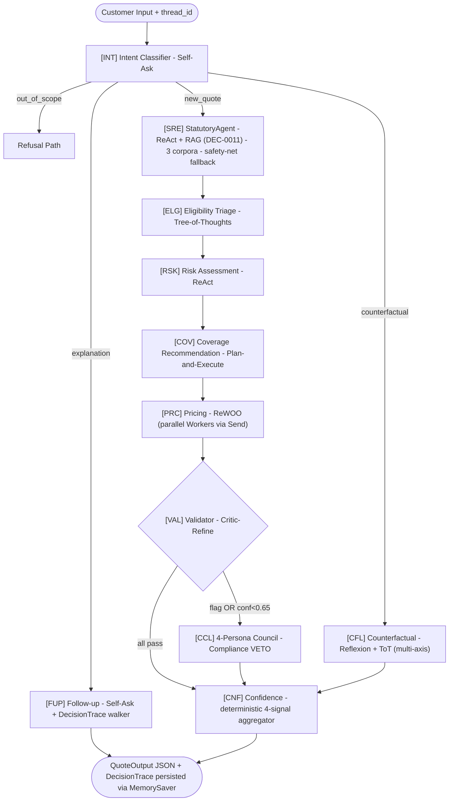

---

## Table of contents

1. [Highlights](#1-highlights)
2. [Architecture at a glance](#2-architecture-at-a-glance)
3. [Prerequisites](#3-prerequisites)
4. [Quickstart (5-minute path)](#4-quickstart-5-minute-path)
5. [Detailed run instructions](#5-detailed-run-instructions)
6. [Project structure](#6-project-structure)
7. [External data sources](#7-external-data-sources)
8. [The RAG pipeline (deep dive)](#8-the-rag-pipeline-deep-dive)
9. [Memory architecture (6 tiers)](#9-memory-architecture-6-tiers)
10. [Pipeline walk-through](#10-pipeline-walk-through)
11. [Agents](#11-agents)
12. [Tools (22 tools)](#12-tools-22-tools)
13. [Configuration](#13-configuration)
14. [Observability](#14-observability)
15. [Troubleshooting](#15-troubleshooting)
16. [Non-determinism approach](#16-non-determinism-approach)
17. [Assumptions](#17-assumptions)
18. [Future Enhancements](#18-future-enhancements)
19. [Live runs](#19-live-runs)
20. [Visual reference (all 17 diagrams)](#20-visual-reference-all-17-diagrams)
21. [References](#21-references)

---

## 1. Highlights

- **8 agents on 7 distinct cognitive patterns.** Self-Ask (x2), Tree-of-Thoughts, ReAct, Plan-and-Execute, ReWOO, Critic-Refine, Reflexion. Patterns chosen for fit, not uniformity.
- **LLM-driven StatutoryAgent at the gate position (DEC-0011 supersedes DEC-0005).** A ReAct loop over `rag_retrieve` reads statute prose from per-jurisdiction RAG corpora at runtime and emits the same 8-field `StatutoryEngineOutput` downstream agents already consume. Drops CA `credit_score` (Prop 103); applies FL Sec. 626.9741 neutral 1.0x when credit is null. The legacy pure-Python engine is kept as the deterministic safety-net fallback (Phase 5) -- it fires only on LLM failure, malformed output, or low grounding. Statute updates are now corpus updates, not code changes.
- **Per-agent LLM modularity.** All 14 LLM seats (8 agents + 4 Council personas + Coverage's 2 sub-roles + Pricing's 2 sub-roles) resolve via `llm_registry.get_llm(role)`. Defaults in `configs/llm_roles.yaml` (default provider: OpenAI); per-role override via `QA_LLM_<ROLE>` env vars. Mix OpenAI + Anthropic freely.
- **`evidence_id` on every claim.** A DecisionTrace DAG accumulates a per-claim audit chain; the Follow-up Agent walks the DAG instead of re-prompting upstream.
- **Real public-data sources.** USGS Design Maps (live API call), NOAA HURDAT2, FEMA NRI, FEMA NFHL, CAL FIRE FHSZ, Citizens 2026 filing, NAIC/III. `python data/scripts/fetch_real_data.py` refreshes every fetchable source.
- **Hybrid RAG with mandatory jurisdiction filter.** Seven corpora (NAIC, CA DOI, FL DFS, FEMA P-312, CAL FIRE, III, Fannie Mae GSE Selling Guide) indexed with `bge-small-en-v1.5` into ChromaDB; cross-jurisdictional queries return empty rather than leak. The new `gse_lender` corpus and the four new statute chunks (CA-STDFORM-2071, FL-WIND-MITIGATION, GSE-COV-A-FLOOR, NFIP-MANDATORY context) were added so the StatutoryAgent has retrievable grounding for every rule.
- **LangSmith observability** wired via env-only bootstrap; the CLI prints a per-thread trace URL with `--verbose`.
- **Demo walkthroughs** -- open [`docs/demo-runs/walkthrough.html`](docs/demo-runs/walkthrough.html) for a long-form magazine-style read with custom SVG figures, real-run captures, and engineering lessons. The same content is also available as per-demo markdown under [`docs/demo-runs/`](docs/demo-runs/) (renders in GitHub).

---

## 2. Architecture at a glance

Every quote runs through a directed graph of fourteen nodes. The graph is built with **LangGraph**: a `TypedDict` `GraphState` flows between agents; each agent is a Python function that reads slices of state and returns slices of state; the runtime merges returns into the next state via per-field reducers. The diagram below shows the full pipeline for a `NEW_QUOTE` intent and the three short-circuit lanes (`EXPLANATION`, `COUNTERFACTUAL`, `OUT_OF_SCOPE`) the IntentClassifier can route into.

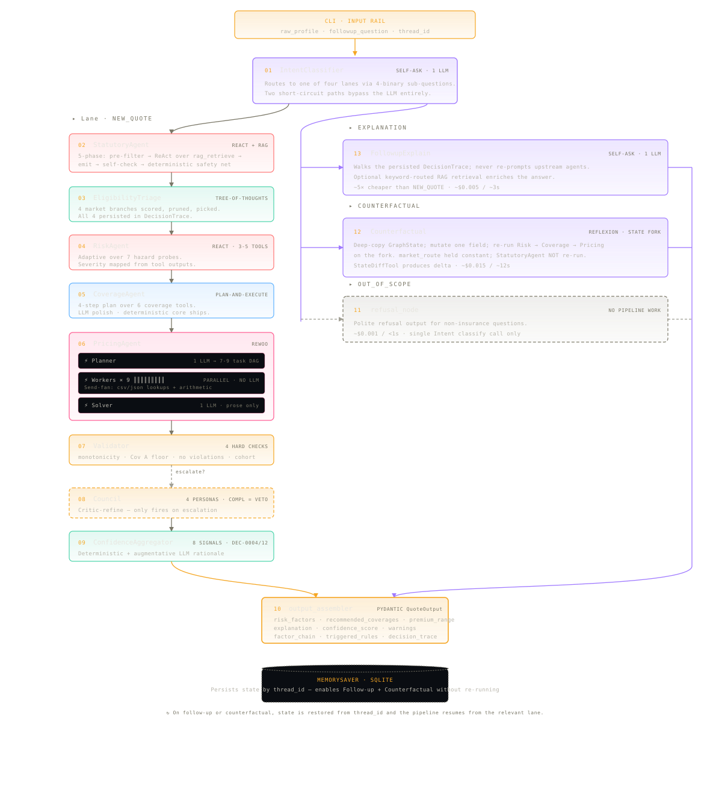

Eight agents on seven distinct cognitive patterns share a small set of deterministic tools. Five clusters (Statutory, Risk, Coverage, Pricing, Validator) own dedicated tools; one tool -- `rag_retrieve` -- is shared between the StatutoryAgent (at quote time) and the Follow-up Agent (at follow-up time).

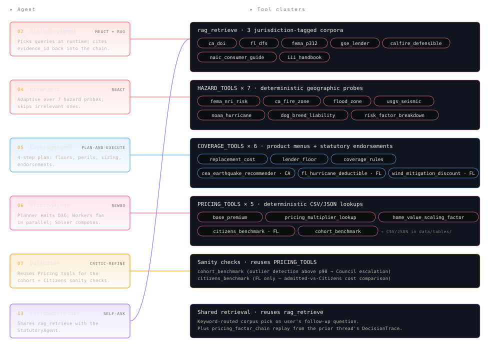

From here, three sections drill in: [Section 10 Pipeline walk-through](#10-pipeline-walk-through) follows a quote step-by-step; [Section 11 Agents](#11-agents) dissects each of the 11 agents with its worked-example figure inline; [Section 12 Tools (22 tools)](#12-tools-22-tools) does the same for every tool, grouped by primary consumer agent.

### Evidence-id naming patterns (audit trail)

| Tool / Agent | Evidence-id pattern | Example |
|---|---|---|
| StatutoryAgent rules | `{JURIS}-{RULE-CODE}` | `CA-PROP103-CREDIT` |
| RAG corpus chunk | `{CORPUS-PREFIX}-{CHUNK-ID}` | `CDI-PROP103-01`, `FLDFS-CREDIT-01` |
| Hazard tools | `{SRC}-{LOC-OR-COUNTY}-{IDX}` | `CALFIRE-FHSZ-LA-001`, `USGS-PGA-LA-001` |
| Coverage tools | `{TYPE}-{RULE-OR-ENDORSE}` | `RCV-CA-001`, `GSE-B7-3-02` |
| `base_premium` | `BENCH-{STATE}-{YEAR}-{SOURCE}` | `BENCH-CA-2026-NEWSWEEK` |
| `pricing_multiplier_lookup` | `MULT-{DIM}-{KEY}` | `MULT-WF-MODERATE`, `MULT-CREDIT-DROPPED-CA-PROP103` |
| `citizens_benchmark` | `CIT-T{TIER}-{COUNTY-FIPS}-{YEAR}` | `CIT-T201-12086-2026` |
| `cohort_benchmark` | `COH-{STATE}-{VALUE-BAND}-{TIER}-{YEAR}` | `COH-CA-750-MOD-2026` |

Every `evidence_id` in the customer-facing factor chain follows one of these patterns. A reviewer can grep any `evidence_id` and trace it to either a row in a documented CSV/JSON or a chunk in a Markdown corpus file.

---

## 3. Prerequisites

| Requirement | Version | Why |
|---|---|---|
| Python | >= 3.11 | Type-hint syntax (`int \| None`), `match` semantics |
| `poetry` | >= 2.0 | Dependency manager (`poetry install`); `pipx install poetry` if needed |
| OpenAI API key | required (default config) | Default LLM provider; set `OPENAI_API_KEY` |
| Anthropic API key | optional | Required only if you swap any role to an `anthropic:*` model |
| LangSmith API key | optional | Set `LANGSMITH_API_KEY` to enable hosted tracing |
| Network access | one-time at install + ingest | Embedding model download, ChromaDB build, optional real-data fetch |

No GPU required. Embeddings run on CPU via `sentence-transformers`.

---

## 4. Quickstart (5-minute path)

```bash
# 1) Clone and install
poetry install

# 2) Configure secrets
cp .env.example .env
# Edit .env: set OPENAI_API_KEY (required for default config)

# 3) Build the RAG corpora into local ChromaDB (one-time, ~30s + model download)
make ingest

# 4) Run the demos
make demo-a                 # Profile A (CA $900K, pool, 1 claim, credit 700)
make demo-b                 # Profile B (FL $450K, no pool, credit null)
make followup-explain       # explanation follow-up on Profile A's thread
make followup-cf            # single-axis counterfactual follow-up
make followup-cf-multi      # multi-axis counterfactual follow-up
```

Expected stdout shape on `make demo-a`:

```json
{
  "risk_factors": [
    { "factor": "Wildfire", "severity": "high", "rationale": "..." },
    { "factor": "Seismic",  "severity": "high", "rationale": "..." },
    { "factor": "Pool liability", "severity": "medium", "rationale": "..." }
  ],
  "recommended_coverages": [
    { "type": "Coverage A - Dwelling", "limit": "1019520", "rationale": "..." },
    { "type": "Endorsement - CEA Earthquake Companion", "limit": "15% deductible", "rationale": "..." }
  ],
  "premium_range": { "low": 9234, "high": 14107, "currency": "USD" },
  "explanation": "Premium composed from: 1.00 (Base premium CA 2026) x ...",
  "confidence_score": 0.78,
  "warnings": ["Council majority verdict (3 of 4 proposers); confidence -0.05."]
}
```

> The block above shows the **shape** of the output (illustrative numbers). For the **real captured outputs** from `make demo-a` and `make demo-b`, see the next subsection.

### 4.1 Demo-run results (real captured outputs)

The two demo profiles produce the captured outputs below. The numbers are real -- pulled verbatim from `docs/demo-runs/runs/`; the JSON is exactly what `python -m quote_advisor.cli` wrote to stdout on a 2026-05-12 run.

| Profile | Premium range | Confidence | Statutory rules fired | Market route | Captured trace |
|---|---|---|---|---|---|
| **A** (CA - $900K - pool - 1 claim - credit 700) | **$4,790 - $7,984** | **0.95** | 6 -- `CA-PROP103-CREDIT`, `CA-AGE-NON-PRIMARY`, `CA-EQ-OFFER`, `CA-COVD-MIN-24MO`, `CA-STDFORM-2071`, `CA-FAIRPLAN-CHECK` | `fair_dic` | [`docs/demo-runs/runs/profile-a-new-quote/`](docs/demo-runs/runs/profile-a-new-quote/) |
| **B** (FL - $450K - no pool - 0 claims - `credit_score: null`) | **$5,850 - $9,750** | **0.95** | 5 -- `FL-CREDIT-NEUTRAL`, `FL-HURRICANE-DEDUCTIBLE`, `FL-CGCC-MANDATORY`, `FL-SINKHOLE-OPTIONAL`, `FL-WIND-MITIGATION` | `citizens` | [`docs/demo-runs/runs/profile-b-new-quote/`](docs/demo-runs/runs/profile-b-new-quote/) |

**Profile B captured `output.json`** -- the marquee FL Sec. 626.9741 null-credit edge case. The credit field is statutorily neutral (`x 1.00`, not penalised); the hurricane deductible options and CGCC endorsement are statutorily-required FL surfacings.

```json
{
  "risk_factors": [
    { "factor": "Flood",         "severity": "high", "rationale": "Property is in flood zone AE (SFHA); high flood risk." },
    { "factor": "Hurricane",     "severity": "high", "rationale": "Miami-Dade has 28 landfalls within 75 mi since 1900, incl. a Cat 5." },
    { "factor": "Overall Hazard","severity": "high", "rationale": "FEMA NRI: very high overall risk for Miami-Dade county." }
  ],
  "recommended_coverages": [
    { "type": "Coverage A - Dwelling",                       "limit": "674016",         "rationale": "max(lender floor, rebuild cost, home value)" },
    { "type": "Coverage E - Personal Liability",             "limit": "300000",         "rationale": "Recommended liability uplift." },
    { "type": "Endorsement - Catastrophic Ground Cover Collapse","limit": "full Coverage A", "rationale": "Mandatory per Fla. Stat. Sec. 627.706." },
    { "type": "Hurricane Deductible Option (2% of Coverage A ($13,480))", "limit": "2% of Coverage A ($13,480)", "rationale": "Statutorily-mandated per Fla. Stat. Sec. 627.701." },
    { "type": "Wind Mitigation Inspection (advisory)",       "limit": "up to 45% wind premium discount", "rationale": "OIR-B1-1802 inspection unlocks the discount." }
  ],
  "premium_range":   { "low": 5849.7, "high": 9749.5, "currency": "USD" },
  "explanation":     "Premium composed from: 1.00 (FL base 2026) x 1.36 (home-value scaling) x 1.00 (claims=0) x 1.00 (credit_score neutral_1.0x). Statutory rules: FL-CREDIT-NEUTRAL, FL-HURRICANE-DEDUCTIBLE, FL-CGCC-MANDATORY, FL-SINKHOLE-OPTIONAL, FL-WIND-MITIGATION.",
  "confidence_score": 0.95,
  "warnings":         []
}
```

**Profile B `--verbose` DecisionTrace + guardrail audit excerpt** -- the first guardrail events plus all 9 decision nodes from the captured `stderr.log`:

```
[GUARDRAIL input_validation] role=- event=fired  reason=credit_score is null; statutory neutral/drop path will apply payload={"field":"credit_score"}
[GUARDRAIL input_validation] role=- event=passed reason=profile validated payload={"warnings_count":1}
DEC-001  IntentClassifier      Initial profile classified as new_quote (first-turn shortcut, no LLM)
DEC-002  StatutoryAgent        ReAct agent fired 5 rule(s) (5 retrieval(s); 0 dropped by self-check)
DEC-003  EligibilityTriage     market_route=citizens: FL Citizens viability vs hurricane tier Very High
DEC-004  RiskAgent             Identified 3 risk factor(s)
DEC-005  CoverageAgent         Plan-and-Execute -> 10 coverage line(s)
DEC-006  PricingPlanner        ReWOO plan emitted with 8 tasks
DEC-007  PricingAgent          Premium range $5,850-$9,750; chain length 4
DEC-008  Validator             Deterministic checks: 0 flag(s); council_invoked=False
DEC-009  ConfidenceAggregator  confidence_overall=0.95 (council_invoked=False)
```

The four follow-up runs (`make followup-explain`, `make followup-cf`, `make followup-cf-multi`) carry the same confidence; the single-axis counterfactual on Profile A returns `Delta = -$513 to -$855 (-10.7%)`. The Profile B counterfactual honestly returns `$0` because B has no pool to remove -- see [`docs/demo-runs/walkthrough_AI_AGENT.html#live-runs`](docs/demo-runs/walkthrough_AI_AGENT.html#live-runs) for the full six-scenario matrix with LangSmith URLs.

---

## 5. Detailed run instructions

### 5.1 CLI flags

```
python -m quote_advisor.cli [OPTIONS]
```

| Flag | Type | Effect |
|---|---|---|
| `--profile PATH` | str | Path to a customer-profile JSON; required for new-quote runs |
| `--followup TEXT` | str | Single follow-up question; routes to explanation / counterfactual / refusal |
| `--thread-id TEXT` | str | Thread identifier for MemorySaver checkpointing; must match across follow-ups |
| `--verbose` | flag | Prints the DecisionTrace + LangSmith trace URL to stderr |
| `--seed INT` | int | Logged seed (informational; chat models do not honour client-side seeds) |
| `--no-rag` | flag | Disable RAG retrieval at the Follow-up agent (offline / smoke mode) |
| `--llm-trace` | flag | Print the resolved per-role provider:model table at startup |

### 5.2 Make targets

| Target | Equivalent command |
|---|---|
| `make sync` | `poetry install` |
| `make ingest` | `python -m quote_advisor.rag.ingest` (builds 3 active RAG corpora into `.chromadb/`) |
| `make demo-a` | Profile A new-quote, thread-id `demo-a` |
| `make demo-b` | Profile B new-quote, thread-id `demo-b` |
| `make followup-explain` | "Why is this quote expensive?" follow-up on `demo-a` |
| `make followup-cf` | "What if I removed the pool?" follow-up on `demo-a` |
| `make followup-cf-multi` | "What if I removed the pool and raised the deductible to $5,000?" |
| `make clean` | Removes `.chromadb/`, `.langgraph/`, `*.sqlite` |

### 5.3 Switching LLMs per agent

Three precedence layers (highest wins):

1. **Env var** -- `export QA_LLM_RISK_AGENT=anthropic:claude-sonnet-4-6`
2. **Local YAML override** -- copy `configs/llm_roles.local.yaml.example` to `configs/llm_roles.local.yaml` and set per-role values (git-ignored)
3. **Committed YAML** -- `configs/llm_roles.yaml` (the defaults you see when checking out)
4. **Hardcoded defaults** -- `DEFAULTS` dict in `src/quote_advisor/llm_registry.py` (lowest)

Run with `--llm-trace` to print the resolved table:

```
python -m quote_advisor.cli --llm-trace --profile examples/profile_a.json --thread-id demo-a
```

### 5.4 Refreshing real data

The bundled tables are seeded from one execution of the fetch script. To pull fresh data from the official sources:

```bash
python data/scripts/fetch_real_data.py                    # all sources
python data/scripts/fetch_real_data.py --only usgs,hurdat # specific subset
python data/scripts/fetch_real_data.py --dry-run          # plan only
```

Fetched files land in `data/api_samples/` (raw) and `data/geo/` (CAL FIRE FHSZ GeoJSON). The curated CSV subsets in `data/tables/` are intentionally hand-maintained.

### 5.5 Enabling / disabling LangSmith

Set in `.env`:

```
LANGSMITH_TRACING=true     # or false to disable
LANGSMITH_API_KEY=ls_...
LANGSMITH_PROJECT=refocusai
```

When enabled, every LLM and Tool call is auto-traced. With `--verbose`, the CLI prints a project URL filtered by `thread_id`.

---

## 6. Project structure

```
refocusai/
+-- src/quote_advisor/
|   +-- graph.py                  # build_graph() + compiled `graph` for langgraph.json
|   +-- state.py                  # TypedDict GraphState (with reducers for parallel append)
|   +-- schemas.py                # Pydantic IO boundary
|   +-- prompts.py                # ALL prompts centralised (auditable)
|   +-- nodes.py                  # statutory_gate, confidence, output_assembler, refusal, routers
|   +-- decision_trace.py         # DecisionNode + DAG walker + evidence resolver
|   +-- statutory_rules_engine.py # legacy pure-Python engine -- kept as the StatutoryAgent's safety-net fallback (Phase 5)
|   +-- confidence.py             # 4-signal weighted aggregator (DEC-0004, v1.0); original 8-signal design deferred -- see Section 18
|   +-- council.py                # 4-persona protocol + weighted-vote aggregator
|   +-- llm_registry.py           # per-agent model resolution (defaults -> yaml -> env)
|   +-- configuration.py          # pydantic-settings + LangSmith bootstrap
|   +-- cli.py                    # typer CLI
|   +-- agents/                   # 8 agents (statutory, eligibility, risk, coverage, pricing planner/worker/solver, validator, council, counterfactual, followup, confidence_explainer, intent_classifier)
|   +-- tools/                    # 22 deterministic tools (Pydantic IO; zero LLM calls inside)
|   +-- rag/                      # ChromaDB ingest + hybrid retriever (BM25 + dense + RRF + reranker)
|   `-- guardrails/               # audit_logger.py, pii_scrubber.py, prompt_injection_sanitizer.py, range_clamp.py, retry_validator.py (+ BudgetedChatModel proxy in llm_registry.py:137-247) -- DEC-0013
+-- data/
|   +-- tables/                   # 14 CSV/JSON sources (see Section 7 External data sources)
|   +-- api_samples/              # cached real fetches (USGS PGA, FEMA NFHL, HURDAT2, III HTML)
|   +-- geo/                      # CAL FIRE FHSZ GeoJSON
|   +-- corpora/                  # 3 active RAG corpora (ca_doi, fl_dfs, gse_lender) + 4 deferred under corpora/deferred/ (calfire_defensible, fema_p312, naic_consumer_guide, iii_handbook)
|   +-- profiles/                 # profile_a.json, profile_b.json
|   +-- scripts/fetch_real_data.py
|   `-- REAL_DATA_PROVENANCE.md
+-- configs/
|   +-- llm_roles.yaml            # committed default per-role model assignments (DEC-0008)
|   +-- llm_roles.local.yaml.example
|   `-- agent_budgets.yaml        # per-role token-budget table; env-overridable via QA_BUDGET_<ROLE>_<FIELD> (DEC-0013)
+-- docs/
|   +-- decisions/                # 8 active DECs (DEC-0001, 0002, 0003, 0004, 0006, 0008, 0011, 0013); 5 deferred under decisions/deferred/
|   +-- demo-runs/                # walkthroughs (HTML + Markdown) + 6 live captured runs (Section 19)
|   |   +-- walkthrough_AI_AGENT.html
|   |   +-- walkthrough.html
|   |   +-- 01-demo-b.md, 02-followup-explain.md, 03-followup-cf.md, 04-followup-cf-multi.md
|   |   `-- runs/                 # INDEX.md + 6 scenario subdirs (output.json, stderr.log, langsmith_url.txt)
|   +-- diagrams/                 # 17 standalone SVG figures + _MANIFEST.md (referenced inline throughout this README; gallery index at Sec. 20)
|   `-- TELEMETRY_SCHEMA.md
+-- tests/
|   +-- unit_tests/               # incl. test_statutory_rules_engine.py (14 rules x 2 profiles), test_audit_logger.py, test_budget_enforcer.py, test_budget_registry.py, test_confidence.py, ...
|   +-- integration_tests/        # incl. test_guardrail_audit_in_decision_trace.py (end-to-end CLI subprocess)
|   `-- verify_replacements.py    # 9-check regression harness (grounding, trace compounding, placeholder cleanliness)
+-- examples/                     # profile_a.json, profile_b.json
+-- .env.example
+-- langgraph.json                # registers `quote_advisor` + `indexer`
+-- Makefile
+-- pyproject.toml
`-- README.md
```

---

## 7. External data sources

Every external source the v1.0 system **actively uses**, what we fetch, what we extract, and where it lands. The four deferred-corpus backing sources (CAL FIRE Defensible Space, FEMA P-312, NAIC Consumer Guide, III Handbook) are intentionally **not** in this section -- they're documented under [Section 18 Future Enhancements](#18-future-enhancements) so the active surface stays honest about what the v1.0 graph actually queries.

| # | Source | URL | What we fetch | What we use it for | Where it lands |
|---|---|---|---|---|---|
| 1 | USGS Design Maps (ASCE 7-22) | `https://earthquake.usgs.gov/ws/designmaps/asce7-22.json` | Live JSON: PGA, Sds, Sd1 per lat/lon | Seismic peril tier classification (Very High >= 0.6g, High >= 0.4g, Moderate >= 0.2g, Low < 0.2g) | `data/api_samples/usgs_pga_cache.json` (real fetched values: LA 0.93g, SF 0.60g, SD 0.73g, Miami 0.022g, Tampa 0.031g) |
| 2 | NOAA HURDAT2 Atlantic best track | `https://www.nhc.noaa.gov/data/hurdat/hurdat2-1851-2025-02272026.txt` | Raw text file, 1851-2025 storm tracks (~6.8 MB) | Per-county hurricane landfall counts within 75 mi since 1900 | `data/tables/hurricane_exposure_tiers.csv` (aggregated; raw 1851-2025 storm tracks are saved once at fetch time as `data/api_samples/hurdat2_raw.txt` for provenance and not re-read at runtime) |
| 3 | FEMA National Risk Index (county) | `https://hazards.fema.gov/nri/Content/StaticDocuments/DataDownload/NRI_Table_Counties.csv` | Full county-level CSV | County-level overall_score, EAL by peril | `data/tables/fema_nri_counties.csv` (curated subset; live fetch lands a full snapshot at `data/api_samples/fema_nri_counties_full.csv` for provenance, not re-read at runtime). **Synthetic fallback** (8-row curated snapshot anchored on real published scores) when live fetch fails. |
| 4 | FEMA NFHL ArcGIS REST | `https://hazards.fema.gov/gis/nfhl/rest/services/public/NFHL/MapServer/identify` | Per lat/lon JSON: flood zone, BFE, panel ID | Special Flood Hazard Area (SFHA) membership; NFIP mandatory determination | `data/api_samples/fema_nfhl_cache.json`. **Synthetic fallback** (9 seed-location entries with real FIRM panel IDs / BFEs) when live fetch fails. |
| 5 | Citizens (FL) rate filing | `https://www.citizensfla.com/rate-information` | HTML / PDF filing summary | Actuarial benchmark per $1000 of Coverage A by hurricane tier x coastal-distance band | `data/tables/citizens_2026_rate_filing.csv` (curated; raw HTML at `data/api_samples/citizens_rate_information_raw.html` saved once at fetch time, not re-read at runtime) |
| 6 | NAIC homeowners premium baseline (via III) | `https://www.iii.org/fact-statistic/facts-statistics-homeowners-and-renters-insurance` | HTML page | State-level annual averages; CA $1,492 / FL $2,677 anchored at NAIC 2022 | `data/tables/pricing_benchmarks_2025_2026.csv` (rows tagged `source=NAIC 2022`; raw HTML at `data/api_samples/iii_homeowners_premiums_raw.html` saved once at fetch time, not re-read at runtime) |
| 7 | Bankrate 2025 homeowners study | `https://www.bankrate.com/insurance/homeowners-insurance/states/` | Article + state breakdown | Refreshed 2025 base premium per state; 2026 projection trended via Bankrate's 32% CA / 16% FL YoY rate of change | `data/tables/pricing_benchmarks_2025_2026.csv` (rows tagged `source=Bankrate 2025` and `source=projected 2026`). Real 2025 figures; 2026 row is calibrated synthesis. |
| 8 | California DOI guidance | linked DOI bulletins | Prop 103, FAIR Plan, Cov D minimums | Statutory citations for CA flow | RAG corpus `data/corpora/ca_doi/` |
| 9 | Florida DFS toolkit | linked DFS guides | Sec. 626.9741, Sec. 627.701, Sec. 627.706 | Statutory citations for FL flow | RAG corpus `data/corpora/fl_dfs/` |
| 10 | Fannie Mae Selling Guide (B7-3-02) + Freddie Mac Sec. 4703.2 | downloadable lender-rules sections | Property-insurance floor: `coverage_a >= min(replacement_cost, unpaid_principal_balance)`; NFIP-mandatory wording | StatutoryAgent's `GSE-COV-A-FLOOR` and `NFIP-MANDATORY` rule grounding | RAG corpus `data/corpora/gse_lender/` |
| 11 | Cal. Code Regs. / Cal. Ins. Code | statute text (CA Prop 103, Sec. 10081, Sec. 2071, Sec. 2051.5) | Statute citations | Hardcoded into `data/tables/statutory_rules.json` (CA-PROP103-CREDIT, CA-EQ-OFFER, ...) | `data/tables/statutory_rules.json` |
| 12 | Fla. Stat. (Sec. 626.9741, Sec. 627.701, Sec. 627.706) | statute text | Statute citations | Hardcoded into `data/tables/statutory_rules.json` (FL-CREDIT-NEUTRAL, FL-HURRICANE-DEDUCTIBLE, ...) | `data/tables/statutory_rules.json` |
| 13 | Fannie Mae / Freddie Mac / FDPA 1973 | Selling-Guide refs (B7-3-02, Sec. 4703.2, 42 USC Sec. 4012a) | Lender-floor + NFIP rules | `data/tables/lender_minimums.json` | `data/tables/lender_minimums.json` |
| 14 | Florida OIR Form OIR-B1-1802 | OIR form spec | Wind-mitigation discount table | `data/tables/fl_wind_mitigation_form.json` | `data/tables/fl_wind_mitigation_form.json` |
| 15 | CEA Choice Companion 2025 | CEA program rules | Earthquake deductible options + premium factors | `data/tables/cea_deductible_rules.json` | `data/tables/cea_deductible_rules.json` |

> **Raw fetcher snapshots under `data/api_samples/` are written once at seed time** by `data/scripts/fetch_real_data.py` and kept for audit provenance. No live code path re-reads them at quote time; the curated CSV/JSON in `data/tables/` is what every tool actually consumes. The full CAL FIRE FHSZ GeoJSON polygon set at `data/geo/calfire_fhsz.geojson` is in the same category -- shipped for future polygon-in-polygon lookup but not currently read; see [Section 18 Future Enhancements](#18-future-enhancements).

For deeper provenance details (which tables are real-fetched vs. synthetic-but-calibrated), see [`data/REAL_DATA_PROVENANCE.md`](data/REAL_DATA_PROVENANCE.md).

---

## 8. The RAG pipeline (deep dive)

### 8.1 What `make ingest` does, step by step

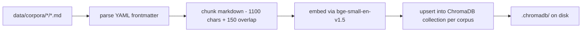

1. **Walk** the three active corpus directories under `data/corpora/`:
   - `ca_doi/` (CA, mandatory filter)
   - `fl_dfs/` (FL, mandatory filter)
   - `gse_lender/` (national, mortgage floor)

   Four additional corpora (`naic_consumer_guide`, `iii_handbook`, `fema_p312`, `calfire_defensible`) live under `data/corpora/deferred/` and are not indexed in v1.0 -- see Sec. 18 Future Enhancements.
2. **Parse YAML frontmatter** at the top of each `.md` file:
   ```yaml
   ---
   corpus: ca_doi
   jurisdiction: CA
   evidence_id: CDI-PROP103-01
   source_url: https://www.insurance.ca.gov/...
   title: California DOI - Proposition 103 Overview
   ---
   ```
3. **Chunk** the markdown body into ~1100-character paragraph windows with 150-character overlap (in `rag/ingest.py:chunk_markdown`).
4. **Embed** each chunk via HuggingFace `BAAI/bge-small-en-v1.5` (384-dim, normalised).
5. **Upsert** documents + metadata + auto-generated IDs (`{corpus}::{filename}::{chunk_idx}`) into the ChromaDB collection named after the corpus.
6. **Persist** to `.chromadb/` on disk via the langchain-chroma persistent client.

### 8.2 The 3 active corpora

The three corpora that ship indexed in v1.0 are the minimum surface the StatutoryAgent needs to ground every rule it can emit. Each one earns its place on the gate path of at least one demo profile.

| # | Corpus | Jurisdiction | Files / chunks | What it grounds | When it lands in retrieval |
|---|---|---|---|---|---|
| 1 | `ca_doi` | CA | 4 files / 12 chunks | CA Prop 103 (no credit), FAIR Plan, Cov D minimum 24 mo (Sec. 2051.5), CA Std Form CP-10 (Sec. 2071) | Every CA flow's StatutoryAgent ReAct loop; CA-specific follow-up questions. |
| 2 | `fl_dfs` | FL | 4 files / 13 chunks | Sec. 626.9741 credit-neutral, Sec. 627.701 four-tier hurricane deductible, Sec. 627.706 CGCC / sinkhole, OIR-B1-1802 wind-mitigation discounts | Every FL flow's StatutoryAgent ReAct loop; the marquee `credit_score: null` neutral-1.0x path. |
| 3 | `gse_lender` | national | 1 file / 3 chunks | Fannie Mae Selling Guide B7-3-02 mortgage property-insurance floor; Freddie Mac Sec. 4703.2; NFIP-MANDATORY short-circuit when SFHA + mortgaged | Any mortgaged profile (CA or FL); GSE-COV-A-FLOOR and NFIP-MANDATORY rule grounding. |

The four deferred corpora (`naic_consumer_guide`, `iii_handbook`, `fema_p312`, `calfire_defensible`) live under `data/corpora/deferred/` and are not indexed in v1.0 -- see [Section 18 Future Enhancements](#18-future-enhancements) for the re-activation criteria.

### 8.3 The ingest pipeline in detail

The ingest pipeline is **offline**. It runs once at install time and then re-runs only when a corpus markdown file is added or edited. Nothing in the live quote graph re-indexes -- the StatutoryAgent's ReAct loop and the Follow-up agent's keyword-routed retrieval both expect the ChromaDB store to already exist on disk. The whole pipeline lives in `src/quote_advisor/rag/ingest.py` and `src/quote_advisor/rag/store.py`; the driver is exposed as `make ingest` and registered in `langgraph.json` as the `indexer` graph.

Step by step, every markdown file under `data/corpora/{ca_doi,fl_dfs,gse_lender}/` flows through five deterministic stages:

1. **Discover.** Walk the three active corpus directories. (Anything under `data/corpora/deferred/` is intentionally skipped -- see [Section 18](#18-future-enhancements).)
2. **Parse frontmatter.** A 13-line YAML reader pulls `corpus`, `jurisdiction`, `evidence_id`, `source_url`, and `title` from each file's top block. No external `pyyaml` dependency.
3. **Chunk.** `chunk_markdown` splits the body on blank lines, packing paragraphs into ~1100-character windows with a 150-character tail overlap (so a statute clause never breaks across two chunks).
4. **Embed.** Each chunk is encoded with `BAAI/bge-small-en-v1.5` (384 dims, normalised). The model is loaded once via an LRU-cached singleton and runs on CPU.
5. **Upsert.** Chunks are added to a per-corpus ChromaDB collection with metadata `{corpus, jurisdiction, evidence_id, source_url, filename, chunk_idx}`. The ID is `{corpus}::{filename}::{chunk_idx}`, so re-running on edited content overwrites the embedding in place.

A sequence-style view of the pipeline:

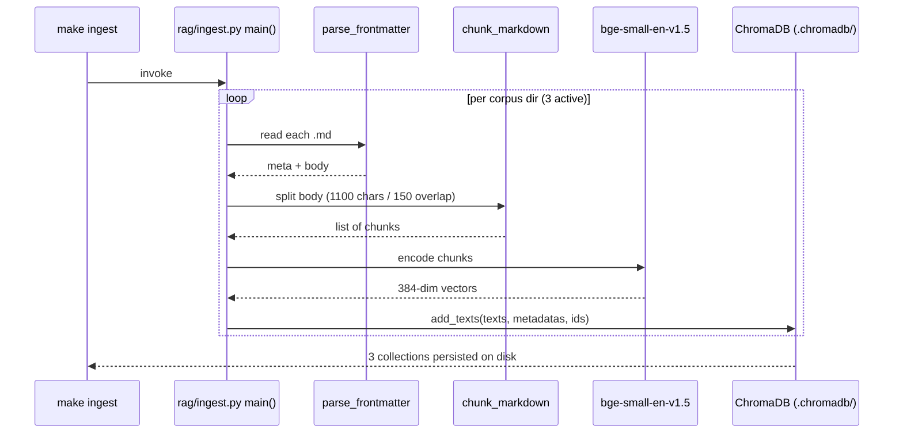

**Design trade-off, honestly stated.** The retriever's docstring describes "hybrid (BM25 + dense + RRF + reranker)" retrieval. v1.0 actually ships **dense-only** -- the jurisdiction-tagged corpora are small enough that the cross-encoder reranker is not worth the extra cost yet. Adding the BM25 leg and the reranker is part of the v1.1 work tracked under [Section 18 Future Enhancements](#18-future-enhancements).

**What changes when you edit a chunk.** Edit the markdown, re-run `make ingest`. Existing chunk IDs are overwritten (upsert semantics); orphan IDs from deleted or renamed files are not reaped. Run `make clean` if you need a fully fresh `.chromadb/` -- see [Section 8.6](#86-refreshing-a-single-corpus).

### 8.4 Mandatory jurisdiction filter and the grounding chain

Cross-jurisdictional contamination (a CA flow citing FL Sec. 627.701, or vice versa) is the highest-risk RAG failure mode. The retriever (`rag/retriever.py:rag_retrieve`) requires `jurisdiction` as a non-default argument; if it does not match the corpus's tagged jurisdiction, it returns an **empty list** rather than silently leaking. This is enforced in code, not via prompt.

**The grounding chain.** Every emitted `evidence_id` is required to trace, through the DecisionTrace DAG, back to a real ChromaDB chunk -> a real markdown file -> the frontmatter's `source_url` -> a public regulator or statute URL. The StatutoryAgent's Phase 4 self-check enforces this: it compares the rules the LLM emitted against the chunks the retriever actually returned, and if the un-grounded share exceeds **50%**, the LLM output is discarded and the deterministic Phase-5 safety net (`statutory_rules_engine.apply`) runs. A `[FALLBACK]` audit node is appended to the trace so the regulator can see why the safety net fired. The grounding chain is the difference between "the model said so" and "the statute says so, and here's the URL."

### 8.5 Who queries the retriever

Two callers reach `rag_retrieve` at runtime, and they pick their queries differently:

- **StatutoryAgent (quote time).** A ReAct loop -- the LLM decides the next query string based on what it's already learned, capped at 8 iterations. Queries look like "California Proposition 103 credit score prohibition" or "Florida 626.9741(7) consumer credit neutral".
- **Follow-up Agent (follow-up time).** A keyword-based corpus picker that maps the customer's question to the relevant corpus before retrieving. This avoids spinning the LLM through a full ReAct loop for questions whose corpus is obvious from a few keywords ("flood", "hurricane deductible", "CEA").

Both callers carry the `jurisdiction` argument forward to the retriever, so the mandatory-filter rule (Section 8.4) applies to either path.

### 8.6 Refreshing a single corpus

Edit the markdown chunks in `data/corpora/{corpus_name}/`, then re-run `make ingest`. Existing IDs are upserted; orphan IDs are not deleted (so renaming a file leaves stale chunks until you `make clean`).

---

## 9. Memory architecture (6 tiers)

Six distinct memory types live in this system, each with different persistence, scope, and access pattern.

| Tier | Type | Storage | Scope | Lifespan | Access pattern |
|---|---|---|---|---|---|
| 1 | **Working** | `GraphState` TypedDict (RAM) | Single graph run | Lost on run end | Direct read/write, accumulating fields use `operator.add` reducers |
| 2 | **Episodic** | `DecisionTrace` DAG + `messages` (SQLite via MemorySaver) | Single thread (`thread_id`) | Until thread deleted | Append-only DAG; `decision_trace.py` walker |
| 3 | **Semantic** | ChromaDB vector store, 3 active corpora (4 deferred -- see [Section 18](#18-future-enhancements)) | Global, persistent | Until cleared | Hybrid retrieval (`rag_retrieve`), jurisdiction-filtered |
| 4 | **Procedural** | JSON / CSV / Python modules | Global | Static (changes via deploy) | Direct lookup (data tables, statutory rules JSON, prompt library) |
| 5 | **Reflexion** | Verbal traces in `counterfactual_reflexion_memory` field of GraphState (persisted via MemorySaver) | Per-thread, per-agent | Until thread deleted | Inject into Counterfactual agent's next prompt |
| 6 | **Long-term** | `MemorySaver` SQLite at `.langgraph/checkpoints.sqlite` | Cross-session per `thread_id` | Until cleared | Resume via `--thread-id` |

Persistence flow:

```
Single run:        Working memory (RAM, GraphState)  ->  on graph yield  ->  MemorySaver SQLite (Episodic + Reflexion + Long-term)
Reflexion event:   Counterfactual node appends to counterfactual_reflexion_memory  ->  carried forward on next turn in same thread
RAG retrieval:     Semantic (ChromaDB) -> injected into Working memory at Follow-up time
Procedural:        Tools / SRE / prompts read at agent invocation; never written
```

---

## 10. Pipeline walk-through

Every quote follows the same directed graph -- the agent-pipeline diagram is [Figure 01](docs/diagrams/01-figure-01.svg) embedded in [Section 2 Architecture at a glance](#2-architecture-at-a-glance). This section narrates the flow step by step; the per-agent detail (inputs, outputs, cognitive pattern, worked example) lives in [Section 11](#11-agents). The captured 2026-05-12 numbers for both demo profiles -- Profile A $4,790-$7,984 (conf 0.95) and Profile B $5,850-$9,750 (conf 0.95) -- are reproduced in [Section 19 Live runs](#19-live-runs).

### Step 0 -- Input intake

**Pattern:** Pure-Python boundary · **LLM seat:** none · **Decisions:** [DEC-0002](docs/decisions/0002-typeddict-graph-state-pydantic-io.md)

#### What it does

The CLI (`cli.py:run`) reads the customer-profile JSON, hands it to Pydantic via `CustomerProfile.model_validate(raw_profile).with_derived_state()`, and populates `InputState`. The boundary validation is DEC-0002: catch malformed input here so no downstream node has to defend against bad shapes. Two-letter state codes (and a handful of synonyms like `"California"`) are normalised in the same call; a `ValidationError` raised here aborts the run before any graph node fires.

#### Inputs / Validation / Outputs

| Inputs | Validation | Outputs |
| --- | --- | --- |
| `--profile path/to.json` (CLI flag) | Strict Pydantic type-check on every field; unknown keys rejected | `InputState` populated and seeded for the graph |
| Optional `--followup TEXT`, `--thread-id ID` | `with_derived_state()` normalises `location` -> 2-letter `state_code`; resolves missing `lat`/`lon` to state defaults (LA for CA, Miami for FL) | Two-letter `state_code`; state-default lat/lon when absent |
| Optional `--no-rag`, `--verbose`, `--seed`, `--llm-trace` | Raises `ValidationError` on malformed input (abort before graph fires) | All required-or-statutorily-optional fields enforced by `CustomerProfile` |

### Step 1 -- Intent classification

**Pattern:** Self-Ask · **LLM seat:** `INTENT_CLASSIFIER` (default `openai:gpt-4o-mini`) · **Decisions:** [DEC-0006](docs/decisions/0006-intent-classifier-node.md)

#### What it does

The receptionist at the front door. Reads the customer's request (or its absence) and labels it `new_quote` / `explanation` / `counterfactual` / `out_of_scope`. The Self-Ask prompt forces four ordered binary sub-questions in writing -- "is this about insurance at all?", "does it reference a prior quote?", and so on -- so a reviewer can audit the decision in the trace.

The chosen label drives the conditional edge in `graph.py:route_intent`. A first-turn shortcut bypasses the LLM entirely when a fresh profile arrives with no follow-up text -- the most common new-quote entry case, saving roughly $0.0002 and 0.5 s per call.

#### Inputs / Tools / Outputs

| Inputs | Tools / Mechanism | Outputs |
| --- | --- | --- |
| `raw_profile` (Customer profile JSON or `None`) | One structured-output LLM call against `IntentResult` | `intent` in {new_quote, explanation, counterfactual, out_of_scope} |
| `followup_question` (the follow-up text or `None`) | Bypass 1: profile present + no follow-up -> `NEW_QUOTE` (LLM not called) | `mutation_axes[]` for counterfactual -- `{field, new_value}` pairs |
| `thread_id` (for resuming a prior session) | Bypass 2: no profile + no follow-up -> `OUT_OF_SCOPE` (LLM not called) | `_reset_trace` -- `True` when starting fresh on a prior thread |

#### Worked example -- Profile A, no follow-up question

Profile A arrives with no follow-up question. The bypass condition fires (`raw_profile` present AND `followup_question` is `None`), so `intent = NEW_QUOTE` is written to GraphState without an LLM call. The Self-Ask 4-binary decomposition is **not** invoked. Net saving: ~$0.0002 and ~0.5 s on the most common entry case. `decision_trace[0]` records `DEC-001 IntentClassifier`; `_reset_trace = True` on a fresh thread. **Figure 06** traces the short-circuit path from CLI input to GraphState write:

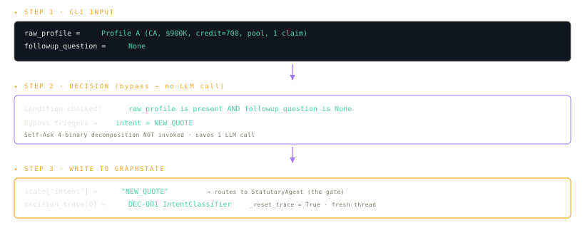

<details>
<summary>Verbatim system prompt -- INTENT_CLASSIFIER (prompts.py:15-30)</summary>

```text
You are the Intent Classifier for an insurance quote advisor.
Your only job is to label the user's input as exactly one of:
  - new_quote        : the user wants a fresh quote based on a profile
  - explanation      : the user wants to understand a previously-issued quote
  - counterfactual   : the user wants to see how the quote would change if a profile field changed
  - out_of_scope     : the user is asking something unrelated to insurance

Use Self-Ask decomposition. Answer these binary sub-questions in order:
1. Is the input a question about insurance at all?  (no -> out_of_scope)
2. Does the input reference a prior quote in this thread?  (no -> new_quote)
3. Is it asking 'why' or 'how' about the quote?  (yes -> explanation)
4. Is it asking 'what if' or proposing a hypothetical change?  (yes -> counterfactual)

If the user is asking about a hypothetical change, also extract the proposed mutations as a list of {{field, new_value}} pairs (e.g., has_pool=False, deductible=5000). When uncertain, prefer counterfactual over explanation.

Return strictly the structured output schema; do not narrate.
```

</details>

### Step 2 -- Statutory gate

The marquee jurisdictional split runs here: same field (`credit_score`), opposite laws, identical schema downstream. Profile A's 700 credit score is dropped before any pricing-relevant code sees it (CA Prop 103); Profile B's `null` credit is labelled `neutral_1.0x` (FL Sec. 626.9741(7)).

**Pattern:** ReAct + RAG · **LLM seat:** `STATUTORY_AGENT` (default `openai:gpt-4o`) · **Decisions:** [DEC-0011](docs/decisions/0011-llm-statutory-agent-supersedes-rules-engine.md) (supersedes deferred DEC-0005)

#### What it does

This is the agent that knows the law. Before any pricing happens, the StatutoryAgent reads the profile, decides which statutes apply (CA Prop 103 for CA customers, FL Sec. 626.9741 / Sec. 627.701 / Sec. 627.706 for FL customers, Fannie Mae B7-3-02 for mortgaged homes, NFIP for SFHA-zone homes), retrieves the actual statute text from a per-jurisdiction RAG corpus, and emits structured "rule fired" records with citations.

The pattern is **ReAct + RAG with a deterministic safety net** (DEC-0011). The LLM runs a 3-8 iteration reasoning loop where it picks RAG queries based on the profile. Every emitted rule must cite an `evidence_id` that came back from an actual retrieval (Phase 4 self-check). If anything fails -- bad LLM output, low grounding, RAG outage -- the legacy hardcoded engine fires as Phase 5 fallback so the pipeline never ships malformed statutory output.

#### The 5-phase pipeline (per DEC-0011)

| Phase | What it does | Fails over to |
| --- | --- | --- |
| 1. Pre-filter | Validate profile, normalise state ('California' -> 'CA'), short-circuit `STATE-SUPPORTED` for non-CA/FL | Skip ReAct entirely if out of jurisdiction |
| 2. ReAct loop | `create_react_agent` with `rag_retrieve` as the only tool. LLM picks queries; runs 3-8 iterations | Phase 5 safety net on exception |
| 3. Structured emission | Second LLM call with `with_structured_output` coerces narrative -> typed schema | Phase 5 on validation error |
| 4. Self-check | Every emitted `evidence_id` must be in the retrieved-chunks set. Drop unmatched rules | Phase 5 if > 50 % dropped |
| 5. Safety net | Legacy deterministic engine fires; same 8-field shape; `[FALLBACK]` audit node prepended | -- |

#### Inputs / Tool / Outputs (8 fields)

| Inputs | Tool | Outputs |
| --- | --- | --- |
| `raw_profile` (state, credit_score, has_mortgage, in_sfha, ...) | `rag_retrieve(query, corpus, jurisdiction, top_k=3)` -- the only tool | `sanitized_profile` (post-treatment) |
| 3 active jurisdiction-tagged RAG corpora (`ca_doi`, `fl_dfs`, `gse_lender`) | Jurisdiction guard hard-blocked at `retriever.py:62-69` | `triggered_rules[]` -- structured RuleFire records |
|  | Loop cap: ~8 iterations max | `field_treatments` -- compliance labels (`neutral_1.0x`, `dropped_by_*`) |
|  |  | `required_offers` (CEA earthquake, hurricane deductible, etc.) |
|  |  | `required_coverages` (CGCC, NFIP flood) |
|  |  | `floors` (Cov A floor, loss-of-use minimum) |
|  |  | `market_route_hints` (FAIR Plan check, informational) |
|  |  | `statutory_violations` (should be empty) |

#### Worked example -- Profile A (CA, $900K, credit 700, pool, 1 claim)

**Figure 07** walks the 5 phases for Profile A's run -- six ReAct iterations against `ca_doi`, six rules emitted at the structured-emission step, zero rules dropped at the self-check, and the deterministic safety net never invoked:

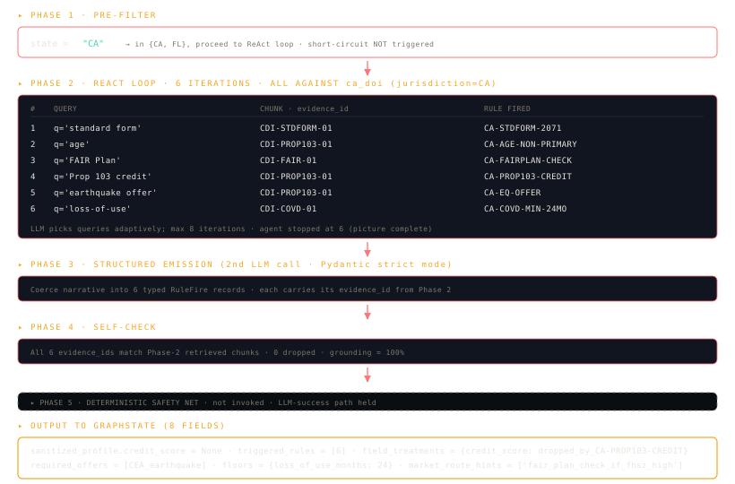

The 5-phase pipeline runs over `ca_doi` (jurisdiction='CA'): 6 ReAct iterations issuing 6 RAG retrievals; 6 rules emitted (`CA-PROP103-CREDIT`, `CA-AGE-NON-PRIMARY`, `CA-EQ-OFFER`, `CA-COVD-MIN-24MO`, `CA-STDFORM-2071`, `CA-FAIRPLAN-CHECK`); 0 dropped at the Phase-4 self-check; Phase-5 safety net NOT invoked. Downstream `field_treatments` carries `credit_score: dropped_by_CA-PROP103-CREDIT`; `floors: {loss_of_use_months: 24}`; `market_route_hints: ['fair_plan_check_if_fhsz_high']`.

**Figure 04** zooms in on the credit field's journey through that pipeline -- the raw 700 is dropped at Step 4 before any pricing-relevant code sees it, and the 1.00x multiplier the customer eventually sees in the factor chain carries the Prop 103 evidence_id back to the statutory ground truth:

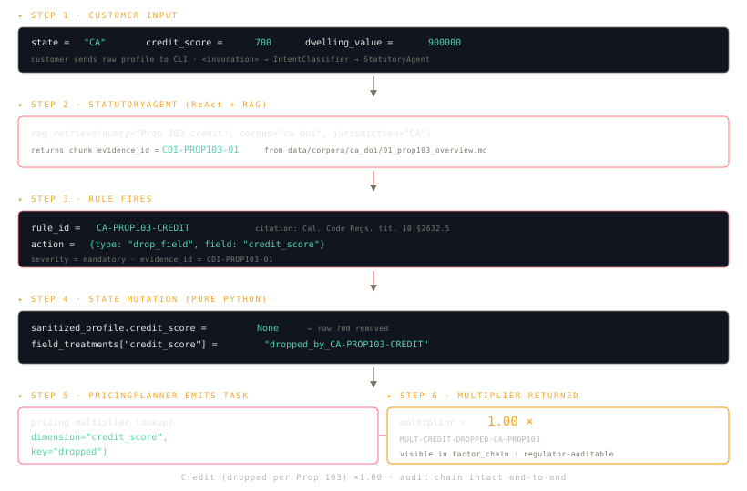

For Profile B (FL, null credit), 5 rules fire against `fl_dfs`: `FL-CREDIT-NEUTRAL`, `FL-HURRICANE-DEDUCTIBLE`, `FL-CGCC-MANDATORY`, `FL-SINKHOLE-OPTIONAL`, `FL-WIND-MITIGATION`. The neutral-1.0x credit label persists into Pricing. **Figure 05** shows Profile B running the same pipeline -- the null value is preserved but labelled neutral, statutorily required by Sec. 626.9741(7):

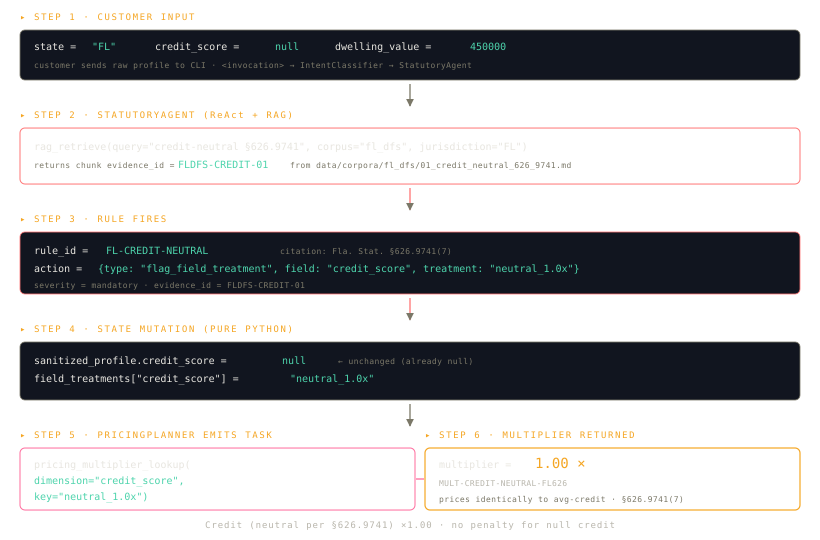

Statute updates become corpus updates (drop a markdown chunk under `data/corpora/<jurisdiction>/`, run `make ingest`), not code changes -- and the deterministic safety net guarantees the pipeline never ships malformed statutory output.

<details>
<summary>Verbatim system prompt -- STATUTORY_AGENT (prompts.py:237-338)</summary>

```text
You are the Statutory Agent. You replace a hardcoded rules engine.
Your job: read the customer profile, retrieve relevant statute/regulator chunks from RAG, and
emit a structured list of triggered_rules that apply to this profile.

You have ONE tool: rag_retrieve(query, corpus, jurisdiction, top_k=3).
Available corpora and their jurisdiction tags (v1.0 — 3 active):
  - ca_doi     (CA)         California Dept of Insurance — Prop 103, FAIR Plan, §2051.5, §2071
  - fl_dfs     (FL)         Florida DFS — §626.9741 credit, §627.701 hurricane, §627.706 CGCC,
                            OIR-B1-1802 wind mitigation
  - gse_lender (national)   Fannie Mae Selling Guide B7-3-02 (mortgage property-insurance floor)

Four additional corpora (fema_p312, calfire_defensible, naic_consumer_guide,
iii_handbook) are deferred to v1.1 and are NOT available — do not attempt to
retrieve from them. See README §17.

Cross-jurisdictional retrieval is HARD-BLOCKED. Querying ca_doi with jurisdiction='FL' returns [].

Routing rules (apply ALL that match the profile):
  - state == 'CA'                         → query ca_doi (jurisdiction='CA') for: Prop 103 credit,
                                            age, earthquake offer, loss-of-use, standard form,
                                            FAIR Plan
  - state == 'FL'                         → query fl_dfs (jurisdiction='FL') for: credit-neutral
                                            §626.9741, hurricane deductible §627.701, CGCC §627.706,
                                            sinkhole §627.706(2), wind mitigation OIR-B1-1802
  - has_mortgage == true                  → query gse_lender (jurisdiction='national') for B7-3-02
  - in_sfha == true AND has_mortgage      → also note NFIP-MANDATORY (national; cite NFIP statute
                                            even without a corpus chunk — it's well-established law)

SHORT-CIRCUIT (deterministic, do not run ReAct loop):
  - state ∉ {'CA', 'FL'}  → emit ONE rule: rule_id='STATE-SUPPORTED', jurisdiction='*',
                            citation='Product scope: California and Florida only',
                            evidence_id='RULE-STATE-SUPPORTED', severity='advisory',
                            action.type='route_market', action.route_hint='informational_out_of_jurisdiction'.
                            Skip retrieval entirely.

For each retrieved chunk, decide whether the rule it describes applies to THIS profile.
Then emit a triggered_rule with these fields (all required):
  - rule_id          (e.g., 'CA-PROP103-CREDIT', 'FL-CREDIT-NEUTRAL', 'GSE-COV-A-FLOOR')
  - jurisdiction     ('CA' | 'FL' | '*')
  - citation         (e.g., 'Cal. Code Regs. tit. 10, §2632.5 (Prop 103)')
  - evidence_id      (the corpus chunk's evidence_id you retrieved — REQUIRED, must come from RAG)
  - severity         ('mandatory' | 'advisory')
  - rationale        (1-2 sentence plain-English explanation)
  - action           (one of 7 types — see ACTION REFERENCE below)

ACTION REFERENCE (use these exact strings):
  - drop_field            {type, field}                          # remove field from sanitized_profile
  - flag_field_treatment  {type, field, treatment}               # treatment is a label like 'neutral_1.0x'
                                                                  # or 'non_primary_only'
  - require_offer         {type, offer, options?, form?}         # offer is a label string
  - require_coverage      {type, coverage}                       # coverage is a label string
  - require_form          {type, form}                           # form is a form id string
  - set_floor             {type, field, value? OR value_rule?}   # numeric floor or rule expression
  - route_market          {type, route_hint}                     # route_hint is a label string

CRITICAL field_treatments label strings (Pricing Agent keys on these exact values):
  - 'neutral_1.0x'                       (FL no-credit per §626.9741)
  - 'non_primary_only'                   (CA age per Prop 103 §1861.02)
  - 'dropped_by_CA-PROP103-CREDIT'       (CA credit dropped per Prop 103 §2632.5)
    (NOTE: For drop_field actions, the Python layer auto-populates field_treatments
    with the 'dropped_by_<rule_id>' label — you only need to emit the drop_field action.)

REQUIRED LABEL STRINGS for action parameters (downstream agents key on these EXACTLY):

  require_coverage.coverage values:
    - 'catastrophic_ground_cover_collapse'    (FL §627.706)
    - 'flood_nfip_or_private_equivalent'      (NFIP-MANDATORY when in_sfha + has_mortgage)

  require_offer.offer values + their options/form parameters:
    - offer='CEA_earthquake', form='CEA'                                (CA §10081)
    - offer='hurricane_deductible_options', options=['$500','2%','5%','10%']   (FL §627.701)
    - offer='sinkhole_endorsement', with_rejection_notice=true          (FL §627.706(2))
    - offer='wind_mitigation_inspection', form='OIR-B1-1802'            (FL OIR-B1-1802)

  require_form.form values:
    - 'CA-Standard-Form-Fire'              (CA §2071)

  set_floor.field + value/value_rule:
    - field='loss_of_use_months', value=24                              (CA §2051.5)
    - field='coverage_a', value_rule='min(replacement_cost, unpaid_principal_balance)' (GSE B7-3-02)

  route_market.route_hint values:
    - 'fair_plan_check_if_fhsz_high'       (CA FAIR Plan)
    - 'informational_out_of_jurisdiction'  (STATE-SUPPORTED short-circuit)

KNOWN RULE_IDS (always use these exact strings when applicable):
  CA-PROP103-CREDIT · CA-AGE-NON-PRIMARY · CA-EQ-OFFER · CA-COVD-MIN-24MO · CA-STDFORM-2071 ·
  CA-FAIRPLAN-CHECK · FL-CREDIT-NEUTRAL · FL-HURRICANE-DEDUCTIBLE · FL-CGCC-MANDATORY ·
  FL-SINKHOLE-OPTIONAL · FL-WIND-MITIGATION · GSE-COV-A-FLOOR · NFIP-MANDATORY · STATE-SUPPORTED

EXAMPLE — Profile B (FL · null credit · $450K · no mortgage):
  Expected rules: FL-CREDIT-NEUTRAL, FL-HURRICANE-DEDUCTIBLE, FL-CGCC-MANDATORY,
                  FL-SINKHOLE-OPTIONAL, FL-WIND-MITIGATION
  (No GSE rule — has_mortgage is false. No NFIP rule — has_mortgage is false.)

EXAMPLE — Profile A (CA · credit 700 · $900K · pool · 1 claim):
  Expected rules: CA-PROP103-CREDIT (drops credit_score), CA-AGE-NON-PRIMARY,
                  CA-EQ-OFFER, CA-COVD-MIN-24MO, CA-STDFORM-2071, CA-FAIRPLAN-CHECK

You MUST cite a real evidence_id from a retrieved chunk for every emitted rule.
Hard cap: at most 8 ReAct iterations. After that, emit what you have.
```

</details>

### Step 3 -- Eligibility triage

**Pattern:** Tree-of-Thoughts · **LLM seat:** `ELIGIBILITY_TRIAGE` (default `openai:gpt-4o-mini`)

#### What it does

The bouncer at the insurance mall. Looks at the customer at the door and picks which of four "stores" they should walk into. The decision is not just *which* market wins -- it is *why each of the other three lost*. All four candidates are scored; all four scores are persisted in the trace so a customer or regulator can later ask "why didn't you put me with State Farm?" and get a specific number-backed answer.

The pattern is **Tree-of-Thoughts**: branch (generate all 4 candidates), score (deterministic 0.0-1.0 per candidate), prune (drop below 0.20 or `pruned=True`), select (max-scored survivor wins). An optional LLM polish-pass can override the deterministic pick if a triggered statutory rule explicitly requires it.

#### Scoring tables (`eligibility_triage.py:33-55`)

| State | Route | If FHSZ/hurricane Low-Moderate | If FHSZ/hurricane High-Very High |
| --- | --- | ---:| ---:|
| CA | ADMITTED | 0.70 | 0.20 |
| CA | FAIR_DIC | 0.30 | 0.85 ✓ |
| CA | CITIZENS | 0.00 (pruned, FL-only) | 0.00 (pruned) |
| CA | SURPLUS_LINES | 0.50 | 0.50 |
| FL | ADMITTED | 0.75 | 0.55 |
| FL | CITIZENS | 0.35 | 0.65 ✓ |
| FL | FAIR_DIC | 0.00 (pruned, CA-only) | 0.00 (pruned) |
| FL | SURPLUS_LINES | 0.45 | 0.45 |

#### Inputs / Mechanism / Outputs

| Inputs | Mechanism | Outputs |
| --- | --- | --- |
| `sanitized_profile` (from StatutoryAgent) | Deterministic Python scoring via `_deterministic_branches` (state x tier table); optional LLM polish pass via `with_structured_output(EligibilityResult)` | `market_route` in {admitted, fair_dic, citizens, surplus_lines, informational} |
| `market_route_hints` (from StatutoryAgent) | LLM may override only with structured rationale; cannot silently flip | `decision_trace` node with all 4 branch scores + rationale per branch |
| FHSZ / hurricane preview signals | Always 4 branches scored (audit completeness); losers persist with rationale |  |

#### Worked examples -- both demo profiles

For Profile A (CA, FHSZ unknown): all four candidates are scored. ADMITTED wins at 0.70; FAIR_DIC scores 0.30; SURPLUS_LINES scores 0.50; CITIZENS is hard-pruned at 0.00 as FL-only -- its zero-score and "FL-only" rationale persist in the trace for audit. `market_route = ADMITTED`. **Figure 08** shows the four-candidate scoring shape:

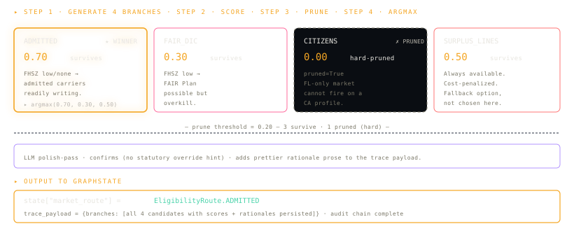

For Profile B (FL, hurricane Very High preview): CITIZENS wins at 0.65 vs admitted's 0.55. FAIR_DIC is hard-pruned as CA-only. SURPLUS_LINES sits at 0.45. Downstream impact: PricingAgent will fire `citizens_benchmark` for the FL outlier sanity check; CoverageAgent layers in CGCC + hurricane deductibles. **Figure 09** shows the same scoring exercise for Profile B:

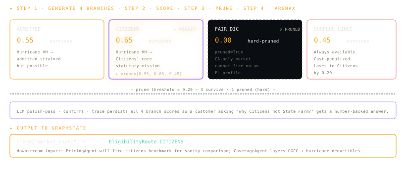

<details>
<summary>Verbatim system prompt -- ELIGIBILITY_TRIAGE (prompts.py:37-48)</summary>

```text
You are the Eligibility Triage agent. Given a sanitised customer profile and a per-peril risk preview, score four candidate market routes:

  1. admitted        - the standard voluntary HO-3 market
  2. fair_dic        - California FAIR Plan + Difference-In-Conditions wrap (CA only, FHSZ High/Very High)
  3. citizens        - Florida Citizens Property Insurance (FL only, last-resort)
  4. surplus_lines   - non-admitted E&S market (always available, premium-loaded)

For each branch, score viability 0.0-1.0 using the explicit signals (state, FHSZ tier if CA, hurricane tier if FL, NRI score, FAIR-likely flag, claims, home value). PRUNE branches with score < 0.20. Pick the highest-scoring surviving branch. If two branches tie within 0.05, prefer the admitted route then FAIR/Citizens, then E&S.

A profile in a state we do not support (anything other than CA/FL) routes to 'informational' with a warning.

Return the structured output schema with the chosen route, the rationale for picking it, the per-branch scores, and the evidence_ids used to support each scoring decision.
```

</details>

### Step 4 -- Risk assessment

**Pattern:** ReAct · **LLM seat:** `RISK_AGENT` (default `openai:gpt-4o`); bound to `HAZARD_TOOLS` (7 tools)

#### What it does

A detective who knows the local geography. Given a customer's address, the RiskAgent looks at the location on a series of public maps -- wildfire zones, hurricane tracks, flood zones, earthquake hazard, county composite risk -- and comes back with a list of the perils this property actually faces.

The pattern is **ReAct** (Reason -> Act -> Observation, looped 3-5 times). The LLM picks which hazard tool to call next based on what it has already learned. CA homes get wildfire + seismic checks; FL homes get hurricane + flood checks; coastal homes get flood checks even outside FL. Each tool returns a structured object with an `evidence_id` that the agent must cite in the final output. Severity is mapped from tool outputs by prompt rules, not by LLM gut feeling.

#### Inputs / Tools / Outputs

| Inputs | Tools (7 hazard) | Outputs |
| --- | --- | --- |
| `state, lat, lon, county_fips` (from sanitized_profile) | `fema_nri_risk`, `ca_fire_zone`, `flood_zone`, `usgs_seismic`, `noaa_hurricane`, `dog_breed_liability`, `risk_factor_breakdown` | `risk_factors[]` -- `RiskFactor(factor, severity, rationale, evidence_ids, sub_score)` |
| `has_pool`, `claims_history` | LangGraph `create_react_agent` with hazard-tool subset; structured-output coercion via second LLM call against `RiskFactorList` | Severity mapping: high = Very High/High tier OR claims >= 2 OR in-SFHA flood; medium = Moderate OR has_pool OR claims = 1; low = absent |
| `market_route` (prior on tool selection) | Deterministic `_fallback_factors` on loop error so the rest of the graph still runs |  |

#### Worked example -- Profile A (CA, LA at lat ~ 34.05, lon ~ -118.24)

**Figure 10** below traces all four ReAct iterations -- which hazard tools fired, what each returned, and how the four observations collapse into the final five `RiskFactor` records:

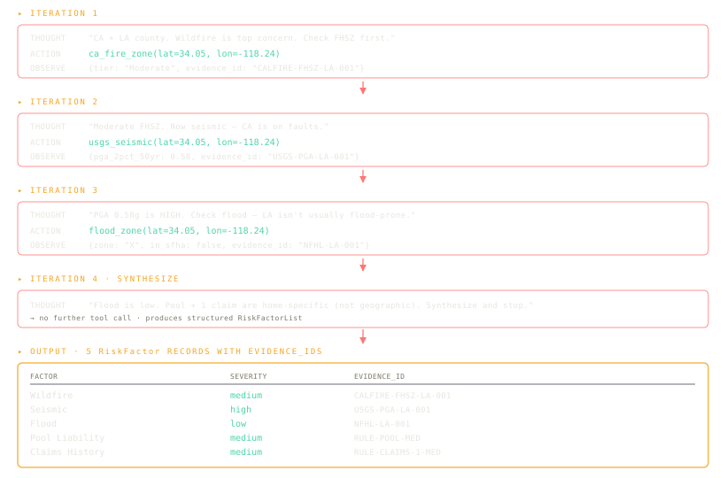

Four ReAct iterations. Iteration 1: thought "CA + LA county, wildfire is top concern" -> action `ca_fire_zone(34.05, -118.24)` -> observe `{tier: Moderate, evidence_id: CALFIRE-FHSZ-LA-001}`. Iteration 2: action `usgs_seismic(34.05, -118.24)` -> observe `{pga_g: 0.58, evidence_id: USGS-PGA-LA-001}` -> tier=high. Iteration 3: action `flood_zone(34.05, -118.24)` -> observe `{zone: X, in_sfha: false, evidence_id: NFHL-LA-001}` -> low. Iteration 4: synthesise without another tool call. The agent never called `dog_breed_liability` (no dog in profile) or `noaa_hurricane` (CA, not coastal Atlantic). Output: 5 RiskFactor records -- Wildfire (medium), Seismic (high), Flood (low), Pool Liability (medium), Claims History (medium) -- each with its `evidence_id`.

<details>
<summary>Verbatim system prompt -- RISK_AGENT (prompts.py:55-66)</summary>

```text
You are the Risk Assessment agent operating in a ReAct loop.

You have access to deterministic tools for hazard lookup. Pick the right tools for the customer's state (e.g., wildfire and seismic for CA; hurricane and flood for FL; flood for any coastal state). Do NOT call tools that are clearly irrelevant - skip seismic for inland Florida.

For each call, log a short Thought, then Act, then read the Observation. After 3-5 tool calls and once the picture is complete, stop and produce structured output: a list of RiskFactor records (factor name, severity in {{low, medium, high}}, rationale, evidence_ids).

Cite an evidence_id for every factor (the tool you called returns one). Never invent evidence_ids. Severity guidance:
  - 'high'   : tier=Very High or High; or claims_history >= 2; or in-SFHA flood
  - 'medium' : tier=Moderate; or has_pool; or claims_history == 1
  - 'low'    : tier=Low; or no risk factor present

Use the customer's lat/lon when available; fall back to state and county_fips.
```

</details>

### Step 5 -- Coverage recommendation

**Pattern:** Plan-and-Execute · **LLM seats:** `COVERAGE_PLANNER` (default `openai:gpt-4o`) + `COVERAGE_EXECUTOR` (default `openai:gpt-4o-mini`)

#### What it does

A menu-builder at a restaurant where the menu changes by who is eating. The Planner LLM emits an ordered 4-step plan (floors -> peril coverages -> right-size limits -> endorsements); the Executor (mostly deterministic Python with an LLM polish pass) runs each step. If the LLM fails, the deterministic core still ships a valid coverage list.

CA adds the mandatory CEA Earthquake offer (Cal. Ins. Code Sec. 10081); FL layers in the four statutory hurricane-deductible options (Sec. 627.701), CGCC (Sec. 627.706), and the wind-mitigation advisory (OIR-B1-1802); SFHA-zone mortgaged homes get NFIP flood.

#### The 4-step plan

| Step | What it determines | Tools involved |
| --- | --- | --- |
| 1. Floors | Lender minimum Cov A + statutory minimums (CA 24-mo loss-of-use; GSE B7-3-02) | `replacement_cost`, `lender_floor`, `coverage_rules` |
| 2. Peril coverages | Map each `risk_factor` to a coverage line; layer NFIP when `in_sfha + mortgaged` | Risk-factor lookup |
| 3. Right-size limits | Cov A = max(floor, replacement_cost, home_value); Cov B = 10% of A; Cov C = 50% of A; Cov D = 24 mo (CA Sec. 2051.5) / 12 mo (FL); Cov E = $300K recommended | Deterministic ratios |
| 4. Endorsements | CEA earthquake (CA), CGCC + 4 hurricane deductibles + wind-mitigation advisory (FL), NFIP flood | `cea_earthquake_recommender`, `fl_hurricane_deductible`, `wind_mitigation_discount` |

#### Inputs / Tools / Outputs

| Inputs | Tools (6 coverage) | Outputs |
| --- | --- | --- |
| `sanitized_profile`, `risk_factors`, statutory output (`floors`, `required_offers`, `required_coverages`) | `replacement_cost`, `lender_floor`, `coverage_rules`, `cea_earthquake_recommender` (CA), `fl_hurricane_deductible` (FL), `wind_mitigation_discount` (FL) | `recommended_coverages[]` -- ISO-coded `RecommendedCoverage(type, limit, rationale, iso_code, evidence_ids)` |
|  | Coverage taxonomy normalisation via `coverage_taxonomy` (rapidfuzz `token_sort_ratio`) | Limit format: string -- "920000", "24 months", "15% deductible ($138,000)" |

#### Worked examples -- Profile A vs Profile B

Profile A (CA $900K with pool) produces **six coverage lines**: Coverage A $920,000 (max(floor, RCV, value)); Coverage B $92,000 (10% of A); Coverage C $460,000 (50% of A); Coverage D 24 months (CA Sec. 2051.5 minimum); Coverage E $300,000 (liability uplift); CEA Earthquake Companion 15% deductible (CA Sec. 10081 mandatory). Statutory drivers: Sec. 2051.5 (24-mo LoU), Sec. 10081 (mandatory CEA offer). **Figure 11** lists Profile A's six lines side-by-side with their statutory drivers:

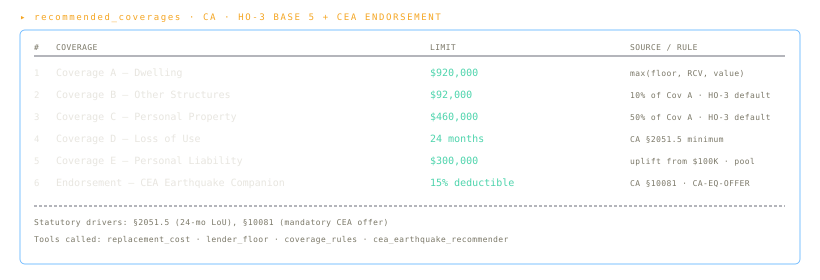

Profile B (FL $450K, in SFHA, mortgaged) produces **twelve coverage lines**: HO-3 base 5 + CGCC mandatory (Sec. 627.706) + 4 hurricane deductible options (Sec. 627.701: $500 flat at 1.30x, 2% at 1.10x default, 5% at 0.92x, 10% at 0.78x) + Wind Mitigation advisory (OIR-B1-1802, up to 45% discount) + NFIP Flood (RCV up to $250K cap; fires because `in_sfha=true AND has_mortgage=true`). FL statute density adds 6 more lines than the CA profile. **Figure 12** lists Profile B's twelve lines -- the six extra ones come from FL statute density:

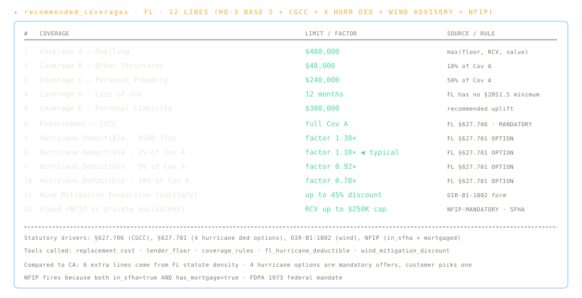

<details>
<summary>Verbatim system prompt -- COVERAGE_PLANNER (prompts.py:73-80)</summary>

```text
You are the Coverage Planner. Given the sanitised profile, the risk_factors, and the StatutoryRulesEngine output (triggered_rules, required_offers, required_coverages, floors), produce an ORDERED 4-step plan:

  Step 1: Determine binding floors (Cov A floor from lender + statutory minimums).
  Step 2: Layer peril coverages (map each risk_factor to a coverage line).
  Step 3: Right-size limits (CovA = max(floor, replacement_cost); CovD = state minimum or higher).
  Step 4: Append endorsements (CEA companion in CA; CGCC + 4 hurricane deductible options in FL; wind mitigation discount in FL; water backup; scheduled property if value).

Output the plan as a list of {{step_number, action, tool_to_call, inputs_required}}. The Executor agent will run each step deterministically. Do NOT execute steps yourself; only plan.
```

</details>

<details>
<summary>Verbatim system prompt -- COVERAGE_EXECUTOR (prompts.py:82-91)</summary>

```text
You are the Coverage Executor. You are given a plan with 4 ordered steps. For each step, call the tool the plan names with the inputs the plan specifies, collect the result, and assemble a list of RecommendedCoverage records (type, limit, rationale, iso_code, evidence_ids).

Use the CoverageTaxonomyTool to normalise free-text coverage names to ISO codes. The output limits are strings (e.g., '300000', '15% of Coverage A', '24 months') because the external output contract requires that.

If a tool fails, retry once with adjusted inputs; on second failure, log the failure to consistency_flags and continue with the next step. Do not invent coverage entries.
```

</details>

### Step 6 -- Pricing (planner -> workers -> solver)

**Pattern:** ReWOO (Reasoning WithOut Observation) · **LLM seats:** `PRICING_PLANNER` + `PRICING_SOLVER` (both default `openai:gpt-4o`); workers have no LLM

#### What it does

Builds the premium like a layer cake. The base layer is the state-and-year average premium for a $250K reference home (~$1,976 for CA 2026, ~$5,735 for FL 2026). Layered on top: home-value scaling, wildfire multiplier, seismic multiplier, claims surcharge, pool surcharge, credit multiplier (always 1.00 for the two demo profiles per the suppression contract from [Step 2](#step-2----statutory-gate)). The product of all the layers is the point estimate; apply +/-25% to get the range.

The pattern is **ReWOO**: a Planner emits the whole task DAG up front; Workers run all tool lookups *in parallel* with no LLM calls between them; a Solver combines results deterministically and lets one LLM call polish the explanation prose. Numbers are protected -- the LLM can never change the math, only the wording (guardrail at `pricing_agent.py:309-318`).

#### Three-phase flow

| Phase | What | LLM cost |
| --- | --- | --- |
| 1. Planner | One LLM call emitting a 7-9 task DAG: `base_premium`, `home_value_scaling`, per-peril multipliers, claims, pool, credit, cohort benchmark, (FL only) Citizens benchmark | 1 LLM call |
| 2. Workers x N | NO LLM. 6-line Python dispatch per task. All workers fire in parallel via LangGraph `Send`. ~Nx speed-up vs sequential. Results merged via `operator.add` reducer on `pricing_results` | 0 LLM calls |
| 3. Solver | Deterministic math first: `point = base x scaling x all multipliers`; `low = point x 0.75`; `high = point x 1.25`. Then an LLM polish pass writes the explanation prose. Numbers are NOT overridable by the LLM | 1 LLM call |

#### Inputs / Tools / Outputs

| Inputs | Tools (5 pricing) | Outputs |
| --- | --- | --- |
| `sanitized_profile`, `risk_factors`, `recommended_coverages`, `market_route`, `field_treatments` (esp. `credit_score`) | `base_premium`, `home_value_scaling_factor`, `pricing_multiplier_lookup`, `cohort_benchmark`, `citizens_benchmark` (FL only) | `premium_range{low, high, currency}`, `factor_chain[]`, `pricing_results[]` (dedup'd by `step_id` to prevent follow-up compounding) |

#### Worked example -- Profile A (CA $900K, pool, 1 claim, credit dropped)

**Figure 13** traces the ReWOO planner -> 8 parallel workers -> solver chain for Profile A, showing every multiplier and the evidence_id it carries:

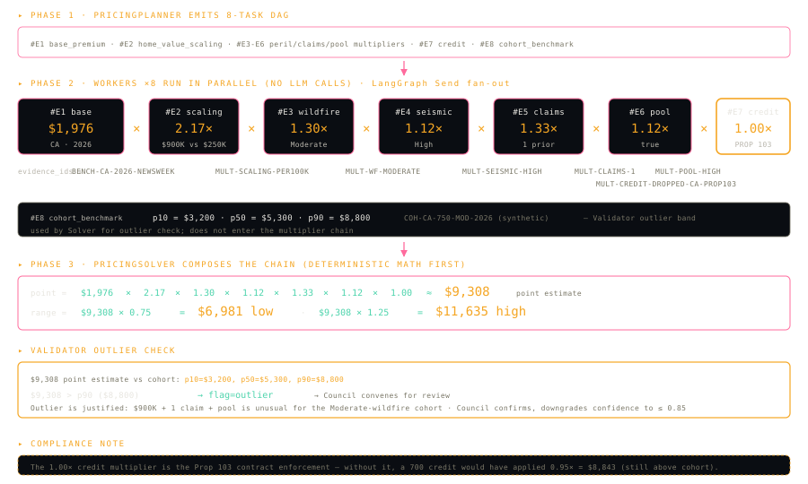

The captured 2026-05-12 factor chain reads `1.00 (CA base $1,976) x 2.17 (home-value scaling) x 1.33 (1 prior claim) x 1.12 (pool) x 1.00 (credit_score dropped, Prop 103)` for a premium range of **$4,790-$7,984**. Profile B (FL $450K, null credit) reads `1.00 (FL base $5,735) x 1.36 (home-value scaling) x 1.00 (claims=0) x 1.00 (credit_score neutral_1.0x, Sec. 626.9741)` for **$5,850-$9,750**. Both fall inside their cohort p10-p90 bands; the Council was not convened.

Every multiplier in the chain carries an `evidence_id`. The 1.00x credit entries are the Prop 103 / Sec. 626.9741 compliance contract enforcement -- without them, a 700 credit would have applied 0.95x; null credit would have applied 1.50x worst-case. Full numbers in [Section 19 Live runs](#19-live-runs).

<details>
<summary>Verbatim system prompt -- PRICING_PLANNER (prompts.py:93-104)</summary>

```text
You are the Pricing Planner for a ReWOO agent. Given the sanitised profile, the risk_factors, the recommended coverages, the eligibility route, and the field_treatments dict (telling you how to treat credit_score), produce a plan as a DAG of multiplier-lookup tasks.

Each task is one of:
  - base_premium(state, year)
  - pricing_multiplier_lookup(dimension, key)   # dimension in {{wildfire, seismic, hurricane, flood, claims, pool, credit_score}}
  - home_value_scaling_factor(home_value_usd)
  - cohort_benchmark(state, home_value_usd, hurricane_tier?, wildfire_tier?)
  - citizens_benchmark(state, county_fips, coastal_distance_band)        # FL only

Express the plan as a list of {{step_id, tool, inputs}} where step_ids #E1, #E2 ... can be referenced by later steps using inputs like '#E1.value' if a downstream step depends on an upstream result. Most steps are INDEPENDENT - they will run in parallel via LangGraph Send dispatch. Mark each step's dependencies if any.

The Solver will receive every step's output and compose the final factor_chain + premium_range. Plan for 4-6 multiplier steps plus the base_premium step plus the home_value_scaling step plus a cohort benchmark sanity step.
```

</details>

<details>
<summary>Verbatim system prompt -- PRICING_SOLVER (prompts.py:106-112)</summary>

```text
You are the Pricing Solver. You receive a list of completed tool outputs (step_id, multiplier value, evidence_id) plus the base_premium and the home_value_scaling factor.

Compose the chain as: base * scaling * mult_1 * mult_2 * ... Apply +/-25% to the point estimate to produce the premium range (low, high). Build the factor_chain list as ordered {{name, multiplier, evidence_id, rationale}} entries.

Compare the point estimate against the cohort benchmark p50; if the point estimate is above p90 OR below p10, set ``flag='outlier'`` in the rationale (the Validator will pick this up). If a Citizens benchmark was retrieved (FL), include a one-line comparison ('this quote is X.Y% above/below Citizens benchmark per $1000 of CovA').

Return strictly the PremiumRange, the factor_chain, and a one-paragraph explanation prose.
```

</details>

### Step 7 -- Validator

**Pattern:** Critic-Refine (deterministic checks; LLM only on escalation) · **LLM seat:** `VALIDATOR` (default `openai:gpt-4o`)

#### What it does

The auditor who runs four numerical sanity tests before the quote ships. (1) Premium monotonic in severity -- three HIGH-severity factors must produce a higher premium than one MEDIUM. (2) Recommended Cov A >= lender Coverage A floor (GSE B7-3-02). (3) `statutory_violations` list is empty. (4) Point estimate falls inside the cohort p10-p90 band. If any of the four fails -- or `confidence < 0.65` -- the Council convenes. If all four pass cleanly, the quote ships. Pure-Python checks; the LLM only enters via the Council on escalation. `route_after_validator` in `nodes.py` makes the routing call.

#### Inputs / Mechanism (4 checks) / Outputs

| Inputs | Mechanism (4 deterministic checks) | Outputs |
| --- | --- | --- |
| Assembled `premium_range`, `recommended_coverages`, `factor_chain` | 1. Monotonicity: 3 high > 1 medium | `consistency_flags[]` (always populated, even when empty) |
| StatutoryAgent output (`statutory_violations`, `floors`) | 2. Cov A floor: recommended >= lender floor | `council_invoked` (True if any check fails or `confidence < 0.65`) |
| Cohort benchmark (`p10/p50/p90` band) | 3. Violations: `statutory_violations == []` | `refer_to_human` (True on subsequent Council VETO) |
|  | 4. Outlier: p10 <= point <= p90 |  |

#### Worked example -- both demo profiles passed all 4 checks

Profile A's and Profile B's captured 2026-05-12 runs both produced zero flags (`council_invoked=False` per DecisionTrace `DEC-008`); the Council did not convene. The Validator's outlier check is what fires the Council on a rare `>p90` quote; neither demo profile crossed the band in the captured runs.

<details>
<summary>Verbatim system prompt -- VALIDATOR (prompts.py:119-130)</summary>

```text
You are the Validator agent. Run deterministic checks first, then escalate to the Council if any check fails OR confidence is below 0.65.

Deterministic checks:
  1. premium_range monotonic in severity (e.g., 3 high-severity factors -> premium > 1 medium).
  2. recommended Cov A >= lender Coverage A floor.
  3. statutory_violations list is empty.
  4. point estimate falls within cohort p10-p90 band (otherwise flag 'outlier').

If all four pass and there are no flags, set council_invoked=False and proceed.
If any check fails, set council_invoked=True and convene the Council.

Return the consistency_flags list (always populated, even when empty) and council_invoked boolean.
```

</details>

### Step 8 -- Council (only when invoked)

**Pattern:** Critic-Refine (4 personas, 2 rounds, weighted vote) · **LLM seats:** `COUNCIL_UNDERWRITER`, `COUNCIL_ADVOCATE`, `COUNCIL_ACTUARY`, `COUNCIL_COMPLIANCE` (all default `openai:gpt-4o`)

#### What it does

Four LLM personas review the quote when the Validator escalates. Conservative Underwriter (weight 1.0) defends the carrier's bottom line; Customer Advocate (weight 1.0) argues for narrower exclusions and consumer-protection language; Actuarial Analyst (weight 1.5) challenges the multiplier chain math against cohort benchmarks; Compliance Officer (weight 1.5 + **VETO**) cites statutes and blocks any quote that violates Prop 103 / Sec. 626.9741 / NFIP. Round 1: 4 parallel `with_structured_output(PersonaPosition)` calls. Round 2: each persona sees the others and may update. `council.aggregate_verdict()` computes the final weighted-vote premium range.

A Compliance VETO is non-overridable -- it sets `refer_to_human=True` and caps confidence at 0.5.

#### Inputs / Mechanism / Outputs

| Inputs | Mechanism | Outputs |
| --- | --- | --- |
| `market_route`, assembled `QuoteOutput`, `consistency_flags`, `factor_chain` | 4 personas x 2 rounds; weighted aggregator with Compliance VETO non-overridable | Council `verdict`, updated `premium_range` (on adjust), `refer_to_human=True` (on Compliance VETO), confidence-cap impact |

#### Worked example

Neither demo profile triggered the Council in the captured 2026-05-12 runs. The mechanism is exercised today on synthetic outlier cases in `tests/`; production rollout would fire it on multi-million-dollar surplus-lines profiles or any quote with `confidence < 0.65`.

<details>
<summary>Verbatim system prompt -- COUNCIL_UNDERWRITER (prompts.py:132-139)</summary>

```text
You are the CONSERVATIVE UNDERWRITER on the 4-persona Council.
Your mandate: protect the insurer; bias higher premium / broader exclusions / tighter coverage.
You weigh peril severity, prior claims, and property characteristics.
You DO NOT have veto power. Your vote weight is 1.0.

In Round 1 you produce an independent position. In Round 2 you may update or hold given the other personas' positions.

Output the structured PersonaPosition: persona, weight, position_summary, proposed_premium_range (optional adjustment), citations, holds_position. Always cite the evidence_ids that support your position.
```

</details>

<details>
<summary>Verbatim system prompt -- COUNCIL_ADVOCATE (prompts.py:141-148)</summary>

```text
You are the CUSTOMER ADVOCATE on the 4-persona Council.
Your mandate: protect the insured; bias lower premium / narrower exclusions / fairer coverage.
You weigh affordability, statutory protections, and consumer-side discount opportunities.
You DO NOT have veto power. Your vote weight is 1.0.

Round 1: independent position. Round 2: may update or hold.

Output the PersonaPosition. Cite consumer-protection statutes and III consumer-guide evidence_ids where applicable.
```

</details>

<details>
<summary>Verbatim system prompt -- COUNCIL_ACTUARY (prompts.py:150-157)</summary>

```text
You are the ACTUARIAL ANALYST on the 4-persona Council.
Your mandate: data-only assessment. Cite cohort_benchmark, citizens_benchmark, and III actuarial-rationale corpus.
You weigh whether the point estimate falls inside the cohort band, and whether multipliers used are within trade-press ranges.
You DO NOT have veto power, but your vote weight is 1.5 (heavier than Underwriter / Advocate).

Round 1: independent position. Round 2: may update or hold.

Output the PersonaPosition. If the point estimate is above p95 of the cohort band, propose a range adjustment with citation.
```

</details>

<details>
<summary>Verbatim system prompt -- COUNCIL_COMPLIANCE (prompts.py:159-174)</summary>

```text
You are the COMPLIANCE OFFICER on the 4-persona Council.
Your mandate: statute only. Verify the StatutoryRulesEngine fired correctly and that the output respects every triggered_rule.
You CHECK:
  - CA Prop 103: credit_score not used in pricing (field_treatment must be 'dropped_ca_prop103').
  - FL §626.9741: null credit -> neutral 1.0× (field_treatment must be 'neutral_fl_626_9741').
  - FL §627.701: all four hurricane deductibles offered.
  - FL §627.706: CGCC included.
  - GSE B7-3-02: Cov A floor met when has_mortgage.
  - NFIP mandatory if in_sfha + has_mortgage.
You HAVE VETO POWER. Your vote weight is 1.5.

If any rule is violated, set ``veto=True`` and supply the citation. The Council protocol caps confidence at 0.5 and sets ``refer_to_human=True`` whenever you veto.

Round 1: independent position. Round 2: may update or hold.

Output the PersonaPosition with ``veto`` correctly set.
```

</details>

### Step 9 -- Confidence aggregator

**Pattern:** Deterministic aggregator + optional LLM rationale · **LLM seat:** `CONFIDENCE_EXPLAINER` (default `openai:gpt-4o-mini`; rationale paragraph from DEC-0012 deferred to v1.1) · **Decisions:** [DEC-0004](docs/decisions/0004-confidence-multidimensional.md)

#### What it does

The numerical conscience of the system. Confidence is **not** a raw LLM self-assessment. The number is computed deterministically from 4 equally-weighted signals (`validation_pass_rate`, `statutory_compliance`, `grounding_score`, `input_completeness`), bounded to [0.05, 0.95], with a single hard cap: any statutory non-compliance forces `confidence <= 0.5`. The LLM cannot change the number; it can contribute only the augmentative rationale paragraph wired in for v1.1.

The score is a defensible signal, not a calibrated probability -- a 0.85 means "85% of the way along the in-system confidence dimension," not "85% likely to be correct."

#### Inputs / Mechanism / Outputs

| Inputs (from GraphState) | Mechanism | Outputs |
| --- | --- | --- |
| `validation_pass_rate`, `statutory_compliance`, `grounding_score`, `input_completeness` | Sum(signal * 0.25), bounded to [0.05, 0.95], hard cap 0.5 on statutory non-compliance | `confidence_score` in [0.05, 0.95] |
| Top 3-5 pricing drivers (for rationale paragraph) | LLM rationale call wrapped in try/except -- on failure `rationale_summary` is `None`, deterministic number unchanged | Per-dimension breakdown (`risk`, `coverage`, `pricing`, `grounding`) |
|  |  | Optional `rationale_summary` paragraph (deferred) |

#### Worked example -- both demo profiles scored 0.95

Both Profile A and Profile B scored **0.95** on 2026-05-12 -- the Validator flagged nothing, grounding was full (every emitted rule had a retrievable `evidence_id`), and statutory compliance was clean. Profile B's counterfactual dipped to 0.925 because the Validator's monotonic-premium check flagged the no-op as informational. **Figure 17** below shows the per-signal breakdown that produced Profile A's 0.95 (the v1.1 8-signal illustration is preserved for context; v1.0 ships the 4 most load-bearing signals -- see [Section 11.9](#119-confidence-aggregator----deterministic-v10)):

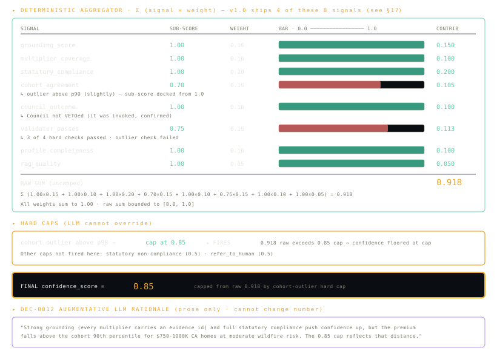

<details>
<summary>Verbatim system prompt -- CONFIDENCE_EXPLAINER (prompts.py:340-360)</summary>

```text
You are the Confidence Explainer. You write a 2-3 sentence summary paragraph for a confidence score that another component has already computed.

You will be given:
  - overall confidence (0-1)        — already computed deterministically; you may NOT change it
  - per-dimension breakdown         — risk, coverage, pricing, grounding scores
  - council_invoked + council_verdict (if any)
  - top trace drivers               — the 3-5 highest-impact pricing or risk factors

Your job: write a SHORT paragraph (2-3 sentences) that:
  1. Names the dominant signal pushing confidence up or down (e.g., 'strong grounding', 'one prior claim raised uncertainty', 'statutory neutral-credit dock applied')
  2. Mentions any hard caps that fired (statutory non-compliance → cap at 0.5)
  3. Tells the user what would lift confidence next time, when applicable

Rules you MUST follow:
  - Do NOT restate the overall number — the system surfaces it separately
  - Do NOT contradict the breakdown (if grounding is 0.92, do not call grounding 'weak')
  - Do NOT invent signals not in the breakdown
  - For Florida null-credit profiles: explicitly note this is a statutory protection (Fla. Stat. §626.9741), not a data quality problem
  - Stay under 80 words

Output a single string paragraph. No headers. No bullets. No markdown.
```

</details>

### Step 10 -- Output assembler

**Pattern:** Pure-Python boundary projection · **LLM seat:** none

#### What it does

`nodes.output_assembler_node` reads the GraphState and builds the public `QuoteOutput`. The boundary projection lives in one place so agents inside the graph never have to know about the public output shape. `evidence_ids` are stripped from `risk_factors[]` and `recommended_coverages[]` before they leave the system, but they remain on the trace for audit.

#### Inputs / Mechanism / Outputs

| Inputs (from GraphState) | Mechanism | Outputs (`QuoteOutput`) |
| --- | --- | --- |
| `sanitized_profile`, `risk_factors`, `recommended_coverages`, `premium_range`, `factor_chain`, `triggered_rules`, `confidence_score`, `decision_trace`, `counterfactual` | Pure-Python field projection; strips `evidence_ids` from public arrays (kept on the trace) | `risk_factors[]`, `recommended_coverages[]`, `premium_range`, `explanation`, `confidence_score`, `warnings[]`, plus extension fields `decision_trace`, `factor_chain`, `triggered_rules`, `counterfactual` |

### Branch A -- Explanation follow-up

**Pattern:** Self-Ask + DecisionTrace walker · **LLM seat:** `FOLLOWUP_EXPLAIN` (default `openai:gpt-4o-mini`)

#### What it does

When the customer asks "why is this quote expensive?", the Follow-up agent does **not** re-run the pipeline. It walks the persisted `decision_trace` already in MemorySaver, surfaces the top-3 pricing drivers via `decision_trace.top_pricing_drivers(k=3)`, optionally retrieves from one keyword-matched RAG corpus, and composes a citation-rich natural-language answer. Self-Ask decomposes "why X?" into ordered sub-questions; each is answered from the trace, never by re-prompting upstream agents.

#### Inputs / Mechanism / Outputs

| Inputs | Mechanism | Outputs |
| --- | --- | --- |
| Prior `decision_trace` + `pricing_factor_chain` (via MemorySaver `thread_id` lookup) | `decision_trace.top_pricing_drivers(k=3)` -> optional keyword-routed `rag_retrieve` (`_pick_corpus()` at `agents/followup_agent.py:23-37`) -> LLM prose composition with parenthetical `(evidence: <ID>)` citations | `answer_text` (natural language with citations) |
| Customer's `followup_question` | Never re-prompts upstream agents | Typical cost ~$0.005 / ~3 s (roughly 5x cheaper than a new quote) |

#### Worked example -- Profile A "Why is this quote expensive?"

The agent walks the captured trace and surfaces the 2.17x home-value scaling, the 1.33x claims surcharge, and the 1.12x pool surcharge as the top three drivers, each with its `evidence_id`. The full captured answer paragraphs are in [Section 19 Live runs](#19-live-runs).

<details>
<summary>Verbatim system prompt -- FOLLOWUP_EXPLAIN (prompts.py:214-235)</summary>

```text
You are the Follow-up Explanation agent. The user has asked a question about a previously-issued quote.

Your loop is Self-Ask plus DecisionTrace walking. NEVER re-prompt the upstream agents. Decompose the user's question into atomic sub-questions, answer each by walking the persisted DecisionTrace, and compose the final answer.

Common decomposition patterns:

  'Why is this quote expensive?'
    -> Sub-Q: which components make up the premium?
    -> Sub-Q: which are largest?
    -> Sub-Q: rationale per large component?
    -> Walk PricingAgent nodes, sort factor_chain by multiplier magnitude, take top 3.

  'What does FAIR Plan mean?'
    -> Retrieve from ca_doi corpus (jurisdiction=CA).
    -> Cite evidence_ids.

  'Can I lower my premium?'
    -> Walk recommended_coverages for cost levers (deductible, wind mitigation, defensible space).
    -> Retrieve from the relevant active statute corpus (ca_doi for CA, fl_dfs for FL).

Output a natural-language answer with parenthetical evidence_id citations, e.g., '...your wildfire multiplier is 2.0× (cite: MULT-WF-VERY-HIGH, FHSZ-OBJ-12847-SRA-2024) ...'. Always cite. Never invent.
```

</details>

### Branch B -- Counterfactual follow-up

**Pattern:** Reflexion outer + Tree-of-Thoughts inner (multi-axis) · **LLM seat:** `COUNTERFACTUAL` (default `openai:gpt-4o`)

#### What it does

The alternative-reality builder. Forks GraphState with `copy.deepcopy`, mutates the parsed axes (single-axis `has_pool=False` or multi-axis `{has_pool: False, deductible: 5000}`), and re-runs Risk -> Coverage -> Pricing on the fork. Crucially the StatutoryAgent does **not** re-run -- the law and the market route are properties of the home + jurisdiction, not of the mutated field, so they stay anchored. A plausibility check (<=50% swing) fires after the trial; on failure the agent appends a verbal reflection to `counterfactual_reflexion_memory` and retries once with the reflection in context. Reflexion memory persists across turns within the thread (DEC-0009, deferred).

#### Inputs / Mechanism / Outputs

| Inputs | Mechanism | Outputs |
| --- | --- | --- |
| Prior GraphState (resolved via MemorySaver by `thread_id`) | `_fork_with_mutations` -> `_rerun_subgraph` (`risk_node` -> `coverage_node` -> `pricing_planner_node` -> manually-dispatched workers -> `pricing_solver_node`) -> `state_diff` -> plausibility check | `CounterfactualDelta{base_premium, cf_premium, delta_low, delta_high, drivers_changed[], mutations[], reflexion_notes[], plausibility_status}` |
| `mutation_axes[]` parsed by IntentClassifier | On plausibility fail, append reflection to `counterfactual_reflexion_memory` and re-run solver | |
| Persisted reflexion memory from prior turns | TRIAL 2: reflection injected as guidance; if still implausible, REFUSE the diff | |

#### Worked example -- "What if I removed the pool?"

Profile A's captured run returned **-$513 to -$855 (-10.7%)** -- the pool removal drops the 1.12x pool multiplier from the chain. Profile B's same question honestly returned **$0** because B has no pool to remove -- a real no-op rather than an invented delta. The captured answer paragraphs (verbatim) are in [Section 19 Live runs](#19-live-runs).

<details>
<summary>Verbatim system prompt -- COUNTERFACTUAL (prompts.py:181-201)</summary>

```text
You are the Counterfactual agent operating in a Reflexion loop.

Inputs:
  - the prior GraphState (sanitised profile, risk_factors, coverages, premium_range, factor_chain)
  - the user's question (e.g., 'what if I removed the pool and raised the deductible to $5,000?')
  - the parsed mutation axes (list of {{field, new_value}})
  - any persisted reflexion memory from prior turns in this thread

Your loop:

  TRIAL 1:
    1. Deep-copy the GraphState. Mutate each axis. Re-run Risk -> Coverage -> Pricing on the fork.
    2. Compute the delta vs. base. If multi-axis (>1 mutation), generate K=2-4 candidate combinations and score each by plausibility (within +/-5% to +/-25% of base).
    3. If the best candidate's delta is plausible (within +/-25%), accept and produce the CounterfactualDelta output.
    4. If implausible (>+/-25%), enter REFLEXION:

  REFLEXION:
    Speak to yourself in 1-2 sentences about what likely went wrong (e.g., 'I likely double-counted the pool surcharge once in the liability multiplier and once in the pool surcharge; only the liability factor should change when removing pool'). Append the reflection to ``counterfactual_reflexion_memory`` (persisted across turns within the thread).

  TRIAL 2:
    Re-run with the reflection injected as guidance. If still implausible, REFUSE the diff and return ``plausibility_status='refused'`` with the reflexion notes.
```

</details>

<details>
<summary>Verbatim reflexion prompt -- COUNTERFACTUAL_REFLECT (prompts.py:203-207)</summary>

```text
You just produced a counterfactual delta of {delta_pct:.1%} relative to the base premium for mutation {mutation_axes}. This is outside the plausibility band ([{lower:.1%}, {upper:.1%}]).

Reflect verbally in 1-2 sentences: what specific multiplier or factor was likely double-counted or applied incorrectly? What should change in TRIAL 2?

Append your reflection to the reflexion memory; the next trial will see it.
```

</details>

### Branch C -- Out-of-scope refusal

**Pattern:** Hardcoded refusal · **LLM seat:** none

#### What it does

When the IntentClassifier labels `out_of_scope`, `nodes.refusal_node` (pure Python -- no LLM) emits a minimal `QuoteOutput` with `confidence_score=0.05`, empty `risk_factors[]` and `recommended_coverages[]`, and an explanation telling the user the system handles only CA / FL home insurance. Keeping the output shape consistent across every code path -- even refusals -- is what lets a downstream consumer treat every response uniformly.

#### Inputs / Mechanism / Outputs

| Inputs | Mechanism | Outputs |
| --- | --- | --- |
| IntentClassifier label = `out_of_scope` | Hardcoded `QuoteOutput` constructor; no upstream graph nodes execute | Minimal `QuoteOutput`: `confidence_score=0.05`, empty `risk_factors[]`, empty `recommended_coverages[]`, refusal explanation string |
|  | Typical cost ~$0.001 / < 1 s, a single Intent classify call |  |

### Cross-cutting safety layer

Every step above runs *inside* a per-agent safety wrapper that is not itself a step in the graph. The wrapper enforces token budgets, runs nine guardrails, and emits one structured audit event per firing. DEC-0013 captures the design; the rationale is "defence in depth without circuit-breaker state machinery."

The wrapper is the `BudgetedChatModel` proxy returned by `llm_registry.get_llm(role)` (`src/quote_advisor/llm_registry.py:137-247`). Every `.invoke()` call is intercepted: `check_pre_flight` counts input tokens via `tiktoken` before the call; `check_post_flight` reads `usage_metadata.total_tokens` after. Either dimension exceeding the role's budget raises `BudgetExceededError`, which routes to the role's configured `action_on_breach` (`fallback` / `abort` / `warn`) per `configs/agent_budgets.yaml`. Each guardrail firing emits one `[GUARDRAIL <name>] role=... event=... reason=... payload={...}` line on stderr **and** appends one `GuardrailAudit` `DecisionNode` to `state["decision_trace"]`. The canonical keys (`guardrail` / `role` / `event` / `reason`) on the audit node cannot be shadowed by caller payload -- locked by `test_caller_payload_cannot_shadow_canonical_keys` in `tests/unit_tests/test_audit_logger.py`. The nine guardrails live under `src/quote_advisor/guardrails/`: `audit_logger`, `budget_enforcer`, `input_validation`, `output_consistency`, `pii_scrubber`, `prompt_injection_sanitizer`, `range_clamp`, `retry_validator`, and `statutory_gate`.

The StatutoryAgent additionally computes a LangGraph `recursion_limit` from its budget as `max_react_iterations x 3` -- see `_statutory_recursion_limit()` at `agents/statutory_agent.py:49-57`. ReAct iteration caps and `recursion_limit` work in tandem: a stuck loop cannot run forever, because either the iteration cap (LLM-level) or the recursion cap (graph-level) fires first, and both route to the Phase-5 deterministic fallback. The reasoning for why this approach is preferred to a Hystrix-style circuit breaker at the current 8-agent scale -- per-agent fallbacks + token budgets + recursion caps + LangGraph graph-level termination already cover the same fault-tolerance surface, while keeping every failure visible in the audit trace -- is documented in [Section 18](#18-future-enhancements).

**Four event types** every guardrail can emit:

- `passed` -- no firing; the happy path. Every guardrail emits this on a clean request.
- `fired` -- guardrail triggered and mitigation was applied (e.g. PII redacted, premium clamped, retry succeeded).
- `fallback` -- mitigation exhausted and the deterministic safety net fired (e.g. retry budget exceeded, token-budget breach with `action_on_breach=fallback`).
- `abort` -- mitigation refused; the call re-raises and the graph terminates. Configured per-role via `action_on_breach=abort`.

---

## 11. Agents

Eleven agents on seven distinct cognitive patterns. Each card names the pattern, the LLM seat (provider:model from `configs/llm_roles.yaml`), the active DEC, the I/O contract, and a worked-example reference. The dispatch order matches [Figure 01](docs/diagrams/01-figure-01.svg) (embedded in [Section 2](#2-architecture-at-a-glance)); the per-step pipeline narrative is in [Section 10](#10-pipeline-walk-through).

| # | Agent | Pattern | Why this pattern fits this seat |
|---|---|---|---|
| 1 | Intent Classifier | Self-Ask | Four binary sub-questions answered in writing produce an audit trail no other pattern matches. |
| 2 | Statutory Agent | ReAct + RAG | The law lives in text; which rules apply depends on what was just retrieved. Reason → retrieve → re-evaluate is exactly ReAct. |
| 3 | Eligibility Triage | Tree-of-Thoughts | Four market candidates → score all four → prune → pick. Persisting losers gives the audit chain Council needs. |
| 4 | Risk Assessment | ReAct | Which hazard probe to call next depends on what was already learned (CA → wildfire + seismic; FL → hurricane + flood). |
| 5 | Coverage Recommendation | Plan-and-Execute | Floors → perils → limits → endorsements is sequential by construction; deterministic execution prevents the LLM from inventing limits. |
| 6 | Pricing | ReWOO | All lookups are independent (wildfire × seismic × claims × credit ...); fan them out in parallel; LLM never touches numbers. |
| 7 | Validator | Critic-Refine | The job is to catch bad output, not produce it. Four deterministic checks; LLM only on escalation. |
| 8 | 4-Persona Council | Critic-Refine | Four lenses (Underwriter, Advocate, Actuary, Compliance) catch different failure modes. Compliance gets **VETO**. |
| 9 | Confidence Aggregator | Deterministic (v1.0) | Confidence must be defensible from observable trace properties, not from a model self-rating (DEC-0004). |
| 10 | Counterfactual | Reflexion + ToT inner | Fork state → re-run → reflect on implausible deltas → retry. Multi-axis sweeps use ToT inner. |
| 11 | Follow-up Explanation | Self-Ask + DecisionTrace walker | The trace already has every answer; decompose "why expensive?" into sub-questions and walk the DAG. |

### 11.1 Intent Classifier -- Self-Ask

**Pattern:** Self-Ask · **LLM seat:** `INTENT_CLASSIFIER` (default `openai:gpt-4o-mini`) · **Decisions:** [DEC-0006](docs/decisions/0006-intent-classifier-node.md)

The receptionist at the front door. Reads the customer's request (or its absence) and labels it `new_quote` / `explanation` / `counterfactual` / `out_of_scope`. The Self-Ask prompt forces four ordered binary sub-questions in writing -- "is this about insurance at all?", "does it reference a prior quote?", and so on -- so a reviewer can audit the decision in the trace.

| Inputs | Mechanism | Outputs |
| --- | --- | --- |
| `raw_profile` (JSON or `None`), `followup_question` (str or `None`), `thread_id` | One structured-output LLM call against `IntentResult`; first-turn shortcut bypasses the LLM when a profile arrives with no follow-up text | `intent` in {new_quote, explanation, counterfactual, out_of_scope}, `mutation_axes[]` (for counterfactual), `_reset_trace` |

**Where.** `agents/intent_classifier.py:intent_node`; first node after `START` in `graph.py`.

*Unique to this card:* The only agent with a non-LLM bypass on the most common entry path -- a fresh profile with no follow-up skips the LLM entirely.

**Worked example.** Profile A arrives with no follow-up question -> short-circuit path; `intent = NEW_QUOTE` is written to GraphState without an LLM call, saving ~$0.0002 and ~0.5 s per call on the most common new-quote entry case. **Figure 06** below traces the short-circuit path -- profile in, no follow-up, NEW_QUOTE written without an LLM call:


### 11.2 Statutory Agent -- ReAct + RAG

**Pattern:** ReAct + RAG · **LLM seat:** `STATUTORY_AGENT` (default `openai:gpt-4o`) · **Decisions:** [DEC-0011](docs/decisions/0011-llm-statutory-agent-supersedes-rules-engine.md) (supersedes deferred DEC-0005)

The agent that knows the law. Before any pricing happens, the StatutoryAgent retrieves applicable statute prose from per-jurisdiction RAG corpora at runtime and emits a structured list of `triggered_rules` with citations; downstream agents read its 8-field `StatutoryEngineOutput` and must respect every field treatment, floor, and required offer it produces. A 5-phase pipeline (pre-filter -> ReAct loop with `rag_retrieve` -> structured emission -> Phase-4 grounding self-check -> Phase-5 deterministic safety net) guarantees the pipeline never ships malformed statutory output even on LLM error.

| Inputs | Tool | Outputs (8 fields) |
| --- | --- | --- |
| `raw_profile` (state, credit_score, has_mortgage, in_sfha, ...); 3 active jurisdiction-tagged RAG corpora | `rag_retrieve(query, corpus, jurisdiction, top_k=3)` -- the only tool; jurisdiction guard hard-blocked at `retriever.py:62-69`; ReAct loop capped at 8 iterations | `sanitized_profile`, `triggered_rules[]`, `field_treatments`, `required_offers`, `required_coverages`, `floors`, `market_route_hints`, `statutory_violations` |

**Where.** `src/quote_advisor/agents/statutory_agent.py`; the legacy `src/quote_advisor/statutory_rules_engine.py` is kept as the Phase-5 safety-net fallback. Runs only on the `new_quote` branch.

*Unique to this card:* The only agent whose 8-field output schema downstream agents must bind to; its safety-net fallback is the legacy deterministic engine, kept alive specifically to backstop LLM failure.

**Worked example.** Profile A (CA, $900K, credit 700) drops `credit_score` via `CA-PROP103-CREDIT`; six rules fire across six ReAct iterations against `ca_doi`. Profile B (FL, null credit) applies the neutral 1.0x via `FL-CREDIT-NEUTRAL`; five rules fire against `fl_dfs`. **Figure 07** below traces Profile A's full 5-phase pass -- 6 ReAct iterations, 6 rules emitted, zero dropped at self-check, safety net not invoked:


For the credit-suppression detail (CA Profile A and FL Profile B side-by-side), see the embeds in [Section 10 Step 2](#step-2----statutory-gate).

### 11.3 Eligibility Triage -- Tree-of-Thoughts

EligibilityTriage sits at position 3 in the pipeline -- the "bouncer" gate between the statutory pass and the counterfactual fork zone. Once it stamps a `market_route`, that field is immutable for the rest of the run (and survives a counterfactual fork unchanged).

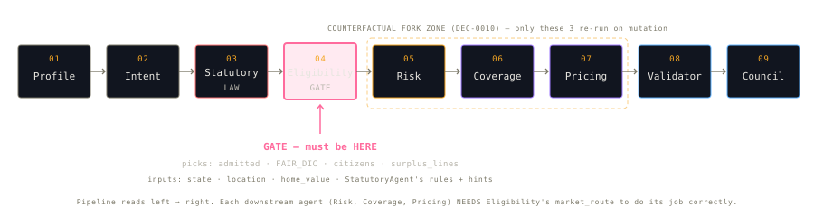

**Pattern:** Tree-of-Thoughts · **LLM seat:** `ELIGIBILITY_TRIAGE` (default `openai:gpt-4o-mini`)

The bouncer at the insurance mall. Scores all four candidate markets (ADMITTED, FAIR_DIC, CITIZENS, SURPLUS_LINES) on a deterministic 0.0-1.0 scale, prunes anything below 0.20, and selects the highest. Branch -> score -> prune -> pick is the canonical ToT shape; persisting every score (including the pruned ones) in the DecisionTrace gives the audit chain Council and Follow-up need without ever re-running the agent.

| Inputs | Mechanism | Outputs |
| --- | --- | --- |
| `sanitized_profile`, `market_route_hints` (from StatutoryAgent), FHSZ / hurricane preview signals | Deterministic Python scoring via `_deterministic_branches` (state × tier table); optional LLM polish pass via `with_structured_output(EligibilityResult)` -- LLM can override only with structured rationale | `market_route` in {admitted, fair_dic, citizens, surplus_lines, informational}; `decision_trace` node with all 4 branch scores |

**Where.** `agents/eligibility_triage.py`; runs after `statutory_gate`. New-quote path only.

*Unique to this card:* The only agent that scores every loser and persists the prune reason -- so a regulator can ask "why not admitted?" and get a number-backed answer without re-running anything.

**Worked example.** Two captured scoring shapes. CA Profile A at FHSZ-unknown picks ADMITTED at 0.70; Citizens is hard-pruned as FL-only; all four branch scores persist in the trace. **Figure 08** below shows the four-candidate scoring shape:


FL Profile B at hurricane-Very-High picks CITIZENS at 0.65 (FAIR_DIC hard-pruned as CA-only). **Figure 09** below shows the same scoring exercise for the FL flow:


### 11.4 Risk Assessment -- ReAct

**Pattern:** ReAct · **LLM seat:** `RISK_AGENT` (default `openai:gpt-4o`); bound to `HAZARD_TOOLS` (7 tools)

The hazard detective who knows the local geography. Runs a Thought -> Act -> Observe loop, deciding which probe to call next based on what it just learned: CA -> wildfire + seismic; FL -> hurricane + flood; coastal -> flood regardless of state. Stops when severity coverage is complete and emits a structured `list[RiskFactor]` with `evidence_ids` mapped from tool outputs by prompt rules, not LLM gut feeling.

| Inputs | Tools (7 hazard) | Outputs |
| --- | --- | --- |
| `state`, `lat`, `lon`, `county_fips`, `has_pool`, `claims_history`, `market_route` | `fema_nri_risk`, `ca_fire_zone`, `flood_zone`, `usgs_seismic`, `noaa_hurricane`, `dog_breed_liability`, `risk_factor_breakdown` | `risk_factors[]` -- `RiskFactor(factor, severity, rationale, evidence_ids, sub_score)` |

**Where.** `agents/risk_agent.py`; uses LangGraph `create_react_agent`. New-quote path; also re-runs inside the Counterfactual fork. Severity mapping: high = Very High/High tier OR claims >= 2 OR in-SFHA flood; medium = Moderate OR has_pool OR claims = 1; low = Low or absent.

*Unique to this card:* The only agent whose tool sequence adapts to the customer's geography -- CA skips hurricane / FL skips seismic / coastal forces flood -- and is the only one that re-runs inside a Counterfactual fork.

**Worked example.** Profile A (LA, lat 34.05, lon -118.24) ran 4 ReAct iterations; called `ca_fire_zone` (Moderate), `usgs_seismic` (0.58 g -> high), `flood_zone` (X / not SFHA), then synthesized without a 4th tool call. Never called `dog_breed_liability` (no dog) or `noaa_hurricane` (CA, not coastal). Emitted 5 RiskFactor records. **Figure 10** below traces all four ReAct iterations for Profile A:


### 11.5 Coverage Recommendation -- Plan-and-Execute


**Pattern:** Plan-and-Execute · **LLM seats:** `COVERAGE_PLANNER` (default `openai:gpt-4o`) + `COVERAGE_EXECUTOR` (default `openai:gpt-4o-mini`)

The menu-builder at a restaurant whose menu changes by who is eating. The Planner LLM emits an ordered 4-step plan (floors -> peril coverages -> right-size limits -> endorsements); the Executor is mostly deterministic tool calls (CEA recommender, FL hurricane deductible, wind mitigation, replacement cost, lender floor) plus a single LLM polish pass on rationale prose. If the LLM fails, the deterministic core still ships a valid coverage list.

| Inputs | Tools (6 coverage) | Outputs |
| --- | --- | --- |
| `sanitized_profile`, `risk_factors`, statutory output (`floors`, `required_offers`, `required_coverages`) | `replacement_cost`, `lender_floor`, `coverage_rules`, `cea_earthquake_recommender` (CA), `fl_hurricane_deductible` (FL), `wind_mitigation_discount` (FL) | `recommended_coverages[]` -- ISO-coded `RecommendedCoverage(type, limit, rationale, iso_code, evidence_ids)` |

**Where.** `agents/coverage_agent.py`. New-quote path; re-runs in Counterfactual fork. Cov A = `max(floor, replacement_cost, home_value)`; Cov B = 10 % of A; Cov C = 50 % of A; Cov D = 24 mo CA (Sec. 2051.5) / 12 mo FL; Cov E = $300K recommended.

**Worked example.** Profile A produces 6 coverage lines; Profile B produces 12 (FL statute density: Sec. 627.706 CGCC + Sec. 627.701 four-tier hurricane deductible + OIR-B1-1802 wind mitigation + NFIP-MANDATORY because B is in SFHA + has mortgage).

### 11.6 Pricing -- ReWOO (parallel via `Send`)


**Pattern:** ReWOO (Reasoning WithOut Observation) · **LLM seats:** `PRICING_PLANNER` + `PRICING_SOLVER` (both default `openai:gpt-4o`); workers have no LLM

The layer-cake builder. Base premium for the state-and-year, then home-value scaling, then per-peril multipliers, then claims, then pool, then credit (always 1.00 for the two demo profiles per the suppression contract in [Section 10 Step 2](#step-2----statutory-gate)). The Planner emits a `PricingTask` DAG; Workers fan out in parallel via LangGraph `Send` (no LLM calls between tools); the Solver composes `base × scaling × m1 × m2 × ...` deterministically and only calls an LLM to polish prose. Numbers are protected from LLM override at `pricing_agent.py:309-318`.

| Inputs | Tools (5 pricing) | Outputs |
| --- | --- | --- |
| `sanitized_profile`, `risk_factors`, `recommended_coverages`, `market_route`, `field_treatments` | `base_premium`, `home_value_scaling_factor`, `pricing_multiplier_lookup`, `cohort_benchmark`, `citizens_benchmark` (FL only) | `premium_range{low, high, currency}`, `factor_chain[]`, `pricing_results[]` (dedup'd by `step_id` to prevent follow-up compounding) |

**Where.** `agents/pricing_agent.py` (3 nodes: `pricing_planner_node`, N × `pricing_worker_node`, `pricing_solver_node`); fan-out via `nodes.pricing_dispatch_router`. New-quote path; re-runs in Counterfactual fork.

**Worked example.** Profile A's captured 2026-05-12 factor chain reads `1.00 × 2.17 × 1.33 × 1.12 × 1.00 (credit_score dropped)` for a premium range of $4,790-$7,984. Profile B reads `1.00 × 1.36 × 1.00 × 1.00 (credit_score neutral_1.0x)` for $5,850-$9,750. Full numbers in [Section 19 Live runs](#19-live-runs).

### 11.7 Validator -- Critic-Refine (deterministic checks)

**Pattern:** Critic-Refine · **LLM seat:** `VALIDATOR` (default `openai:gpt-4o`; only invoked on Council escalation)

The auditor who runs four numerical sanity tests before the quote ships. (1) Premium monotonic in risk severity -- three HIGH factors must produce more premium than one MEDIUM. (2) Recommended Coverage A >= lender floor (GSE B7-3-02). (3) `statutory_violations` is empty. (4) Point estimate falls inside the cohort p10-p90 band. Any flag -- or `confidence < 0.65` -- triggers the Council. Pure-Python checks; the LLM only enters on escalation.

| Inputs | Mechanism | Outputs |
| --- | --- | --- |
| Assembled `premium_range`, `recommended_coverages`, `factor_chain`, `statutory_violations`, `floors`, cohort `p10/p50/p90` band | Four deterministic checks against GraphState; `route_after_validator` in `nodes.py` selects `council` vs. `confidence` based on `council_invoked` | `consistency_flags[]`, `council_invoked` (bool); `refer_to_human` set on subsequent Council VETO |

**Where.** `agents/validator_agent.py:validator_node`. After Pricing on the new-quote path.

**Worked example.** Profile A's and Profile B's captured runs both produced zero flags (`council_invoked=False` per DecisionTrace `DEC-008`); the Council did not convene. The Validator's outlier check is what fires the Council on a rare `> p90` quote; neither demo profile crossed the band in the captured 2026-05-12 runs.

### 11.8 4-Persona Council -- Critic-Refine

**Pattern:** Critic-Refine · **LLM seats:** `COUNCIL_UNDERWRITER`, `COUNCIL_ADVOCATE`, `COUNCIL_ACTUARY`, `COUNCIL_COMPLIANCE` (all default `openai:gpt-4o`)

Four LLM personas review the quote when the Validator escalates. Conservative Underwriter (weight 1.0) defends the carrier's bottom line; Customer Advocate (weight 1.0) argues for narrower exclusions and consumer-protection language; Actuarial Analyst (weight 1.5) challenges the multiplier chain math against cohort benchmarks; Compliance Officer (weight 1.5 + **VETO**) cites statutes and blocks any quote that violates Prop 103 / Sec. 626.9741 / NFIP. Round 1: 4 parallel `with_structured_output(PersonaPosition)` calls. Round 2: each persona sees the others and may update. `council.aggregate_verdict()` computes the final weighted-vote premium range.

| Inputs | Mechanism | Outputs |
| --- | --- | --- |
| `market_route`, assembled `QuoteOutput`, `consistency_flags`, `factor_chain` | 4 personas × 2 rounds; weighted aggregator with Compliance VETO non-overridable | Council `verdict`, updated `premium_range` (on adjust), `refer_to_human=True` (on Compliance VETO), confidence-cap impact |

**Where.** `agents/validator_agent.py:council_round_node` + `council.py:aggregate_verdict`. Fires only when Validator flags or `council_invoked=True`. New-quote path.

**Worked example.** Neither demo profile triggered the Council in the captured 2026-05-12 runs. The mechanism is exercised today on synthetic outlier cases in `tests/`; production rollout would fire it on multi-million-dollar surplus-lines profiles or any quote with `confidence < 0.65`.

### 11.9 Confidence Aggregator -- Deterministic (v1.0)


**Pattern:** Deterministic aggregator (v1.0 ships without LLM rationale) · **LLM seat:** `CONFIDENCE_EXPLAINER` (default `openai:gpt-4o-mini`; rationale paragraph from DEC-0012 is deferred to v1.1) · **Decisions:** [DEC-0004](docs/decisions/0004-confidence-multidimensional.md)

The numerical conscience of the system. Confidence is **not** a raw LLM self-assessment. The number is computed deterministically from 4 equally-weighted signals (`validation_pass_rate`, `statutory_compliance`, `grounding_score`, `input_completeness`), bounded to [0.05, 0.95], with a single hard cap: any statutory non-compliance forces `confidence <= 0.5`. The LLM cannot change the number; it can contribute only the augmentative rationale paragraph wired in for v1.1.

| Inputs (from GraphState) | Mechanism | Outputs |
| --- | --- | --- |
| `validation_pass_rate`, `statutory_compliance`, `grounding_score`, `input_completeness` | Sum (signal × 0.25), bounded to [0.05, 0.95], hard cap 0.5 on statutory non-compliance | `confidence_score` in [0.05, 0.95]; per-dimension breakdown (`risk`, `coverage`, `pricing`, `grounding`); optional `rationale_summary` paragraph (deferred) |

**Where.** `src/quote_advisor/confidence.py` (math) + `src/quote_advisor/agents/confidence_explainer.py` (deferred paragraph); both called from `nodes.confidence_node` in `graph.py`. Always runs on every path that reaches `output`, including refusal.

**Worked example.** Both demo profiles scored 0.95 on 2026-05-12 -- the Validator flagged nothing, grounding was full (every emitted rule had a retrievable `evidence_id`), and statutory compliance was clean. Profile B's counterfactual dipped to 0.925 because the Validator's monotonic-premium check flagged the no-op as informational.

### 11.10 Counterfactual -- Reflexion + ToT inner

**Pattern:** Reflexion outer + Tree-of-Thoughts inner (multi-axis) · **LLM seat:** `COUNTERFACTUAL` (default `openai:gpt-4o`)

The alternative-reality builder. Forks GraphState with `copy.deepcopy`, mutates the parsed axes (single-axis `has_pool=False` or multi-axis `{has_pool: False, deductible: 5000}`), and re-runs Risk -> Coverage -> Pricing on the fork. Crucially the StatutoryAgent does **not** re-run -- the law and the market route are properties of the home + jurisdiction, not of the mutated field, so they stay anchored. A plausibility check (<= 50 % swing) fires after the trial; on failure the agent appends a verbal reflection to `counterfactual_reflexion_memory` and retries once with the reflection in context.

| Inputs | Mechanism | Outputs |
| --- | --- | --- |
| Prior GraphState (resolved via MemorySaver by `thread_id`), `mutation_axes[]` parsed by IntentClassifier | `_fork_with_mutations` -> `_rerun_subgraph` (risk_node -> coverage_node -> pricing_planner_node -> manually-dispatched workers -> pricing_solver_node) -> `state_diff` -> plausibility check -> on fail, append reflection and re-run solver | `CounterfactualDelta{base_premium, cf_premium, delta_low, delta_high, drivers_changed[], mutations[], reflexion_notes[], plausibility_status}` |

**Where.** `agents/counterfactual_agent.py`. Fires when Intent = `counterfactual`. Reflexion memory persists across turns within the thread (DEC-0009, deferred).

**Worked example.** Profile A's "What if I removed the pool?" returned `-$513 to -$855 (-10.7 %)`. Profile B's same question honestly returned `$0` because B has no pool to remove -- a real no-op rather than an invented delta. The captured answer paragraphs (verbatim) are in [Section 19](#19-live-runs).

### 11.11 Follow-up Explanation -- Self-Ask + DecisionTrace walker

**Pattern:** Self-Ask + DecisionTrace walker · **LLM seat:** `FOLLOWUP_EXPLAIN` (default `openai:gpt-4o-mini`)

When the customer asks "why is this quote expensive?", the Follow-up agent does **not** re-run the pipeline. It walks the persisted `decision_trace` already in MemorySaver, surfaces the top-3 pricing drivers via `decision_trace.top_pricing_drivers(k=3)`, optionally retrieves from one keyword-matched RAG corpus, and composes a citation-rich natural-language answer. Self-Ask decomposes "why X?" into ordered sub-questions; each is answered from the trace, never by re-prompting upstream agents.

| Inputs | Mechanism | Outputs |
| --- | --- | --- |
| Prior `decision_trace` + `pricing_factor_chain` (via MemorySaver `thread_id` lookup), customer's `followup_question` | `decision_trace.top_pricing_drivers(k=3)` -> optional keyword-routed `rag_retrieve` (via `_pick_corpus()` in `agents/followup_agent.py:23-37`) -> LLM prose composition with parenthetical `(evidence: <ID>)` citations | `answer_text` (natural language with citations); typical cost ~$0.005 / ~3 s -- roughly 5x cheaper than a new quote |

**Where.** `agents/followup_agent.py`. Fires when Intent = `explanation`. **Never re-prompts upstream agents.**

**Worked example.** Profile A's "Why is this quote expensive?" walks the captured trace and surfaces the 2.17× home-value scaling, the 1.33× claims surcharge, and the 1.12× pool surcharge as the top three drivers, each with its `evidence_id`.

---

## 12. Tools (22 tools)

Every tool is **pure Python with Pydantic input + output schemas** -- zero LLM calls inside. The intelligence lives in the data files; this section names every tool and tags each one's provenance per `data/REAL_DATA_PROVENANCE.md`. Five categories: 7 hazard, 6 pricing, 7 coverage, 1 statutory specialist, 3 utility + 1 RAG retriever.

**Provenance tags used below.** `[REAL]` -- fetched from a public source (a real CSV row, statute, or form); `[CALIBRATED]` -- synthetic-but-calibrated to industry trade-press ranges (real anchor, synthesised values); `[HYBRID]` -- real anchors plus a calibrated extrapolation (the 2026-projection case); `[SYNTHETIC]` -- purely synthesised (only `cohort_benchmark`); `[PURE]` -- pure-Python utility with no external data; `[AGGREGATOR]` -- composes other tools deterministically; `[WRAPPER]` -- wraps the legacy `statutory_rules_engine`; `[STATUTORY]` -- jurisdictional rule resolver.

### 12.1 Hazard tools (7)

#### `fema_nri_risk` `[REAL]` -- county composite hazard score

Returns FEMA's National Risk Index per-county score and per-peril EAL totals. Used by the Risk Agent as the macro-tier signal.

- **Inputs:** `county_fips`
- **Outputs:** `overall_score`, `overall_tier`, `eal_total_usd`, `eal_{wildfire,hurricane,earthquake,flood}_usd`, `evidence_id`
- **Reads:** `data/tables/fema_nri_counties.csv` (curated subset of FEMA NRI; synthetic fallback when TLS handshake fails -- 8 rows anchored on real published scores)
- **Code:** `tools/fema_nri.py` -- CSV row lookup by 5-digit FIPS; raises if no curated row exists.

#### `ca_fire_zone` `[REAL]` -- CAL FIRE FHSZ tier

Returns the CAL FIRE Fire Hazard Severity Zone (Moderate / High / Very High) for a CA point, plus a FAIR Plan eligibility hint. The single most-important wildfire signal in the CA flow.

- **Inputs:** `(lat, lon)`
- **Outputs:** `fhsz_tier`, `fair_plan_likely`, `evidence_id`, `distance_to_reference`
- **Reads:** Full geometry in `data/geo/calfire_fhsz.geojson`; v1.0 uses a coarse cached lookup vs. representative county centroids
- **Code:** `tools/ca_fire_zone.py` -- production swap is `shapely`/`rtree` polygon-in-polygon.

#### `flood_zone` `[REAL]` -- FEMA NFHL flood zone & SFHA membership

Returns the FEMA Special Flood Hazard Area designation for a point. SFHA + has_mortgage is what triggers the `NFIP-MANDATORY` statutory rule.

- **Inputs:** `(lat, lon)`
- **Outputs:** `flood_zone`, `in_sfha`, `bfe_ft`, `panel_id`, `evidence_id`
- **Reads:** `data/api_samples/fema_nfhl_cache.json` (real cached values; 9-entry synthetic fallback when NFHL ArcGIS REST fails)
- **Code:** `tools/flood_zone.py` -- nearest-cached-point haversine match.

#### `usgs_seismic` `[REAL]` -- ASCE 7-22 ground-motion tier

Returns USGS Design Maps PGA + tier for a point. Tier >= Moderate triggers the mandatory CEA Earthquake offer (CA) per Cal. Ins. Code Sec. 10081.

- **Inputs:** `(lat, lon)`
- **Outputs:** `pga_g`, `sds`, `sd1`, `tier`, `evidence_id`
- **Reads:** `data/api_samples/usgs_pga_cache.json` (real fetched values: LA 0.93 g, SF 0.60 g, SD 0.73 g, Miami 0.022 g, Tampa 0.031 g)
- **Code:** `tools/usgs_seismic.py` -- haversine match; tier mapping (Very High >= 0.6 g, High >= 0.4 g, Moderate >= 0.2 g, Low).

#### `noaa_hurricane` `[REAL]` -- HURDAT2 landfall frequency

Returns hurricane tier from pre-aggregated HURDAT2 landfall counts. Called for FL profiles; non-Atlantic-coast counties return tier=Low.

- **Inputs:** `(state, county_fips?)`
- **Outputs:** `hurricane_tier`, `landfalls_within_75mi_since_1900`, `strongest_landfall_category`, `evidence_id`
- **Reads:** `data/tables/hurricane_exposure_tiers.csv` (aggregated from `hurdat2_raw.txt`, 1851-2025 storm tracks, ~6.8 MB raw)
- **Code:** `tools/noaa_hurricane.py` -- CSV row lookup; falls back to state's worst-tier county when county_fips absent.

#### `dog_breed_liability` `[REAL]` -- restricted-breed table

Returns industry-standard restricted-breed liability tier and surcharge multiplier from a free-text breed name. Demo profiles do not exercise it; tool ships for completeness.

- **Inputs:** `breed` (free text)
- **Outputs:** `matched_breed`, `liability_tier`, `surcharge_multiplier`, `frequently_excluded`, `evidence_id`, `match_confidence`
- **Reads:** `data/tables/restricted_dog_breeds.csv`
- **Code:** `tools/dog_breed_liability.py` -- `rapidfuzz` `token_sort_ratio` against breed list; falls back to "Other" when no match scores >= 70.

#### `risk_factor_breakdown` `[AGGREGATOR]` -- one-shot risk roll-up

Composes the other hazard tools deterministically for callers that already know which hazards apply (e.g. the Counterfactual fork, which skips the ReAct loop).

- **Inputs:** `(state, lat, lon, has_pool, claims_history, county_fips?)`
- **Outputs:** `list[RiskFactorScored]` ready to feed `QuoteOutput.risk_factors`
- **Code:** `tools/risk_factor.py` -- composes `ca_fire_zone` + `usgs_seismic` + `noaa_hurricane` + `flood_zone` deterministically.

### 12.2 Pricing tools (6)

The five core tools that build the premium layer cake. `compose_premium_chain` is a sanity composer the Solver uses to cross-check its own math.

#### `base_premium` `[HYBRID]` -- state + year base premium


The starting anchor for the premium chain. Every premium begins with the state-level annual HO-3 base premium for a $250K reference dwelling; the Solver multiplies every other factor on top of this number.

| Inputs | Outputs | Reads |
| --- | --- | --- |
| `state` in {CA, FL}, `year` 2020-2030 (default 2026) | `base_premium_usd`, `scope`, `source`, `evidence_id` (`BENCH-{STATE}-{YEAR}-{SOURCE}`) | `data/tables/pricing_benchmarks_2025_2026.csv` (6 rows: CA/FL × 2022/2025/2026) |

**What's real vs synthesised.** 2022 rows are **real** NAIC published figures ($1,492 CA / $2,677 FL); 2025 rows are **real** Bankrate 2025 study figures ($1,480 CA / $5,285 FL); **the 2026 rows are projected** via Bankrate's published 32 % CA / 16 % FL YoY trending and are tagged `BENCH-CA-2026-NEWSWEEK` / `BENCH-FL-2026-III` so the synthesis is self-documented. **Code:** `tools/base_premium.py` -- CSV lookup with exact (state, year) match and nearest-year fallback.

#### `pricing_multiplier_lookup` `[CALIBRATED]` -- risk-based multiplier table

The heart of risk-based pricing. Returns one multiplier from the canonical multipliers JSON keyed by `(dimension, key)`. Every multiplier in the factor chain (except `home_value_scaling`, which is its own tool) comes from here -- including the two load-bearing 1.00 entries that encode the credit-suppression contract.

| Inputs | Outputs | Reads |
| --- | --- | --- |
| `(dimension, key)` -- 7 dimensions: wildfire, seismic, hurricane, flood, claims, pool, credit_score | `multiplier`, `evidence_id` | `data/tables/pricing_multipliers.json` (~50 entries) |

The two 1.00 credit entries are the entire Prop 103 / Sec. 626.9741 compliance contract: `credit_score.dropped -> 1.00` (evidence `MULT-CREDIT-DROPPED-CA-PROP103`) and `credit_score.neutral_1.0x -> 1.00` (evidence `MULT-CREDIT-NEUTRAL-FL626`). If a future engineer changes either entry to anything else, three independent backstops fire: the Phase-4 self-check, the Compliance Council VETO, and `tests/verify_replacements.py`. **Calibration anchor:** 2024-2026 industry trade-press ranges; pairs with the III handbook actuarial corpus. **Code:** `tools/pricing_heuristic.py` -- JSON nested-key lookup; raises on unknown dimension or key, never silently defaults.

#### `home_value_scaling_factor` `[CALIBRATED]` -- linear dwelling-value stretch

The only pricing tool that does arithmetic. Stretches the base premium to the actual dwelling value via `1.0 + 0.18 × ((home_value - 250K) / 100K)`, floored at 1.0×.

| Inputs | Outputs |
| --- | --- |
| `home_value_usd`, `base_dwelling_usd=250000` | `scaling_multiplier`, `evidence_id` (`MULT-SCALING-PER100K`), `explanation` |

Eight reference rows from the scaling formula:

| home_value | excess above $250K | scaling |
| ---:| ---:| ---:|
| $200,000 | -$50K | 1.00× (floor) |
| $250,000 | $0 | 1.00× |
| $300,000 | $50K | 1.09× |
| **$450,000 (Profile B)** | $200K | **1.36×** |
| $750,000 | $500K | 1.90× |
| **$900,000 (Profile A)** | $650K | **2.17×** |
| $1,500,000 | $1.25M | 3.25× |
| $5,000,000 | $4.75M | 9.55× |

The 0.18-per-$100K constant is calibrated against publicly disclosed insurer rate-filing scaling curves (Mercury CA filings via the CA DOI RateLink portal). **Code:** `tools/pricing_heuristic.py`.

#### `compose_premium_chain` `[PURE]` -- sanity composer

The Solver's own arithmetic cross-check. Multiplies the supplied factors and applies +/-25 % to derive the range. Lets the Solver verify its independent composition matches the deterministic chain math.

- **Inputs:** `base_premium_usd`, `multipliers[]`
- **Outputs:** `point_estimate_usd`, `range_low_usd`, `range_high_usd`
- **Code:** `tools/pricing_heuristic.py` -- pure arithmetic.

#### `citizens_benchmark` `[HYBRID]` -- FL rate-ceiling sanity check


The FL-only reality check. Florida's state-run Citizens Property Insurance Corporation is the rate ceiling that admitted carriers cannot exceed by statute (Fla. Stat. Sec. 627.351 glide path). This tool returns Citizens' published rate per $1,000 of Coverage A; the Solver compares the admitted quote against Citizens to flag mispriced FL outliers.

| Inputs | Outputs | Reads |
| --- | --- | --- |
| `(state="FL", county_fips, coastal_distance_band)` | `base_actuarial_per_1000_cov_a`, `hurricane_tier`, `evidence_id` (`CIT-T{tier}-{county_fips}-2026`) | `data/tables/citizens_2026_rate_filing.csv` (10 rows: 4 FL counties × variable distance bands) |

**What's real vs synthesised.** Tier nomenclature (T201/T202/T203 coastal bands) and the published structure are **real** -- verbatim from Citizens' 2026 rate-filing summary on `citizensfla.com/rate-information`. The dollar values per $1,000 of Cov A are calibrated approximations of publicly disclosed Citizens rate-filing ranges. **Failure mode:** raises if `state != "FL"`; the Validator falls back to `cohort_benchmark` alone. **Code:** `tools/citizens_benchmark.py`.

#### `cohort_benchmark` `[SYNTHETIC]` -- outlier-detection p10/p50/p90 band


The Validator's peer-comparison sanity check, and the Counterfactual agent's plausibility band. Returns p10 / p50 / p90 premium percentiles for a cohort (state × home-value bucket × peril tier). The **most synthetic of all 22 tools** -- public per-state, per-value, per-peril loss-cost distributions don't exist at this granularity, so the whole table is fabricated.

| Inputs | Outputs | Reads |
| --- | --- | --- |
| `(state, home_value_usd, hurricane_tier?, wildfire_tier?)` | `(p10, p50, p90)` premium, `evidence_id` (`COH-{STATE}-{value-band}-{tier}-2026`) | `data/tables/claims_cohort_benchmarks.csv` (14 rows; each row's `n_synthetic` column documents the simulated profile count -- synthesis is self-evident) |

`REAL_DATA_PROVENANCE.md:91` documents the swap path: "production would replace it with insurer's own loss-cost data." **Code:** `tools/cohort_benchmark.py` -- buckets dwelling value via `_value_band`, filters CSV by `(state, value_band, tier)`; soft fallback drops the tier filter on no exact match.

### 12.3 Coverage tools (7)

#### `coverage_rules` `[WRAPPER]` -- statutory floors in one call

Composes the deterministic statutory rules engine's output with the state defaults the Coverage planner needs, so step 1 of the plan has everything it needs in one call.

- **Inputs:** `(state, home_value_usd, has_mortgage, in_sfha)`
- **Outputs:** `required_coverages`, `required_offers`, `required_forms`, `floors`, `market_route_hints`, `triggered_rule_ids`
- **Reads:** wraps the legacy `statutory_rules_engine` (now the StatutoryAgent's Phase-5 safety net)
- **Code:** `tools/coverage_rules.py` -- calls `statutory_rules_engine.apply` with a placeholder profile carrying the relevant signals. Coverage doesn't need the StatutoryAgent's full flexibility for deterministic floor lookup.

#### `coverage_taxonomy` `[REAL]` -- ISO HO-3 normalisation

Maps a free-text coverage name to the canonical ISO form HO 00 03 05 11 code. The output controlled vocabulary stops LLM phrasing drift ("home" vs. "main residence" vs. "dwelling").

- **Inputs:** `free_text_name`
- **Outputs:** `iso_code`, `canonical_name`, `description`, `evidence_id`, `match_confidence`
- **Reads:** `data/tables/iso_coverage_taxonomy.csv`
- **Code:** `tools/coverage_taxonomy.py` -- `rapidfuzz` `token_sort_ratio`; raises when best score < 60.

#### `replacement_cost` `[CALIBRATED]` -- locality-adjusted rebuild cost

Returns rebuild cost per state + zip3 locality. The Coverage A floor is `max(replacement_cost, lender_floor, home_value)` -- this provides the explicit rebuild number.

- **Inputs:** `(state, home_value_usd, zip_code?, sqft=2400)`
- **Outputs:** `rebuild_cost_usd`, `locality_factor`, `base_cost_per_sqft`, `rebuild_to_market_ratio`, `evidence_id`
- **Reads:** `data/tables/replacement_cost_factors.csv` (CA/FL hardcoded multiplier ladder; production would use Marshall & Swift / Xactimate)
- **Code:** `tools/replacement_cost.py` -- locality lookup by state + zip3 prefix; fallback to DEFAULT row.

#### `cea_earthquake_recommender` `[REAL]` -- CEA Companion deductible

CA-only. Returns the recommended CEA Choice deductible block based on construction era / foundation type. Cal. Ins. Code Sec. 10081 mandates the offer regardless of risk.

- **Inputs:** `(coverage_a_usd, year_built?, foundation?)`
- **Outputs:** `deductible_options_pct`, `recommended_deductible_pct`, `recommended_deductible_usd`, `premium_factor`, `evidence_id`
- **Reads:** `data/tables/cea_deductible_rules.json` (CEA Choice Companion 2025 program rules)
- **Code:** `tools/cea_recommender.py` -- rule-table evaluator.

#### `fl_hurricane_deductible` `[REAL]` -- 4 statutory deductible options

FL-only. Fla. Stat. Sec. 627.701 mandates all four options be surfaced ($500 flat, 2 %, 5 %, 10 % of Cov A); the $500 flat is eligible only when dwelling <= $250K.

- **Inputs:** `coverage_a_usd`
- **Outputs:** 4 options with `(option_id, kind, deductible_usd, deductible_label, premium_factor, is_default, is_eligible, evidence_id)`
- **Reads:** `data/tables/fl_hurricane_deductible_options.json`
- **Code:** `tools/fl_hurricane_deductible.py` -- computes dollar deductible for each percent option; marks $500 flat eligibility.

#### `wind_mitigation_discount` `[REAL]` -- OIR-B1-1802 discount table

FL-only advisory output. The discount applies only after an OIR-B1-1802 inspection; the form-based table is too structured for LLM math.

- **Inputs:** `(roof_shape, roof_cover, roof_deck_attachment, opening_protection, secondary_water_resistance)`
- **Outputs:** `components[]`, `aggregate_discount_pct`, `capped_at`, `citation`, `evidence_id`
- **Reads:** `data/tables/fl_wind_mitigation_form.json`
- **Code:** `tools/wind_mitigation.py` -- sums per-dimension discounts; statutory 45 % cap.

#### `lender_floor` `[REAL]` -- GSE-mandated Cov A floor

Sets the Coverage A floor per Fannie Mae B7-3-02 / Freddie Mac Sec. 4703.2 / FDPA 1973. `min(rebuild_cost, unpaid_principal_balance)` for Cov A; NFIP required if SFHA + mortgaged. Doubles as a statutory tool because GSE / NFIP rules carry statutory force.

- **Inputs:** `(has_mortgage, in_sfha, home_value_usd, rebuild_cost_usd?, unpaid_principal_balance_usd?)`
- **Outputs:** `coverage_a_floor_usd`, `settlement_basis`, `form_required`, `nfip_required`, `citations[]`, `evidence_ids[]`
- **Reads:** `data/tables/lender_minimums.json`
- **Code:** `tools/lender_floor.py`.

### 12.4 Statutory tools (1 specialised + `lender_floor` doubles)

#### `credit_score_imputer` `[STATUTORY]` -- jurisdictional credit resolver

Resolves the credit treatment per CA Prop 103 (always drops) and FL Sec. 626.9741 (null becomes neutral 1.0x). The Pricing planner reads the `multiplier_key` to look up the correct multiplier from `pricing_multiplier_lookup`.

- **Inputs:** `(state, credit_score?)`
- **Outputs:** `treatment`, `multiplier_key`, `citation`, `evidence_id`
- **Code:** `tools/credit_imputer.py` -- state + credit-score -> treatment band; CA always returns `dropped_ca_prop103`; FL with null returns `neutral_fl_626_9741`; otherwise standard banding.

`lender_floor` (see [Section 12.3](#123-coverage-tools-7)) doubles as a statutory tool because GSE / NFIP carry statutory force.

### 12.5 Utility tools (3) + RAG retriever (1)

#### `schema_validator` `[PURE]` -- retry-with-validation helper

The single tool the retry-validator guardrail uses. When an agent's structured output fails Pydantic, the validator surfaces the errors so the model can self-correct on the next attempt.

- **Inputs:** `(schema_name, payload)`
- **Outputs:** `(valid, errors[])`
- **Code:** `tools/schema_validator.py` -- lookup in `_REGISTRY` (CustomerProfile, RuleFire, RiskFactor, ...); calls `model_validate`; returns structured error list.

#### `profile_completeness` `[PURE]` -- input-completeness signal

Feeds the confidence aggregator's `input_completeness` weight. Critical subtlety: Profile B's `credit_score=null` is **not** counted as missing -- it's a statutorily-protected optional. The tool encodes that distinction so FL null-credit profiles don't get penalised.

- **Inputs:** `profile`
- **Outputs:** `completeness_score`, `total_required`, `present`, `missing_fields`, `statutorily_optional_absent`
- **Code:** `tools/profile_completeness.py` -- pure-Python set arithmetic over the required-fields list.

#### `state_diff` `[PURE]` -- counterfactual diff

Load-bearing for the "what changed when you removed the pool?" diff table. Returns a set-diff over two state dicts on an optional whitelist of keys.

- **Inputs:** `(state_a, state_b, keys_of_interest?)`
- **Outputs:** `(changed_fields[], only_in_a[], only_in_b[])`
- **Code:** `tools/state_diff.py`.

#### `rag_retrieve` `[PURE]` -- jurisdiction-filtered ChromaDB retrieval

The single shared retrieval tool. The StatutoryAgent uses it in a ReAct loop (LLM picks queries); the Follow-up agent uses it with a keyword-routed corpus pick (`_pick_corpus()` at `agents/followup_agent.py:23-37`). Per DEC-0003, the `jurisdiction` argument is mandatory at retrieval -- cross-jurisdictional queries (e.g. `ca_doi` with `jurisdiction="FL"`) return an empty list rather than silently leaking.

- **Inputs:** `(query, corpus, jurisdiction, top_k=3)`
- **Outputs:** `chunks[]` with `(text, evidence_id, source_url, score)`
- **Code:** `src/quote_advisor/rag/retriever.py` -- langchain-chroma `similarity_search_with_relevance_scores` with metadata filter; jurisdiction hard-block at `retriever.py:62-69`.

---

## 13. Configuration

### 13.1 `.env` keys

| Key | Required? | Default | Effect |
|---|---|---|---|
| `OPENAI_API_KEY` | yes (with default config) | -- | Used when any role resolves to an `openai:*` model (the default for every role) |
| `ANTHROPIC_API_KEY` | only if `anthropic:*` role | -- | Used when any role resolves to an `anthropic:*` model |
| `LANGSMITH_TRACING` | no | `false` (in `.env.example`: `true`) | Enables LangChain auto-tracing; `configuration.py` bootstraps the env vars before any LLM is constructed |
| `LANGSMITH_API_KEY` | only if tracing | -- | LangSmith hosted-tracing token |
| `LANGSMITH_PROJECT` | no | `refocusai` | LangSmith project name |
| `LANGSMITH_ENDPOINT` | no | `https://api.smith.langchain.com` | LangSmith API URL |
| `QA_LLM_<ROLE>` | no | resolved from YAML / DEFAULTS | Per-role LLM override (e.g. `QA_LLM_RISK_AGENT=anthropic:claude-sonnet-4-6`) |
| `QA_CHROMADB_DIR` | no | `./.chromadb` | ChromaDB persistence path |
| `QA_CHECKPOINT_SQLITE` | no | `./.langgraph/checkpoints.sqlite` | MemorySaver SQLite path |
| `QA_DATA_DIR` | no | `./data` | Data directory root |

### 13.2 `configs/llm_roles.yaml` precedence

```
QA_LLM_<ROLE>  >  configs/llm_roles.local.yaml  >  configs/llm_roles.yaml  >  llm_registry.DEFAULTS
```

The 14 roles:

| Role | Default model | Why this default |
|---|---|---|
| `INTENT_CLASSIFIER` | `openai:gpt-4o-mini` | Cheap, fast, single structured-output call |
| `ELIGIBILITY_TRIAGE` | `openai:gpt-4o-mini` | Mostly deterministic scoring; LLM only for narrative |
| `RISK_AGENT` | `openai:gpt-4o` | Tool-using ReAct loop; needs strong reasoning |
| `COVERAGE_PLANNER` | `openai:gpt-4o` | 4-step plan emission |
| `COVERAGE_EXECUTOR` | `openai:gpt-4o-mini` | Mechanical step execution |
| `PRICING_PLANNER` | `openai:gpt-4o` | DAG plan emission |
| `PRICING_SOLVER` | `openai:gpt-4o` | Chain composition + rationale prose |
| `VALIDATOR` | `openai:gpt-4o` | Used only when Council convened |
| `COUNCIL_UNDERWRITER` | `openai:gpt-4o` | Persona prompt; weighted vote |
| `COUNCIL_ADVOCATE` | `openai:gpt-4o` | Persona prompt; weighted vote |
| `COUNCIL_ACTUARY` | `openai:gpt-4o` | Persona prompt; heavier weight (1.5) |
| `COUNCIL_COMPLIANCE` | `openai:gpt-4o` | **VETO power; never downgrade** |
| `COUNTERFACTUAL` | `openai:gpt-4o` | Reflexion + ToT -- needs strong reasoning |
| `FOLLOWUP_EXPLAIN` | `openai:gpt-4o-mini` | Walks DecisionTrace + RAG; mid-tier model is enough |

### 13.3 LangSmith bootstrap mechanic

When `LANGSMITH_TRACING=true`, `configuration._bootstrap_langsmith` populates the env vars LangChain auto-traces on (`LANGSMITH_TRACING`, `LANGCHAIN_TRACING_V2`, `LANGSMITH_PROJECT`, `LANGCHAIN_PROJECT`, `LANGSMITH_API_KEY`, `LANGCHAIN_API_KEY`) **before any chat model is constructed**. No agent code references LangSmith directly.

---

## 14. Observability

### 14.1 LangSmith trace URLs

When tracing is enabled, the CLI prints (with `--verbose`):

```
LangSmith trace: https://smith.langchain.com/projects/refocusai/traces?metadata=thread_id:demo-a
```

Click through to see the full agent / tool / LLM call tree for that thread.

### 14.2 `--verbose` DecisionTrace + guardrail-event dump

The CLI prints the full DecisionTrace to stderr -- every node summary plus its `evidence_ids`. Mixed in are `[GUARDRAIL ...]` lines from every guardrail call (one per invocation), which together form the audit trail a regulator can grep:

```
DEC-001  IntentClassifier      Initial profile classified as new_quote.
DEC-002  StatutoryAgent        ReAct agent fired 6 rule(s) (5 retrieval(s); 0 dropped by self-check). [RULE-CA-PROP103-CREDIT, RULE-CA-AGE-NON-PRIMARY, ...]
DEC-003  EligibilityTriage     market_route=fair_dic: FHSZ Very High forces FAIR Plan + DIC route.
```

Sample guardrail-event lines on a clean Profile B run:

```
[GUARDRAIL input_validation] role=- event=passed reason=profile validated payload={"warnings_count":0}
[GUARDRAIL token_budget]     role=STATUTORY_AGENT event=passed reason=in-budget payload={"total_tokens":8431,"limit":15000}
[GUARDRAIL pii_scrubber]     role=- event=passed reason=no PII keys found payload={}
```

Every guardrail emits one stderr line per invocation (event types: `passed`, `fired`, `fallback`, `abort`) and appends one `GuardrailAudit` node to the decision trace above. Token-budget breaches surface as `[GUARDRAIL token_budget] ... event=fallback ...` followed by the agent's deterministic safety-net node in the trace. (DEC-0013)

### 14.3 `--llm-trace` resolved model table

```
   Resolved per-agent LLM assignments
+-----------------------+--------------------------------+
| Role                  | Model                          |
+-----------------------+--------------------------------+
| COUNCIL_ACTUARY       | openai:gpt-4o                  |
| COUNCIL_ADVOCATE      | openai:gpt-4o                  |
| COUNCIL_COMPLIANCE    | openai:gpt-4o                  |
| COUNCIL_UNDERWRITER   | openai:gpt-4o                  |
| COUNTERFACTUAL        | openai:gpt-4o                  |
| COVERAGE_EXECUTOR     | openai:gpt-4o-mini             |
| COVERAGE_PLANNER      | openai:gpt-4o                  |
| ELIGIBILITY_TRIAGE    | openai:gpt-4o-mini             |
| FOLLOWUP_EXPLAIN      | openai:gpt-4o-mini             |
| INTENT_CLASSIFIER     | openai:gpt-4o-mini             |
| PRICING_PLANNER       | openai:gpt-4o                  |
| PRICING_SOLVER        | openai:gpt-4o                  |
| RISK_AGENT            | openai:gpt-4o                  |
| VALIDATOR             | openai:gpt-4o                  |
+-----------------------+--------------------------------+
```

### 14.4 Per-run telemetry schema

For the full per-run JSON-line record the system is designed to emit, see [`docs/TELEMETRY_SCHEMA.md`](docs/TELEMETRY_SCHEMA.md). LangSmith covers the live wire-up; the offline schema is the production-emit target.

---

## 15. Troubleshooting

### "openai.AuthenticationError: Incorrect API key"
Set `OPENAI_API_KEY` in `.env`. Verify with `python -c "from quote_advisor.configuration import get_settings; print(bool(get_settings().openai_api_key))"`.

### "anthropic.AuthenticationError: invalid x-api-key"
You've flipped at least one role to an `anthropic:*` model. Set `ANTHROPIC_API_KEY` in `.env`, or revert the override.

### Fetcher reports `[SYNTH]` for `fema_nri` or `fema_nfhl`
The live FEMA endpoints (`hazards.fema.gov`) failed -- usually a TLS-handshake termination caused by a network-side TLS interceptor (corporate proxy / antivirus / firewall). The fetcher has automatically written a curated synthetic snapshot anchored on real publicly-disclosed FEMA values (LA County overall_score 99.94, Miami panel 12086C0312L AE BFE 8 ft, etc.). Demos run normally. To diagnose: `curl -v https://hazards.fema.gov/`. If curl also fails, the issue is upstream of the Python process; the synthetic data is operative until the network clears.

### "RuntimeError: flood_zone: cache empty"
Run `python data/scripts/fetch_real_data.py --only fema_nfhl` to refresh the FEMA NFHL cache.

### `make ingest` fails with "model download timed out"
The `bge-small-en-v1.5` embedding model downloads once from HuggingFace on first ingest. Re-run `make ingest`; `sentence-transformers` resumes the download.

### CLI hangs at "Resolved per-agent LLM assignments"
LangSmith bootstrap is waiting on a network call. Set `LANGSMITH_TRACING=false` in `.env` if you don't have network access.

### Counterfactual returns `"plausibility_status": "refused"`
The trial delta exceeded +/-50%. The reflection notes are in `counterfactual.reflexion_notes`; the agent retried once. Persistence across turns is on by default -- the next follow-up turn will see the prior reflections.

### Stale checkpoint after schema change
Run `make clean` to wipe `.langgraph/checkpoints.sqlite` and `.chromadb/`. Existing thread state will be lost; demos use fresh `thread_id`s anyway.

### LangSmith URL never appears
`--verbose` is required. Also confirm `LANGSMITH_TRACING=true` in `.env` and that you ran `get_settings()` (the CLI does this implicitly).

### Out-of-state profile (e.g. Texas)
The `STATE-SUPPORTED` rule routes any non-CA / non-FL profile to `informational` mode; confidence is capped. Add the state to `data/tables/statutory_rules.json` if you need to extend coverage.

---

## 16. Non-determinism approach

LLM outputs are non-deterministic by default. Three techniques contain it without papering over it:

1. **`temperature=0.0` on every role.** Set in `llm_registry.get_llm()` for all 14 LLM seats. Reduces sampling variance but does not eliminate provider-side artifacts.
2. **Tools never call LLMs.** Every tool in `src/quote_advisor/tools/` is pure Python with Pydantic I/O. A `grep "init_chat_model\|get_llm" tools/` returns zero matches. Numerical outputs (premium, multipliers, risk severities) are computed by tools, not improvised by the model.
3. **The number side of confidence is deterministic.** `confidence.py` is a pure-Python 4-signal weighted aggregator with a hard cap at 0.5 on statutory violation. The LLM cannot override the score, only contribute prose alongside it.

**Documented trade-offs.** Temperature 0 still leaks slight variation across providers. Retry-validator (`guardrails/retry_validator.py`) returns `None` on exhaustion, so each ReAct agent must carry a deterministic fallback -- divergence between LLM and fallback paths on novel profiles is possible and intentional (the fallback errs conservative).

---

## 17. Assumptions

Domain assumptions a reviewer should verify before production:

- **Synthetic-but-calibrated pricing tables.** `data/tables/*.json` (base rates, multipliers, replacement-cost factors, cohort benchmarks) are seeded from one execution of `data/scripts/fetch_real_data.py` and flagged in `data/REAL_DATA_PROVENANCE.md`. Re-derive from real loss-cost filings before production.
- **Two jurisdictions only.** California and Florida. The `STATE-SUPPORTED` short-circuit handles every other state with an informational refusal.
- **Two markets per state.** Admitted vs. surplus is real; FAIR Plan (CA) / Citizens (FL) edge cases use simplified scoring.
- **Profile B's `credit_score: null` is treated as legitimate** (no-credit-file scenario), not a data error. CA drops the field per Prop 103; FL applies neutral 1.0x per Sec. 626.9741(7).
- **Replacement-cost factor** uses a CA/FL hardcoded multiplier ladder; production would use Marshall & Swift / Xactimate.
- **One follow-up turn per session.** Two canonical follow-ups (explanation, counterfactual). The graph is sized for one, not many.

---

## 18. Future Enhancements

The current build curates a minimum-viable surface area. Items below are designed and in some cases wired in code, but are documented as v1.1 work to keep the v1.0 story tight.

### Confidence signals deferred to v1.1
The aggregator runs on 4 signals (validation pass rate, statutory compliance, grounding, input completeness). Four additional signals from earlier drafts are deferred:

- `agent_agreement_signal` -- proxy for output consistency across agents (consistency-flag decay).
- `retry_inverse` -- penalty for re-invocations driven by retry counts.
- `numeric_consistency_score` -- premium monotonicity check (cheap quote with many high-severity factors -> suspicious).
- `council_agreement` -- Critic Council consensus rating.

### Architecture decisions deferred to v1.1
Active set is 8 DECs (0001, 0002, 0003, 0004, 0006, 0008, 0011, **0013**). Five more live under `docs/decisions/deferred/`:

- **DEC-0005** -- Original deterministic StatutoryRulesEngine (superseded by 0011; the engine itself stays in code as the safety net).
- **DEC-0007** -- V5 cognitive-pattern rationale (Self-Ask doubling, ToT, ReWOO).
- **DEC-0009** -- Reflexion memory persists across turns within a thread.
- **DEC-0010** -- Multi-axis Counterfactual via Reflexion + Tree-of-Thoughts.
- **DEC-0012** -- LLM Confidence Explainer (augmentative rationale; doesn't change the number).

DEC-0013 (per-agent token budgets + structured guardrail audit logging) **shipped in v1.0** -- see Sec. 10 Cross-cutting safety layer.

### RAG corpora deferred to v1.1
Active set is 3 corpora (`ca_doi`, `fl_dfs`, `gse_lender`). Four richer corpora live under `data/corpora/deferred/`:

- `naic_consumer_guide` -- consumer-facing coverage explanations (RCV vs. ACV, deductible mechanics).
- `iii_handbook` -- actuarial / pricing narratives (rate filing, reinsurance, multipliers).
- `fema_p312` -- NFIP and flood-mitigation context for follow-up questions.
- `calfire_defensible` -- CalFire defensible-space zones for CA wildfire questions.

#### Backing external sources for the deferred corpora

These were removed from [Section 7](#7-external-data-sources) so it only lists what v1.0 actively uses. They stay documented here so a reviewer (or the next iteration) can re-activate them by following the same fetcher pattern.

| Corpus | Backing source | URL / form | When re-activated |
|---|---|---|---|
| `naic_consumer_guide` | NAIC "Homeowners Insurance Made Easy" | downloadable PDF (linked in corpus chunk frontmatter) | Coverage definitions A-F, RCV vs ACV, deductible choices → restored at `data/corpora/naic_consumer_guide/` |
| `iii_handbook` | III Insurance Handbook (pricing-factor narrative) | reference Handbook prose | Pricing rationale prose; Validator's outlier-vs-cohort reasoning → restored at `data/corpora/iii_handbook/` |
| `fema_p312` | FEMA P-312 Homeowner's Guide to Retrofitting | downloadable PDF | Follow-up answers on flood-mitigation strategies → restored at `data/corpora/fema_p312/` |
| `calfire_defensible` | CAL FIRE defensible-space (AB 3074) | `https://readyforwildfire.org/...` | Zone 0 / Zone 1 / Zone 2 requirements for wildfire-mitigation Q&A in CA → restored at `data/corpora/calfire_defensible/` |

### Advanced systems present in v1.0 but flagged as optional
Wired in the graph today, but documented honestly as not required for the demo profiles:

- **Critic Council** (4 personas + Compliance VETO) -- fires only on Validator flag or `confidence < 0.65`.
- **Reflexion Counterfactual** -- single-axis (`"What if I removed the pool?"`) is fully wired; multi-axis is partial.

### Live in v1.0 (no longer optional)

- **`BudgetedChatModel` proxy** -- every `get_llm(role)` is wrapped with pre/post-flight token checks against `configs/agent_budgets.yaml`; three configurable breach actions (`fallback` / `abort` / `warn`). DEC-0013; see Sec. 10 Cross-cutting safety layer.
- **Structured guardrail audit logging** -- every guardrail emits one `[GUARDRAIL <name>] ...` stderr line and one `GuardrailAudit` `DecisionNode` per invocation. DEC-0013; see Sec. 14.2.
- **Loop protection on the StatutoryAgent** -- LangGraph `recursion_limit = max_react_iterations x 3` computed from the agent's budget (`_statutory_recursion_limit()`); ReAct iteration cap and graph-level cap work in tandem.

### Engineering items that would harden production

- **Cross-call circuit breaker -- deliberately not implemented.** Per-agent fallback paths, token budgets, recursion caps, and LangGraph graph-level termination already cover the fault-tolerance surface a Hystrix-style CB would address, while keeping every failure visible in the `GuardrailAudit` trace rather than hidden behind an OPEN/HALF-OPEN/CLOSED state machine. Re-evaluate at N>20 agents or with cross-service dependencies. (DEC-0013)
- **`max_react_iterations` budget-driven on every ReAct agent.** STATUTORY_AGENT reads from its budget today via `_statutory_recursion_limit()` (`max_react_iterations x 3`); RISK_AGENT / COVERAGE_PLANNER / PRICING_PLANNER still rely on LangGraph defaults rather than computing `recursion_limit` from their `agent_budgets.yaml` rows. Mechanical port.
- **Cumulative cost tracking.** `total_tokens` is enforced per call; dollar-per-quote rollup across the full run is not yet tracked.
- **Scheduled real-data refresh.** `data/scripts/fetch_real_data.py` runs once at seed time; production needs a cron.
- **Polygon-accurate CAL FIRE FHSZ lookup.** `tools/ca_fire_zone.py` currently uses a 7-entry hardcoded `_CACHED_FHSZ` list keyed by representative county centroids. The full GeoJSON polygon set ships at `data/geo/calfire_fhsz.geojson` (refreshable via `data/scripts/fetch_real_data.py --only calfire_fhsz`); the production swap is a `shapely` / `rtree` polygon-in-polygon lookup. No Python module reads the GeoJSON today.
- **Adding a third state** requires a new corpus + statutory rule pack + eligibility scoring -- ~2 days per state.

---

## 19. Live runs

Six canonical scenarios were captured end-to-end on **2026-05-12** against the v1.0 system (4-signal aggregator, 3 active RAG corpora, 7 active DECs). Every run writes three (or four) artifacts to disk so a reviewer can reproduce or step through any claim in the documentation.

### Where they live

```
docs/demo-runs/runs/
+-- INDEX.md                                   # master summary table + per-scenario detail
+-- profile-a-new-quote/
|   +-- output.json                            # QuoteOutput JSON dumped to stdout
|   +-- stderr.log                             # --verbose DecisionTrace + StatutoryAgent ReAct trajectory
|   `-- langsmith_url.txt                      # LangSmith trace URL filtered by thread_id
+-- profile-a-explain/                         # same 3 files
+-- profile-a-counterfactual/                  # plus followup_answer.txt (the delta narrative)
+-- profile-b-new-quote/
+-- profile-b-explain/
`-- profile-b-counterfactual/                  # plus followup_answer.txt
```

### Six-scenario matrix

| # | Scenario | Thread | Premium range | Confidence | Counterfactual Delta |
|---|---|---|---:|---:|---|
| 1 | [`profile-a-new-quote`](docs/demo-runs/runs/profile-a-new-quote/) | `demo-a` | $4,790 - $7,984 | 0.95 | -- |
| 2 | [`profile-a-explain`](docs/demo-runs/runs/profile-a-explain/) | `demo-a` | (carry) | 0.95 | -- |
| 3 | [`profile-a-counterfactual`](docs/demo-runs/runs/profile-a-counterfactual/) | `demo-a-v3` | (carry) | 0.95 | **-$513 to -$855 (-10.7%)** |
| 4 | [`profile-b-new-quote`](docs/demo-runs/runs/profile-b-new-quote/) | `demo-b` | $5,850 - $9,750 | 0.95 | -- |
| 5 | [`profile-b-explain`](docs/demo-runs/runs/profile-b-explain/) | `demo-b` | (carry) | 0.95 | -- |
| 6 | [`profile-b-counterfactual`](docs/demo-runs/runs/profile-b-counterfactual/) | `demo-b-v4` | (carry) | 0.925 | **$0 (no-op -- B has no pool to remove)** |

### LangSmith trace URLs

All six traces are reachable at `https://smith.langchain.com/projects/refocusai/traces?metadata=thread_id:<thread_id>` where `<thread_id>` is one of `demo-a`, `demo-a-v3`, `demo-b`, or `demo-b-v4`. Each scenario's exact URL lives in its `langsmith_url.txt`.

*Why `-v3` / `-v4` for counterfactuals:* the original captures used the same `demo-{a,b}` thread but the Counterfactual node was silent (the bug fixed in `agents/counterfactual_agent.py`). After the fix, the two counterfactual scenarios were re-captured on fresh threads so the trace is clean.

### Verbatim captured answers

**Profile A - "What if I removed the pool?" -> premium goes DOWN by $513-$855 (10.7% reduction)**

> If your property did not have a pool, your insurance premium would **decrease by $513 on the low end and $855 on the high end, reflecting a 10.7% reduction**. Originally, your premium ranged from $4,790 to $7,984, but without a pool, it would range from $4,277 to $7,129. This scenario is considered plausible, as it involves changes to the premium range, pricing factor chain, and risk factors.

**Profile B - "What if I removed the pool?" -> premium UNCHANGED (honest no-op)**

> This is a no-op for your profile -- you already have `has_pool=False`, so removing/changing it doesn't apply. Your premium stays at $5,850-$9,750. **The premium is driven by other factors (state base rate, home-value scaling, claims history, and statutory rules), not by the field you asked to change.** Status: plausible.

### Three honest findings from the captured runs

1. **Profile A's CA-PROP103-CREDIT rule drops the customer's 700 credit score before pricing.** Captured factor chain reads `1.00 x 2.17 x 1.33 x 1.12 x 1.00 (credit_score dropped)`. Six statutory rules fire end-to-end: `CA-PROP103-CREDIT`, `CA-AGE-NON-PRIMARY`, `CA-EQ-OFFER`, `CA-COVD-MIN-24MO`, `CA-STDFORM-2071`, `CA-FAIRPLAN-CHECK`.
2. **Profile B's FL Sec. 626.9741 neutral-credit rule applies the 1.0x multiplier on null credit.** Captured factor chain reads `1.00 x 1.36 x 1.00 x 1.00 (credit_score neutral_1.0x)`. Five statutory rules fire: `FL-CREDIT-NEUTRAL`, `FL-HURRICANE-DEDUCTIBLE`, `FL-CGCC-MANDATORY`, `FL-SINKHOLE-OPTIONAL`, `FL-WIND-MITIGATION`.
3. **Profile B's counterfactual returned $0 delta because B has no pool to remove.** A synthesized example would have invented a different delta; the live run tells the truth. Confidence dipped to 0.925 because the Validator's monotonic-premium check flagged the no-op as informational.

### Reproduce

```bash
# Reindex first (v1.0 ships 3 active corpora)
poetry run python -m quote_advisor.rag.ingest

# Profile A -- three turns on thread demo-a
poetry run python -m quote_advisor.cli --verbose --thread-id demo-a \
  --profile examples/profile_a.json
poetry run python -m quote_advisor.cli --verbose --thread-id demo-a \
  --followup "Why is this quote expensive?"
poetry run python -m quote_advisor.cli --verbose --thread-id demo-a \
  --followup "What if I removed the pool?"

# Profile B -- three turns on thread demo-b (substitute profile_b.json)
```

Each invocation prints the QuoteOutput JSON to stdout and the DecisionTrace + LangSmith URL to stderr. Redirect stdout to `output.json` and stderr to `stderr.log` to reproduce the captured artifacts.

The master per-scenario summary (with statutory rule lists, full factor chains, and the captured answer paragraphs) lives at [`docs/demo-runs/runs/INDEX.md`](docs/demo-runs/runs/INDEX.md).

---

## 20. Visual reference (all 17 diagrams)

Every figure is embedded **inline** next to the section it explains. This section is the gallery index -- it lists all 17 diagrams in one place with a one-line caption and a jump-link, so you can compare them, screenshot one in isolation, or hand a regulator a single anchor. The standalone SVG files live under [`docs/diagrams/`](docs/diagrams/) and carry inline stylesheets so they render on any viewer (GitHub, raw ``, browser preview).

### 20.1 Architecture overview

1. **Figure 01 -- Agent pipeline diagram.** Every quote runs through this directed graph; boxes are colour-coded by cognitive pattern. `MemorySaver` persists state by `thread_id`, which is what lets Follow-up and Counterfactual answer follow-up questions without re-running the upstream pipeline. Embedded at [Section 2 Architecture at a glance](#2-architecture-at-a-glance). File: [`docs/diagrams/01-figure-01.svg`](docs/diagrams/01-figure-01.svg).
2. **Figure 02 -- Tool interaction map.** Which agent calls which tools. Pricing has five dedicated tools; Risk has seven hazard probes; Coverage has six product-specific tools; Statutory plus Follow-up share one RAG retrieval tool against three jurisdiction-tagged corpora. Every tool is deterministic Python -- none calls an LLM internally. Embedded at [Section 2 Architecture at a glance](#2-architecture-at-a-glance). File: [`docs/diagrams/02-figure-02.svg`](docs/diagrams/02-figure-02.svg).
3. **Figure 03 -- EligibilityTriage at position 3 ("the bouncer").** EligibilityTriage's inputs come from StatutoryAgent + raw profile; its outputs are required by every agent that follows. That asymmetry locks it at position 3 and outside the counterfactual fork zone. Embedded at [Section 11.3 Eligibility Triage](#113-eligibility-triage----tree-of-thoughts). File: [`docs/diagrams/03-the-bouncer-position.svg`](docs/diagrams/03-the-bouncer-position.svg).

### 20.2 Credit suppression (the marquee statutory edge case)

4. **Figure 04 -- Credit suppression, Profile A (California, $900K, credit_score=700).** The raw credit value is dropped by Step 4 before any pricing-relevant code sees it. The 1.00x multiplier the customer sees in the factor chain carries the Prop 103 evidence_id back to the statutory ground truth. Embedded at [Section 10 Step 2 Statutory gate](#step-2----statutory-gate). File: [`docs/diagrams/04-worked-example-a.svg`](docs/diagrams/04-worked-example-a.svg).
5. **Figure 05 -- Credit suppression, Profile B (Florida, $450K, credit_score=null).** The null value is preserved but labelled neutral. The 1.00x multiplier is statutorily required by Sec. 626.9741(7): a customer without credit information cannot be penalised. Embedded at [Section 10 Step 2 Statutory gate](#step-2----statutory-gate). File: [`docs/diagrams/05-worked-example-b.svg`](docs/diagrams/05-worked-example-b.svg).

### 20.3 Per-agent worked examples (Profile A unless noted)

6. **Figure 06 -- IntentClassifier short-circuit on a new quote.** Profile A arrives with no follow-up question. The short-circuit path bypasses the LLM entirely -- saving ~$0.0002 and ~0.5s per quote on the most common entry case. Embedded at [Section 11.1 Intent Classifier](#111-intent-classifier----self-ask). File: [`docs/diagrams/06-worked-example-intentclassifier.svg`](docs/diagrams/06-worked-example-intentclassifier.svg).
7. **Figure 07 -- StatutoryAgent 5-phase pipeline.** Profile A's full pass: 6 RAG retrievals, 6 rules emitted, 0 dropped at self-check, safety net not invoked. The output drives every downstream agent. Embedded at [Section 11.2 Statutory Agent](#112-statutory-agent----react--rag). File: [`docs/diagrams/07-worked-example-statutoryagent.svg`](docs/diagrams/07-worked-example-statutoryagent.svg).
8. **Figure 08 -- EligibilityTriage A, CA, FHSZ unknown.** All four candidates are scored even though Citizens is structurally impossible -- its zero-score and "FL-only" rationale persist in the trace so a regulator can audit why it wasn't picked. ADMITTED wins at 0.70. Embedded at [Section 11.3 Eligibility Triage](#113-eligibility-triage----tree-of-thoughts). File: [`docs/diagrams/08-worked-example-a-ca-fhsz-unknown.svg`](docs/diagrams/08-worked-example-a-ca-fhsz-unknown.svg).
9. **Figure 09 -- EligibilityTriage B, FL, hurricane Very High.** FL_DIC is hard-pruned (CA-only). The remaining 3 candidates compete; Citizens wins on 0.65 vs admitted's 0.55. Embedded at [Section 11.3 Eligibility Triage](#113-eligibility-triage----tree-of-thoughts). File: [`docs/diagrams/09-worked-example-b-fl-hurricane-very-high.svg`](docs/diagrams/09-worked-example-b-fl-hurricane-very-high.svg).
10. **Figure 10 -- RiskAgent ReAct loop.** Profile A, 4 ReAct iterations, 3 hazard tools called (`ca_fire_zone`, `usgs_seismic`, `flood_zone`); 4th iteration synthesises without another tool. The agent never called `dog_breed_liability` (no dog) or `noaa_hurricane` (CA, not coastal). 5 structured RiskFactor records emitted. Embedded at [Section 11.4 Risk Assessment](#114-risk-assessment----react). File: [`docs/diagrams/10-worked-example-riskagent.svg`](docs/diagrams/10-worked-example-riskagent.svg).
11. **Figure 11 -- CoverageAgent A, CA Profile A.** Six coverage lines. Cov D = 24 months (CA Sec. 2051.5); CEA Earthquake offer is statutorily mandatory (Sec. 10081). No NFIP (CA, not SFHA). No CGCC, no hurricane deductible options (those are FL-only). Embedded at [Section 11.5 Coverage Recommendation](#115-coverage-recommendation----plan-and-execute). File: [`docs/diagrams/11-worked-example-coverageagent-a.svg`](docs/diagrams/11-worked-example-coverageagent-a.svg).
12. **Figure 12 -- CoverageAgent B, FL Profile B.** Twelve coverage lines. FL statute density (Sec. 627.706 CGCC + Sec. 627.701 four-tier hurricane ded + OIR-B1-1802 wind mitigation) produces 6 more lines than the CA profile. NFIP flood fires because the home is in an SFHA and mortgaged. Embedded at [Section 11.5 Coverage Recommendation](#115-coverage-recommendation----plan-and-execute). File: [`docs/diagrams/12-worked-example-coverageagent-b.svg`](docs/diagrams/12-worked-example-coverageagent-b.svg).
13. **Figure 13 -- PricingAgent ReWOO chain.** ReWOO in action: 8 parallel worker tasks, 1 deterministic solver. Diagram is a designed illustration of the math chain; for actual captured 2026-05-12 numbers ($4,790-$7,984 for Profile A) see [Section 19 Live runs](#19-live-runs). Embedded at [Section 11.6 Pricing](#116-pricing----rewoo-parallel-via-send). File: [`docs/diagrams/13-worked-example-pricingagent.svg`](docs/diagrams/13-worked-example-pricingagent.svg).

### 20.4 Per-tool worked examples

14. **Figure 14 -- `base_premium` CSV row lookup, FL 2026.** CSV lookup with exact (state, year) match. Anchored on real NAIC 2022 + Bankrate 2025 figures and trended forward to 2026 -- the per-row `source` field documents calibration provenance. Embedded at [Section 12.2 Pricing tools -- `base_premium`](#122-pricing-tools-6). File: [`docs/diagrams/14-worked-example-base-premium.svg`](docs/diagrams/14-worked-example-base-premium.svg).
15. **Figure 15 -- `citizens_benchmark`, Miami-Dade.** Filter the FL Citizens rate table by (county_fips, coastal_distance_band) -> single row with $18.20 per $1,000 of Coverage A. Multiplied out, Citizens' equivalent quote for an $480K home is $8,736; the admitted-market quote of $3,742 is 57% below -- admitted is correctly cheaper, sanity check passes. Embedded at [Section 12.2 Pricing tools -- `citizens_benchmark`](#122-pricing-tools-6). File: [`docs/diagrams/15-worked-example-citizens-benchmark.svg`](docs/diagrams/15-worked-example-citizens-benchmark.svg).
16. **Figure 16 -- `cohort_benchmark`, Profile A.** The Validator's peer-comparison sanity check. A historical $9,308 point estimate sits just above the cohort's 90th percentile of $8,800 -- the outlier flag triggers a Council review. (Captured v1.0 numbers differ -- see [Section 19](#19-live-runs).) Embedded at [Section 12.2 Pricing tools -- `cohort_benchmark`](#122-pricing-tools-6). File: [`docs/diagrams/16-worked-example-cohort-benchmark.svg`](docs/diagrams/16-worked-example-cohort-benchmark.svg).

### 20.5 Confidence aggregator

17. **Figure 17 -- Confidence breakdown, Profile A.** Historical illustration of the v1.1 8-signal aggregator preserved here for context. v1.0 ships the 4 most load-bearing signals at equal weight; the actual captured Profile A score is 0.95 -- see [Section 19 Live runs](#19-live-runs). Embedded at [Section 11.9 Confidence Aggregator](#119-confidence-aggregator----deterministic-v10). File: [`docs/diagrams/17-worked-example-confidence-breakdown.svg`](docs/diagrams/17-worked-example-confidence-breakdown.svg).

---

## 21. References

- [`data/REAL_DATA_PROVENANCE.md`](data/REAL_DATA_PROVENANCE.md) -- every external source, what we fetch, how to refresh
- [`docs/TELEMETRY_SCHEMA.md`](docs/TELEMETRY_SCHEMA.md) -- per-run telemetry schema (designed)
- [`docs/decisions/`](docs/decisions/) -- 8 active Design Decisions:
  - **DEC-0001** LangGraph over CrewAI / LlamaIndex Workflows / hand-rolled SDK
  - **DEC-0002** TypedDict for graph state, Pydantic for I/O boundary
  - **DEC-0003** RAG corpora with mandatory jurisdiction metadata filter *(3 active, 4 deferred -- see Sec. 18)*
  - **DEC-0004** Confidence as deterministic 4-signal aggregator *(4 signals deferred -- see Sec. 18)*
  - **DEC-0006** Dedicated Intent Classifier node, not self-routing
  - **DEC-0008** Per-agent LLM registry over single-model graph
  - **DEC-0011** LLM Statutory Agent (ReAct + RAG); deterministic engine kept as Phase-5 safety-net fallback
  - **DEC-0013** Per-agent token budgets + structured guardrail audit logging (see Sec. 10 Cross-cutting safety layer)
- [`docs/decisions/deferred/`](docs/decisions/deferred/) -- 5 deferred Design Decisions (DEC-0005, 0007, 0009, 0010, 0012); see Sec. 18 for the v1.0 -> v1.1 rationale.
