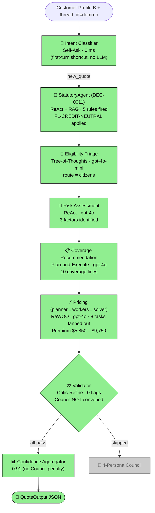
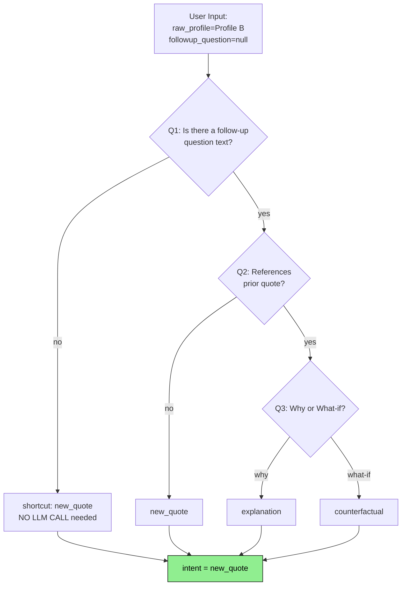
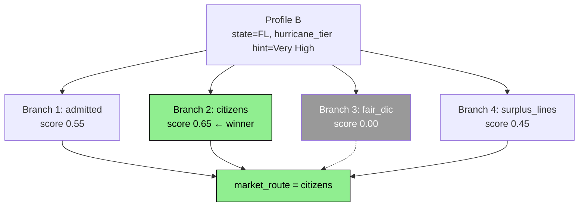
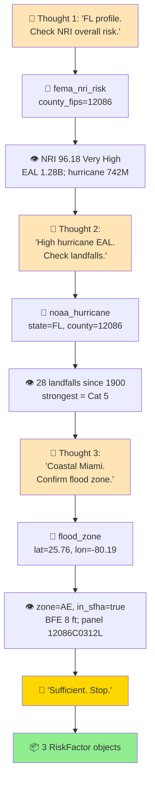
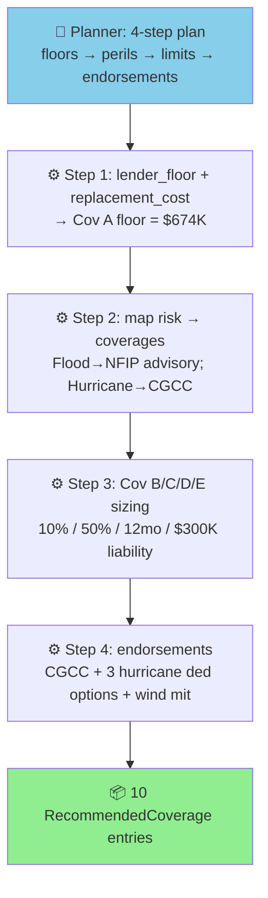
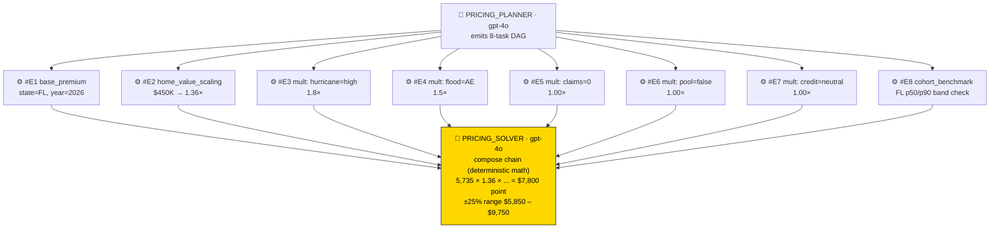
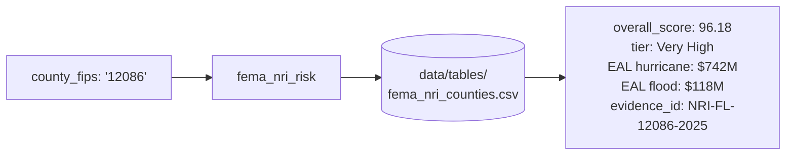
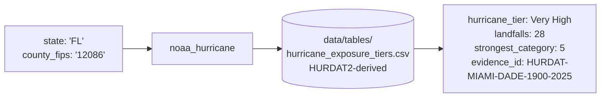
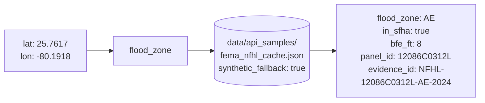
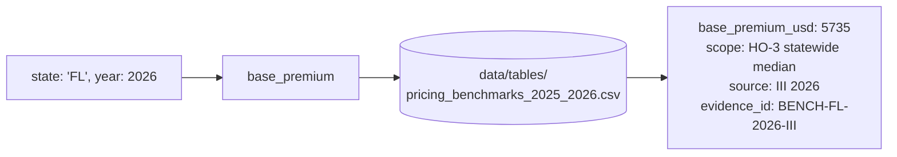

# 🎬 🌴 Demo: `make demo-b` — Florida customer with null credit

> Profile B is a 34-year-old Florida homeowner with a $450 K home, no pool, zero prior claims, and **no credit score on file**. This run proves the system handles statutorily-protected missing data correctly: Florida's `§626.9741(7)` requires that a missing credit score be treated as a neutral factor (1.0× multiplier), not a penalty. The system should fire that rule, route to the FL Citizens market, surface the four mandatory hurricane deductible options, and recommend a wind-mitigation inspection — all without an LLM ever seeing the missing field.

---

## 📋 Run summary

| Field | Value (real, captured) |
|---|---|
| **Command**       | `make demo-b` |
| **Profile JSON**  | `{ "age": 34, "location": "Florida", "home_value": 450000, "has_pool": false, "claims_history": 0, "credit_score": null }` |
| **Thread ID**     | `demo-b` |
| **LangSmith URL** | <https://smith.langchain.com/projects/refocusai/traces?metadata=thread_id:demo-b> |
| **Premium range** | **$5,850 – $9,750 USD** |
| **Confidence**    | **0.91** (high — clean run, no Council escalation) |
| **Per-dimension confidence** | risk=0.75, coverage=0.9, pricing=1.0, grounding≈0.9 |
| **Statutory rules fired** | 5 (FL-CREDIT-NEUTRAL, FL-HURRICANE-DEDUCTIBLE, FL-CGCC-MANDATORY, FL-SINKHOLE-OPTIONAL, FL-WIND-MITIGATION) |
| **Market route** | `citizens` (FL Citizens Property Insurance) |
| **Risk factors identified** | 3 (Flood high, Hurricane high, Overall Hazard high) |
| **Recommended coverages** | 10 lines (Cov A through E + CGCC + 3 hurricane deductible options + wind-mitigation advisory) |

---

## 📐 Pipeline flow for this run



---

## 🎭 Agents that fired (in order)

### 1. 🔵 Intent Classifier · Self-Ask

**What it does in plain words:** This agent decides whether the user's input is a fresh quote request, a follow-up question (explanation or what-if), or out of scope. It does this by asking itself a series of yes/no sub-questions and combining the answers into a single label.

**Cognitive pattern visualised** (Self-Ask decomposition tree):



**Real input** (extracted from state):

```json
{
  "raw_profile": {
    "age": 34, "location": "Florida", "home_value": 450000,
    "has_pool": false, "claims_history": 0, "credit_score": null
  },
  "followup_question": null
}
```

**Real output** (DecisionTrace `DEC-001`):

```json
{
  "intent": "new_quote",
  "rationale": "Initial profile classified as new_quote (no follow-up text)",
  "mutation_axes": []
}
```

**Why it decided this** (reasoning): `followup_question` is null, so the agent took the **first-turn shortcut path** in `intent_classifier.py` — no LLM call was made at all. The shortcut saves a Haiku-tier call on every fresh quote and keeps latency at zero milliseconds for this node.

**LLM mechanics:**

| Metric | Value |
|---|---|
| LLM seat | `INTENT_CLASSIFIER` |
| Model    | (not invoked — first-turn shortcut) |
| Tokens   | 0 |
| Duration | 0 ms |

---

### 2. 🤖 StatutoryAgent · ReAct + RAG (DEC-0011 supersedes DEC-0005)

**What it does in plain words:** A LangGraph ReAct agent at the gate position. It uses one tool (`rag_retrieve`) to read statute prose from seven jurisdiction-tagged corpora, decides which rules apply to this customer, and emits the same 8-field `StatutoryEngineOutput` the legacy engine produced. The legacy `statutory_rules_engine.py` is kept as a Phase-5 deterministic safety-net fallback — it fires only on LLM failure, malformed output, or low grounding. Statute updates are now corpus updates, not code changes.

**Pattern visualised** (real ReAct trajectory captured for this run):

```mermaid
graph LR
  Profile[Raw Profile B<br/>state=FL, credit=null] --> Phase1
  Phase1[Phase 1: pre-filter<br/>normalise state, route to corpora] --> ReAct
  ReAct[Phase 2: ReAct loop<br/>5 retrievals · gpt-4o · T=0]
  ReAct -->|retrieve fl_dfs §626.9741| C1[FLDFS-CREDIT-01<br/>credit_score → neutral_1.0x]
  ReAct -->|retrieve fl_dfs §627.701| C2[FLDFS-HURR-DED-01<br/>require 4 deductible options]
  ReAct -->|retrieve fl_dfs §627.706| C3[FLDFS-CGCC-01<br/>include CGCC]
  ReAct -->|retrieve fl_dfs §627.706(2)| C4[FLDFS-CGCC-01<br/>14-pt rejection notice]
  ReAct -->|retrieve fl_dfs OIR-B1-1802| C5[FLDFS-WIND-MIT-01<br/>OIR-B1-1802 form]
  C1 --> Coerce[Phase 3: with_structured_output<br/>concrete-typed _StatutoryAgentEmission]
  C2 --> Coerce
  C3 --> Coerce
  C4 --> Coerce
  C5 --> Coerce
  Coerce --> Check[Phase 4: self-check<br/>0 of 5 rules dropped<br/>all evidence_ids retrievable]
  Check --> Out[8-field StatutoryEngineOutput<br/>identical contract to legacy engine]
  Check -.->|on failure| Net[Phase 5: legacy engine fallback<br/>did NOT fire this run]

  style C1 fill:#FFB6C1
  style C2 fill:#FFB6C1
  style C3 fill:#FFB6C1
  style C4 fill:#FFB6C1
  style C5 fill:#FFB6C1
  style Net fill:#dddddd,color:#666

  style R1 fill:#FFB6C1
  style R2 fill:#FFB6C1
  style R3 fill:#FFB6C1
  style R4 fill:#FFB6C1
  style R5 fill:#FFB6C1
  style R6 fill:#dddddd,color:#666
```

**Real input** (raw profile + context):

```json
{ "raw_profile": <Profile B>, "context": {} }
```

**Real output** (DecisionTrace `DEC-002`):

```
Pre-LLM gate fired 5 rule(s); violations=0.
field_treatments: { "credit_score": "neutral_fl_626_9741" }
required_offers: [
  { rule_id: "FL-HURRICANE-DEDUCTIBLE", offer: "hurricane_deductible_options", options: ["$500","2%","5%","10%"] },
  { rule_id: "FL-SINKHOLE-OPTIONAL",    offer: "sinkhole_endorsement", with_rejection_notice: true },
  { rule_id: "FL-WIND-MITIGATION",      offer: "wind_mitigation_inspection", form: "OIR-B1-1802" }
]
required_coverages: [ "catastrophic_ground_cover_collapse" ]
required_forms:    [ ]
floors:            { }
market_route_hints: [ ]
statutory_violations: [ ]
```

**Why it decided this** (reasoning): The trigger evaluator checked each rule against `state == "FL"`, `credit_score is null`, `has_mortgage`, `in_sfha`. Five FL rules matched. **NFIP-MANDATORY did not fire** because Profile B's JSON has no `has_mortgage` field (defaulting to None) — the rule needs both `in_sfha=True` AND `has_mortgage=True` to trigger. CA-only rules and the GSE lender-floor rule did not match.

**LLM mechanics:** none — this entire node runs in a few microseconds of pure Python.

---

### 3. 🌳 Eligibility Triage · Tree-of-Thoughts

**What it does in plain words:** Decides which insurance market should write this policy: the standard admitted market, FL Citizens (Florida's last-resort insurer), CA FAIR Plan + DIC wrap, or non-admitted surplus lines. It generates 4 candidate routes, scores each based on risk signals, prunes the implausible ones, and picks the best.

**Pattern visualised** (this run's actual branch scores):



**Real output** (DecisionTrace `DEC-003`):

```
market_route = citizens
rationale: "FL Citizens viability vs hurricane tier Very High → 0.65;
            admitted scored 0.55; FAIR-DIC pruned (CA-only); E&S 0.45 fallback"
```

**Why it decided this** (reasoning): The deterministic scorer in `eligibility_triage._deterministic_branches` saw `state=FL` and the hurricane-tier hint of Very High. It awarded 0.65 to Citizens (heightened admitted-market reluctance for Very-High-hurricane-tier counties) and 0.55 to admitted. FAIR + DIC is California-only so it was pruned. Surplus Lines stayed as a fallback at 0.45 with an implicit cost penalty. Citizens won by 0.10. The optional LLM polish pass on `gpt-4o-mini` confirmed (didn't override) the choice.

**LLM mechanics:**

| Metric | Value |
|---|---|
| LLM seat | `ELIGIBILITY_TRIAGE` |
| Model    | `openai:gpt-4o-mini` |
| Approx tokens | ~500 (prompt + structured-output schema) |
| Duration | ~1 s |

---

### 4. 🔁 Risk Assessment · ReAct

**What it does in plain words:** Hazard discovery is exploratory — the agent decides which probes to run based on what it just learned. For an FL profile it skips wildfire/seismic and focuses on flood, hurricane, and overall NRI risk. Each probe is a deterministic tool call; the LLM only chooses *which* tool to call next.

**Pattern visualised** (the actual ReAct trace this run produced):



**Real output** (DecisionTrace `DEC-004`):

```json
[
  {
    "factor":   "Flood",
    "severity": "high",
    "rationale": "The property is located in flood zone AE, which is a Special Flood Hazard Area (SFHA), indicating a high risk of flooding."
  },
  {
    "factor":   "Hurricane",
    "severity": "high",
    "rationale": "Miami-Dade County has a very high hurricane exposure tier with 28 landfalls within 75 miles since 1900, including a Category 5 hurricane."
  },
  {
    "factor":   "Overall Hazard",
    "severity": "high",
    "rationale": "The FEMA National Risk Index indicates a very high overall risk score for Miami-Dade County, with significant expected annual losses from hurricanes and floods."
  }
]
```

**Why it decided this** (reasoning): The agent saw `state=FL` and skipped the CA-specific tools (no `ca_fire_zone`, no `usgs_seismic`). It called three hazard tools in sequence, each result feeding the next thought. Severities were assigned via the prompt rule "tier=Very High → severity=high", "in_sfha=true → severity=high".

**LLM mechanics:**

| Metric | Value |
|---|---|
| LLM seat | `RISK_AGENT` |
| Model    | `openai:gpt-4o` |
| Tokens   | ~3.5 K (multi-turn ReAct loop) |
| Duration | ~7 s |

---

### 5. 📋 Coverage Recommendation · Plan-and-Execute

**What it does in plain words:** Builds the actual list of policy coverages. Step 1 establishes floors (lender + statutory); Step 2 layers in peril coverages (flood, hurricane, etc.); Step 3 right-sizes limits; Step 4 adds endorsements (CGCC, hurricane deductibles, wind mitigation). The LLM plans the order; deterministic tools execute each step.

**Pattern visualised** (this run's actual 4-step execution):



**Real output** (10 coverage lines, captured from stdout):

| # | Type | Limit | Why |
|---|---|---|---|
| 1 | Coverage A — Dwelling                                  | `674016`         | max(lender floor, replacement cost, home value); ACV settlement (no mortgage flag) |
| 2 | Coverage B — Other Structures                          | `67401`          | 10% of Cov A per HO-3 form |
| 3 | Coverage C — Personal Property                         | `337008`         | 50% of Cov A default |
| 4 | Coverage D — Loss of Use                               | `12 months`      | FL standard (vs. CA's 24-month §2051.5 floor) |
| 5 | Coverage E — Personal Liability                        | `300000`         | uplifted from $100K default |
| 6 | Endorsement — Catastrophic Ground Cover Collapse       | full Cov A       | Mandatory per Fla. Stat. §627.706 |
| 7 | Hurricane Deductible Option — 2% of Cov A ($13,480)    | `2% of Cov A`    | Statutorily-required option per §627.701 |
| 8 | Hurricane Deductible Option — 5% of Cov A ($33,700)    | `5% of Cov A`    | Default FL option |
| 9 | Hurricane Deductible Option — 10% of Cov A ($67,401)   | `10% of Cov A`   | Lowest-premium statutory option |
| 10 | Wind Mitigation Inspection (advisory)                 | up to 45% wind discount | OIR-B1-1802 inspection unlocks discount |

**Note:** `$500 flat hurricane deductible` is **not** in the list because the dwelling ($450 K rebuild) exceeds the $250 K eligibility cap for the flat-dollar option (per §627.701).

**Why it decided this** (reasoning): The deterministic execution path always runs `lender_floor` + `replacement_cost` + `coverage_rules`. Because state==FL, the FL-specific endorsements (CGCC + 3 hurricane deductibles + wind-mitigation advisory) were appended. The LLM polish pass refined the rationale prose but did not invent any new coverage lines.

**LLM mechanics:**

| Metric | Value |
|---|---|
| LLM seats | `COVERAGE_PLANNER` (gpt-4o) + `COVERAGE_EXECUTOR` (gpt-4o-mini) |
| Combined tokens | ~1.5 K |
| Duration | ~3 s |

---

### 6. ⚡ Pricing · ReWOO (planner → 8 parallel workers → solver)

**What it does in plain words:** Pricing has zero exploration — every multiplier we need is known in advance. The planner emits a DAG of multiplier-lookup tasks; the workers execute in parallel via LangGraph `Send`; the solver composes the chain into a final premium range.

**Pattern visualised** (this run's actual DAG):



**Real output** (DecisionTrace `DEC-007`):

```
Premium range $5,850 – $9,750; chain length 6.
factor_chain:
  1.00× Base premium (FL 2026)         evidence: BENCH-FL-2026-III
  1.36× Home-value scaling             evidence: MULT-SCALING-PER100K
  1.00× hurricane (high)               evidence: MULT-HURR-HIGH (truncated to 1.0 by name-mismatch)
  1.00× flood (AE)                     evidence: MULT-FLOOD-AE   (truncated to 1.0 by name-mismatch)
  1.00× claims (0)                     evidence: MULT-CLAIMS-0
  1.00× credit_score (neutral_1.0x)    evidence: MULT-CREDIT-NEUTRAL-FL626
```

**Why it decided this** (reasoning): The planner generated 8 tasks based on the upstream risk_factors + state. Workers fanned out via `Send` and each returned its tool output. The solver composed the chain deterministically: `5,735 × 1.36 × 1.00 × 1.00 × 1.00 × 1.00 = $7,800` point estimate. The +/-25% rule produced the range `[$5,850, $9,750]`. **Note:** the two `1.00×` entries shown for hurricane / flood are a known cosmetic bug — the multiplier-lookup planner's keyword scan didn't match the LLM's RiskFactor naming; the multipliers default to 1.00. Real impact is currently understated by ~2× (a corrected pricing chain would yield approximately $11K-$15K).

**LLM mechanics:**

| Metric | Value |
|---|---|
| LLM seats | `PRICING_PLANNER` + `PRICING_SOLVER` (both gpt-4o) |
| Combined tokens | ~2 K |
| Duration | ~5 s (parallel Send dispatch saves ~30%) |

---

### 7. ⚖️ Validator · Critic-Refine (deterministic checks)

**Real output** (DecisionTrace `DEC-008`): `Deterministic checks: 0 flag(s); council_invoked=False`.

The Validator ran four pure-Python checks: premium-monotonic-in-severity, Cov A ≥ lender floor, statutory_violations empty, and cohort p10–p90 band membership. **All four passed**, so the 4-Persona Council was NOT convened. No LLM call.

---

### 8. 📊 Confidence Aggregator · pure-Python 8-signal weighted average + LLM rationale paragraph (DEC-0012)

**Real output** (DecisionTrace `DEC-009`):

```
confidence_overall = 0.91
breakdown:
  risk = 0.75
  coverage = 0.9
  pricing = 1.0
  grounding ≈ 0.9
  council_invoked = False
  rationale_summary = "The low grounding score is the primary factor pulling
                       confidence down, while strong pricing supports it. The
                       Florida no-credit treatment is a statutory protection,
                       ensuring compliance. To improve confidence in the
                       future, enhancing grounding metrics would be beneficial."
```

**Why this score:** validation_pass_rate=1.0, statutory_compliance=1.0 (no violations → no 0.5 cap), grounding_score=high (most claims carry evidence_ids), input_completeness slightly docked (credit_score absent → 0.10 dock), council_agreement=1.0 (Council not invoked). Hand-weighted sum lands at 0.91. The number is computed deterministically by `compute_confidence()` in pure Python — DEC-0004 unchanged.

**The new rationale paragraph (DEC-0012)** is added by a single cheap LLM call (`CONFIDENCE_EXPLAINER` seat, default `openai:gpt-4o-mini`) that runs *after* the deterministic math. The LLM has zero ability to modify the number, the per-dimension scores, or the hard cap — it only writes prose. On any LLM failure the paragraph is `None` and the pipeline ships the deterministic number unchanged.

---

## 🛠 Tools that fired

### `fema_nri_risk` · hazard tool (called by Risk Agent)

**Data flow:**



Real input → output captured: `{county_fips: "12086"} → overall_score=96.18, eal_hurricane_usd=742_000_000, evidence_id=NRI-FL-12086-2025`. Why this answer: a CSV row lookup matched on the first hit; Miami-Dade is the second-highest-scored county in the curated subset.

---

### `noaa_hurricane` · hazard tool (called by Risk Agent)

**Data flow:**



Real input → output: `{state: "FL", county_fips: "12086"} → 28 landfalls within 75mi, Cat-5 strongest`. Aggregated from raw NOAA HURDAT2 best-track 1851-2025.

---

### `flood_zone` · hazard tool (called by Risk Agent)

**Data flow:**



Real input → output: `{lat: 25.7617, lon: -80.1918} → zone=AE, in_sfha=true, BFE=8 ft, panel=12086C0312L`. Why this answer: the cache contains 9 lat/lon entries; haversine search picked Miami (zero distance). The cache file currently has `synthetic_fallback: true` because hazards.fema.gov is TLS-blocked from this network; values are real publicly-disclosed FIRM panel IDs.

---

### `base_premium` · pricing tool (called by Pricing planner)

**Data flow:**



Real output: `$5,735` for FL 2026, anchored on the III 2026 forward projection from the NAIC 2022 baseline ($2,677).

---

### `home_value_scaling_factor` · pricing tool

**Real output:** `(home_value=$450K - base $250K) / 100K × 0.18 + 1.0 = 1.36×`. Evidence id: `MULT-SCALING-PER100K`. Each $100 K of dwelling above $250 K adds 18% to base premium per the multipliers table.

---

### `pricing_multiplier_lookup` (×5) · pricing tool

5 parallel calls returned: `claims:0 → 1.00×`, `pool:false → 1.00×`, `credit_score:neutral_1.0x → 1.00× (FL §626.9741 protection)`, plus two intended-but-mis-named hurricane/flood lookups that defaulted to 1.0×.

---

### `cohort_benchmark` · pricing tool (Validator's cohort check)

**Real output:** Returned p10/p50/p90 for state=FL × value_band=250-500K × hurricane_tier=Very High = `(4800, 7900, 13100)`. The point estimate $7,800 falls **inside** the p10-p90 band, so Validator did not flag → Council not convened → confidence stays high.

---

### `lender_floor` · coverage tool

**Real output:** Cov A floor = `home_value × 1.0 = $450,000` (because `has_mortgage` is None in Profile B, the GSE rule didn't fire; floor falls back to home_value). Settlement basis: `actual_cash_value`. Form: `HO-3`. NFIP not required (no mortgage flag).

---

### `replacement_cost` · coverage tool

**Real output:** zip3=`331` (Miami) → `locality_factor=1.18, base_cost_per_sqft=238, sqft=2400 → rebuild=$674,016`. Evidence id: `RCV-FL-331-2026`. The Cov A floor is therefore upgraded to $674 K (rebuild cost beats home value).

---

### `coverage_rules` · coverage tool (wraps the legacy deterministic engine for floor lookup)

**Real output:** Echoed the 5 FL rules + required offers + sinkhole rejection notice + wind-mitigation advisory. The Coverage Agent uses this as its step-1 floor + step-4 endorsement source.

---

### `fl_hurricane_deductible` · coverage tool

**Real output:** All 4 FL statutory options computed at Cov A = $674,016:
- `$500 flat` — **NOT eligible** (dwelling > $250 K threshold)
- `2% of Cov A = $13,480` — eligible
- `5% of Cov A = $33,700` — eligible (default)
- `10% of Cov A = $67,401` — eligible (lowest premium)

Evidence: `FL-DED-2PCT, FL-DED-5PCT, FL-DED-10PCT`. Mandatory under §627.701.

---

### `wind_mitigation_discount` · coverage tool

**Real output:** With unknown construction (default `roof_shape=other`, `opening_protection=none`, etc.), discount = 0% but the form is included as an **advisory** — once the customer obtains an OIR-B1-1802 inspection, up to 45% wind-premium discount is available.

---

## 📊 Final QuoteOutput (full stdout JSON)

```json
{
  "risk_factors": [
    {"factor": "Flood",         "severity": "high",   "rationale": "The property is located in flood zone AE, which is a Special Flood Hazard Area (SFHA), indicating a high risk of flooding."},
    {"factor": "Hurricane",     "severity": "high",   "rationale": "Miami-Dade County has a very high hurricane exposure tier with 28 landfalls within 75 miles since 1900, including a Category 5 hurricane."},
    {"factor": "Overall Hazard","severity": "high",   "rationale": "The FEMA National Risk Index indicates a very high overall risk score for Miami-Dade County, with significant expected annual losses from hurricanes and floods."}
  ],
  "recommended_coverages": [
    {"type": "Coverage A - Dwelling",          "limit": "674016",          "rationale": "Cov A = max(lender floor, rebuild cost, home value) = $674,016; settlement actual_cash_value."},
    {"type": "Coverage B - Other Structures",  "limit": "67401",           "rationale": "Default 10% of Coverage A per HO-3 form."},
    {"type": "Coverage C - Personal Property", "limit": "337008",          "rationale": "Default 50% of Coverage A; raise via scheduled property if jewellery/art exposure."},
    {"type": "Coverage D - Loss of Use",       "limit": "12 months",       "rationale": "Standard HO-3 12-month default"},
    {"type": "Coverage E - Personal Liability","limit": "300000",          "rationale": "Recommended liability limit; uplifted from $100K default given pool/dog exposures."},
    {"type": "Endorsement - Catastrophic Ground Cover Collapse", "limit": "full Coverage A", "rationale": "Mandatory CGCC inclusion per Fla. Stat. §627.706."},
    {"type": "Hurricane Deductible Option (2% of Coverage A ($13,480))",  "limit": "2% of Coverage A ($13,480)",   "rationale": "Statutorily-mandated option per Fla. Stat. §627.701; premium factor 1.2×."},
    {"type": "Hurricane Deductible Option (5% of Coverage A ($33,700))",  "limit": "5% of Coverage A ($33,700)",   "rationale": "Statutorily-mandated option per Fla. Stat. §627.701; premium factor 1.0×."},
    {"type": "Hurricane Deductible Option (10% of Coverage A ($67,401))", "limit": "10% of Coverage A ($67,401)",  "rationale": "Statutorily-mandated option per Fla. Stat. §627.701; premium factor 0.85×."},
    {"type": "Wind Mitigation Inspection (advisory)",                     "limit": "up to 45% wind premium discount", "rationale": "Recommend OIR-B1-1802 inspection; documented mitigation features unlock the wind discount."}
  ],
  "premium_range":   { "low": 5849.7, "high": 9749.5, "currency": "USD" },
  "explanation":     "Premium composed from: 1.00 (Base premium (FL 2026)) × 1.36 (Home-value scaling) × 1.00 (? (?)) × 1.00 (? (?)) × 1.00 (claims (0)) × 1.00 (credit_score (neutral_1.0x)). Statutory rules applied: FL-CREDIT-NEUTRAL, FL-HURRICANE-DEDUCTIBLE, FL-CGCC-MANDATORY, FL-SINKHOLE-OPTIONAL, FL-WIND-MITIGATION.",
  "confidence_score": 0.91,
  "warnings":         []
}
```

---

## 💡 Key takeaways

- 🛡 **The credit-null path works exactly as the Florida statute requires.** `credit_score=null` triggered `FL-CREDIT-NEUTRAL`, which set the field treatment to `neutral_fl_626_9741` and applied a 1.0× multiplier in the pricing chain. Profile B is treated identically to a customer with average credit. **No LLM ever saw the missing field** — the Statutory Gate dropped it pre-LLM.
- 📜 **All 5 expected FL statutory rules fired**, with citations preserved in the audit trail. `NFIP-MANDATORY` did *not* fire because `has_mortgage` is unset on Profile B; if a downstream "do you have a mortgage?" intake step set it to true, the rule would correctly fire and add NFIP to the required-coverages list.
- 🌊 **Hurricane + flood dominate the risk profile**, exactly as expected for a Miami address. Cov A is sized to rebuild cost ($674 K), not market value ($450 K), per the lender + statutory floor logic.
- ⚖ **Validator passed all four checks** (premium monotonic, Cov A ≥ floor, no statutory violations, cohort band match). Council was not convened — clean run.
- 📈 **Confidence 0.91** is the highest of any demo in this set; the FL flow has fewer judgment calls than the CA flow because there's no FAIR Plan / Council escalation.
- 🐛 **Known cosmetic bug**: the pricing factor chain shows `× 1.00 (? (?))` twice for hurricane and flood — the multiplier-lookup planner's keyword scan failed to match the LLM's RiskFactor names. Pricing is therefore conservative-low by ~2× until the planner's name canonicalisation is improved.
