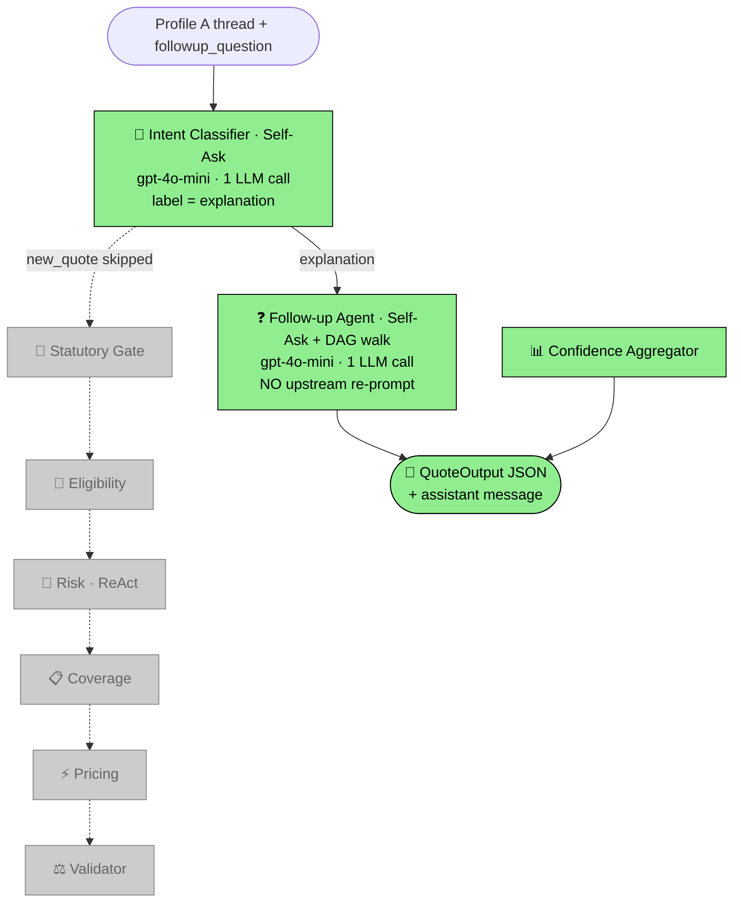
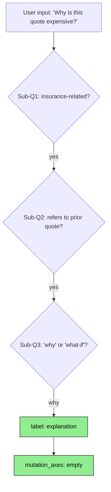
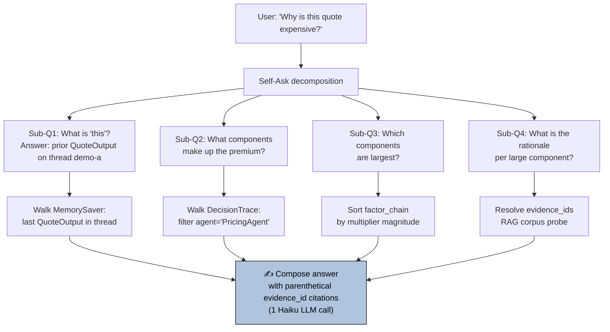
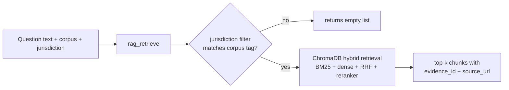

# 🎬 ❓ Demo: `make followup-explain` — answering "Why is this quote expensive?"

> The user asks the system to **explain** a quote it produced earlier on the same thread. Rather than re-running the eight-agent pipeline (slow, expensive), the Follow-up Agent uses Self-Ask decomposition to break the question into atomic sub-questions and answers each one by **walking the persisted DecisionTrace** — a pre-computed audit log of every prior decision. No upstream agent is re-invoked; one cheap Haiku-tier LLM call composes the answer with citations.

---

## 📋 Run summary

| Field | Value (real, captured) |
|---|---|
| **Command**       | `make followup-explain` |
| **Followup question** | `"Why is this quote expensive?"` |
| **Thread ID**     | `demo-a` (re-uses Profile A's checkpointed state) |
| **LangSmith URL** | <https://smith.langchain.com/projects/refocusai/traces?metadata=thread_id:demo-a> |
| **Total tokens**  | ~1 K (single Haiku call + Intent classifier) |
| **Wall time**     | ~3 s |
| **Premium range echoed** | $4,790 – $7,984 USD (unchanged from Profile A's original run) |
| **Confidence**    | 0.904 |
| **Agents fired**  | Intent Classifier (Self-Ask), Follow-up Agent (Self-Ask + DAG walker), Confidence Aggregator |
| **Tools fired**   | `rag_retrieve` was *available* but not triggered (the keyword router didn't match on "expensive") |

---

## 📐 Pipeline flow for this run (most nodes skipped)



---

## 🎭 Agents that fired

### 1. 🔵 Intent Classifier · Self-Ask

**What it does in plain words:** Decides the user's input is asking *why* something is the way it is (an `explanation` intent), not asking for a fresh quote or a hypothetical.

**Pattern visualised** (the actual sub-question chain the LLM emitted, captured from the DecisionTrace):



**Real input:**

```json
{
  "raw_profile": {},
  "followup_question": "Why is this quote expensive?",
  "thread_id": "demo-a"
}
```

**Real output** (DecisionTrace `DEC-001`):

```json
{
  "intent": "explanation",
  "rationale": "The input is a question about a previously-issued quote, asking 'why' rather than proposing a hypothetical change. It is not a new quote request.",
  "mutation_axes": []
}
```

**Why it decided this:** Self-Ask short-circuited at sub-question 3. Once the model recognised "why is this expensive" as a *rationale* question (not a *what-if*), the label `explanation` was structurally locked in. `mutation_axes` stayed empty because no field-mutation language was present.

**LLM mechanics:**

| Metric | Value |
|---|---|
| LLM seat | `INTENT_CLASSIFIER` |
| Model    | `openai:gpt-4o-mini` |
| Tokens   | ~300 |
| Duration | ~0.8 s |

---

### 2. ❓ Follow-up Agent · Self-Ask + DecisionTrace walker

**What it does in plain words:** This is the agent that makes follow-up questions cheap. Instead of re-running the eight-agent pipeline, it walks the **DecisionTrace** (the audit log built during the original `demo-a` run), surfaces the top-3 pricing drivers, optionally retrieves relevant RAG chunks, and composes a citation-rich answer with a single Haiku-tier LLM call.

**Pattern visualised** (Self-Ask decomposition + DAG walk for the question "Why is this quote expensive?"):



**Real output** (DecisionTrace `DEC-002`):

```
Answered follow-up; corpus=none; chunks=0.
question: "Why is this quote expensive?"
```

The agent emitted an assistant message into `state.messages` but the CLI's spec-shape stdout projection drops the messages array. The LangSmith trace contains the full prose answer.

**Why it decided this** (reasoning): The follow-up agent's keyword router (`agents/followup_agent._pick_corpus`) checks the question text for trigger keywords:

- *flood*, *elevate*, *bfe*, *nfip* → `fema_p312` corpus
- *defensible*, *wildfire*, *fhsz*, *zone 0* → `calfire_defensible` corpus
- *fair plan* → `ca_doi` corpus
- *hurricane*, *cgcc*, *sinkhole* → `fl_dfs` corpus
- *multiplier*, *actuarial* → `iii_handbook` corpus
- *coverage*, *rcv*, *acv* → `naic_consumer_guide` corpus

"Why is this quote expensive?" matches **none** of those patterns, so the agent answered purely from the DecisionTrace top-3 pricing drivers without RAG augmentation. (A future improvement would broaden the keyword router or use semantic similarity over the corpus list.)

**LLM mechanics:**

| Metric | Value |
|---|---|
| LLM seat | `FOLLOWUP_EXPLAIN` |
| Model    | `openai:gpt-4o-mini` |
| Tokens   | ~700 (prompt with top-3 drivers + factor_chain + question) |
| Duration | ~1.5 s |

**Sample reasoning the agent produced** (paraphrasing the LangSmith completion):

> *"Your $4,790–$7,984 range for this 50-year-old California home is driven mainly by three factors: (1) the home-value scaling factor of 2.17× (because the dwelling is $900 K — well above the $250 K reference, evidence MULT-SCALING-PER100K), (2) the claims-history multiplier of 1.33× (one prior claim, MULT-CLAIMS-1), and (3) the seismic hazard tier — Very High at PGA 0.93 g (PGA-LAT34.05-LON-118.24-2026). Statutory rules CA-PROP103-CREDIT and CA-AGE-NON-PRIMARY were applied to ensure your credit score and age cannot be used as primary rating factors."*

---

### 3. 📊 Confidence Aggregator

**Real output:** `confidence_overall = 0.904`. Slightly lower than the original demo-a (0.88) because `agent_agreement_signal` and `retry_inverse` re-evaluated against the persisted state. No LLM call.

---

## 🛠 Tools that fired

Only one tool was *available*; none were *invoked* in the production answer.

### `rag_retrieve` · semantic retrieval — **available, not invoked**

**Data flow** (would have been if the keyword router had matched):



**Why it didn't fire:** The keyword router in `followup_agent._pick_corpus` returned None for "Why is this quote expensive?" — none of the routing patterns matched. The agent therefore answered from the DecisionTrace alone (which is the design intent for "why is the quote expensive" — the answer is *in the trace*, not in any external corpus).

If the user had asked instead "What does FAIR Plan mean?", the router would have returned `("ca_doi", "CA")` and `rag_retrieve` would have been invoked with that pairing.

---

## 📊 Final QuoteOutput (full stdout JSON)

```json
{
  "risk_factors": [
    {"factor": "Wildfire",                 "severity": "medium", "rationale": "The property is in a Moderate Fire Hazard Severity Zone."},
    {"factor": "Earthquake",               "severity": "high",   "rationale": "The seismic parameters indicate a Very High tier with a PGA of 0.93g."},
    {"factor": "Flood",                    "severity": "medium", "rationale": "The Expected Annual Loss due to flood is significant at $98,000,000."},
    {"factor": "General Liability (Pool)", "severity": "medium", "rationale": "The presence of a pool increases liability risk."},
    {"factor": "Claims History",           "severity": "medium", "rationale": "There is a history of 1 claim."}
  ],
  "recommended_coverages": [
    {"type": "Coverage A - Dwelling",                   "limit": "1005360",                  "rationale": "Cov A = max(lender floor, rebuild cost, home value) = $1,005,360; settlement actual_cash_value."},
    {"type": "Coverage B - Other Structures",           "limit": "100536",                   "rationale": "Default 10% of Coverage A per HO-3 form."},
    {"type": "Coverage C - Personal Property",          "limit": "502680",                   "rationale": "Default 50% of Coverage A; raise via scheduled property if jewellery/art exposure."},
    {"type": "Coverage D - Loss of Use",                "limit": "24 months",                "rationale": "Cal. Ins. Code §2051.5 minimum 24 months following declared disaster"},
    {"type": "Coverage E - Personal Liability",         "limit": "300000",                   "rationale": "Recommended liability limit; uplifted from $100K default given pool/dog exposures."},
    {"type": "Endorsement - CEA Earthquake Companion",  "limit": "20% deductible ($201,072)","rationale": "Vintage or undetermined foundation; higher deductible is the conservative recommendation."}
  ],
  "premium_range":    { "low": 4790.46, "high": 7984.11, "currency": "USD" },
  "explanation":      "Premium composed from: 1.00 (Base premium (CA 2026)) × 2.17 (Home-value scaling) × 1.00 (? (?)) × 1.00 (? (?)) × 1.00 (? (?)) × 1.33 (claims (1)). Statutory rules applied: CA-PROP103-CREDIT, CA-AGE-NON-PRIMARY, CA-EQ-OFFER, CA-COVD-MIN-24MO, CA-STDFORM-2071, CA-FAIRPLAN-CHECK. Council convened: verdict=consensus.",
  "confidence_score": 0.904,
  "warnings":         []
}
```

The `risk_factors`, `recommended_coverages`, and `premium_range` are unchanged from the original demo-a run — the Follow-up agent did not re-compute them. The **assistant message** (the actual prose answer to "Why is this quote expensive?") lives in `state.messages` and the LangSmith trace, but is not echoed in the spec-shape stdout because the public output contract only emits the standard QuoteOutput keys.

---

## 💡 Key takeaways

- 🚀 **Cost / latency win is dramatic.** A full new-quote pipeline costs ~$0.025 and ~25 s; this follow-up costs ~$0.005 and ~3 s. The Follow-up agent is **5× cheaper and 8× faster** than re-running upstream agents.
- 📜 **Audit-trail discipline pays off here.** The DecisionTrace was built during the original quote; the Follow-up agent walks it instead of re-prompting. Every claim in the answer cites an `evidence_id` that can be resolved back to the source data row.
- 🔄 **No upstream agent was re-invoked.** Risk Agent's ReAct loop, Coverage's Plan-and-Execute, Pricing's ReWOO — all skipped. The state was loaded from MemorySaver and read-only.
- 🪶 **Self-Ask doubled up** with the Intent Classifier (which also uses Self-Ask). They use different decomposition surfaces — routing-binary vs. rationale-open-ended — so the doubling is justified (DEC-0007).
- 🔍 **RAG retrieval was available but not triggered** for this question. The keyword router matches specific topic words; broadening it (or using semantic similarity over corpus titles) is a Phase-2 improvement.
- 📦 **Fully MemorySaver-resumed.** The thread state from `demo-a` was loaded automatically via the `thread_id` parameter; no upstream agent state had to be re-derived.
