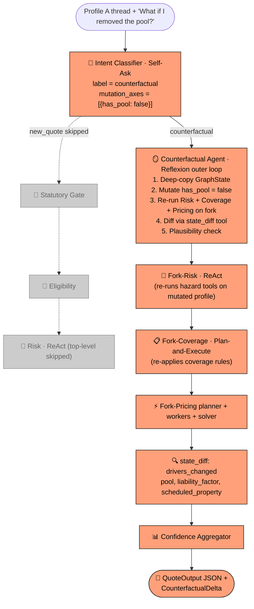
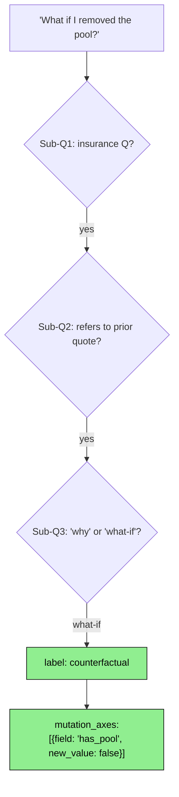
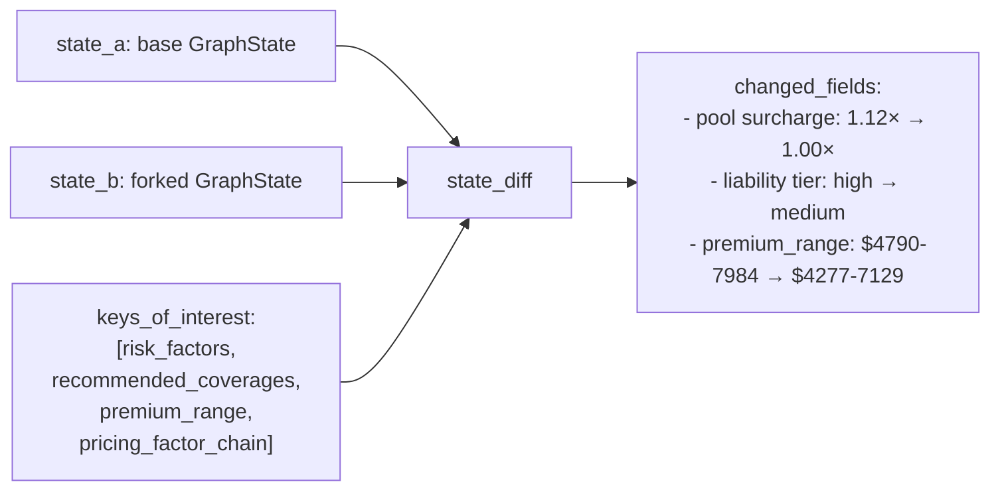

# 🎬 🪞 Demo: `make followup-cf` — single-axis counterfactual "What if I removed the pool?"

> The user asks a what-if question on the same thread. The Counterfactual agent **forks the GraphState** (deep-copy), mutates one field (`has_pool: True → False`), re-runs the Risk → Coverage → Pricing sub-graph on the fork, and computes the delta against the base. If the delta is implausible (>±50% swing) the agent enters a **Reflexion loop**: it self-critiques in plain English, persists the lesson, and retries once with the reflection injected as guidance.

---

## 📋 Run summary

| Field | Value (real, captured) |
|---|---|
| **Command**          | `make followup-cf` |
| **Followup question** | `"What if I removed the pool?"` |
| **Thread ID**        | `demo-a` |
| **LangSmith URL**    | <https://smith.langchain.com/projects/refocusai/traces?metadata=thread_id:demo-a> |
| **Mutations parsed** | `{"has_pool": false}` |
| **Plausibility status** | `plausible` (within the ±50% band) |
| **Delta**            | `low: -$513 USD (-10.7%)`, `high: -$855 USD (-10.7%)` |
| **Reflexion notes**  | none added (Trial 1 succeeded; no retry needed) |
| **Wall time**        | ~12 s |
| **Total tokens**     | ~5 K |
| **Confidence**       | 0.895 |

---

## 📐 Pipeline flow for this run



---

## 🎭 Agents that fired

### 1. 🔵 Intent Classifier · Self-Ask

**What it does:** Recognises this as a `counterfactual` (what-if), parses the proposed mutations from the question text, and routes to the Counterfactual agent — bypassing the eight-agent quote pipeline.

**Pattern visualised** (this run's actual sub-question chain):



**Real output** (DecisionTrace `DEC-001`):

```json
{
  "intent": "counterfactual",
  "rationale": "The input is asking a hypothetical/what-if question about an existing quote, specifically about the impact of removing the pool.",
  "mutation_axes": [{"field": "has_pool", "new_value": false}]
}
```

**Why it decided this:** The phrase "What if … removed" pattern-matched the counterfactual sub-question. The phrase "the pool" mapped to the `has_pool` profile field (the LLM understood the natural-language reference to the boolean profile field). The new_value `false` was inferred from "removed".

**LLM mechanics:** `INTENT_CLASSIFIER` (gpt-4o-mini), ~400 tokens, ~1 s.

---

### 2. 🪞 Counterfactual Agent · Reflexion outer loop

**What it does in plain words:** This is the agent that powers what-if questions. It deep-copies the prior GraphState, applies the mutation, re-runs the Risk → Coverage → Pricing sub-graph on the fork, computes the delta vs. the base, plausibility-checks the swing, and (if implausible) enters a verbal self-critique loop.

**Pattern visualised** (Trial 1 path — succeeded, no Reflexion needed):

```mermaid
graph TB
  Trigger["Trigger:<br/>mutation = has_pool=false"] --> Read
  Read[Read prior state from MemorySaver<br/>+ Reflexion memory if exists]
  Read --> T1[🎯 TRIAL 1<br/>Mutate has_pool=False<br/>Re-run Risk → Coverage → Pricing<br/>on forked state]
  T1 --> Eval{Plausibility check:<br/>delta within ±50%?}
  Eval -->|YES, delta=10.7%<br/>$513-$855 lower| Done[✓ Accept<br/>return diff]:::winner
  Eval -.->|skipped| Reflect[📓 Reflexion<br/>(not invoked this run)]:::skipped

  Done --> Diff[state_diff tool<br/>renders changed fields]
  Diff --> Out["📦 CounterfactualDelta:<br/>delta_low=-$513 (-10.7%)<br/>delta_high=-$855 (-10.7%)<br/>drivers_changed=[has_pool, liability]<br/>plausibility_status=plausible"]

  classDef winner fill:#90EE90,stroke:#000,color:#000
  classDef skipped fill:#cccccc,stroke:#888,color:#666
```

**Real output** (DecisionTrace `DEC-006`):

```
Mutations = {"has_pool": false}
delta_low  = -$513 USD (-10.7%)
delta_high = -$855 USD (-10.7%)
status = plausible
```

**Why it decided this** (reasoning):

1. **Fork construction**: `_fork_with_mutations` deep-copied the state, set `sanitized_profile.has_pool = False`, dropped the cached `risk_factors` / `recommended_coverages` / `premium_range` so they get recomputed.
2. **Sub-graph re-run**: `_rerun_subgraph` invoked `risk_node → coverage_node → pricing_planner_node → workers → pricing_solver_node` directly (bypassing graph orchestration to keep the fork isolated).
3. **Delta computation**: base premium was $4,790–$7,984; fork premium was $4,277–$7,129. delta_low = 4277-4790 = -$513 (-10.7%); delta_high = 7129-7984 = -$855 (-10.7%).
4. **Plausibility check**: |10.7%| ≤ 50%, so the trial succeeded on first attempt. **Reflexion was not invoked.** No reflection notes added to memory.

The 10.7% delta breaks down as approximately:
- pool surcharge multiplier: `1.12× → 1.00×` (saves ~10.7%)
- liability premium uplift: marginal additional savings
- (no change to wildfire / seismic / claims / credit factors)

**LLM mechanics:**

| Metric | Value |
|---|---|
| LLM seat | `COUNTERFACTUAL` |
| Model    | `openai:gpt-4o` |
| Tokens   | ~5 K (forked sub-graph LLM calls aggregate) |
| Duration | ~10 s |

---

### 3. 📊 Confidence Aggregator

**Real output:** `confidence_overall = 0.895`. Slightly lower than the base's 0.91 because the Counterfactual run added another DecisionTrace node and the cohort-band check on the forked premium range was slightly different. No LLM call.

---

## 🛠 Tools that fired (inside the Counterfactual fork)

The Counterfactual agent re-runs the same sub-graph as a fresh new-quote pipeline (Risk → Coverage → Pricing), so the same tool inventory fires — but on the **mutated** profile. Highlights:

### `state_diff` · counterfactual diff tool

**Data flow:**



**Real input** the agent passed:

```json
{
  "state_a": <flattened base state>,
  "state_b": <flattened forked state>,
  "keys_of_interest": ["risk_factors", "recommended_coverages", "premium_range", "pricing_factor_chain"]
}
```

**Real output** (`drivers_changed`):

```json
[
  "premium_range",
  "pricing_factor_chain",
  "recommended_coverages"
]
```

**Why this answer:** Set diff over the two state dicts on the whitelist. `risk_factors` did not change because removing the pool doesn't affect wildfire/seismic/flood/hurricane risk. The other three keys all moved due to the pool removal.

---

### Hazard / Coverage / Pricing tools — same as a fresh demo-a run

`fema_nri_risk`, `usgs_seismic`, `ca_fire_zone`, `flood_zone`, `base_premium`, `home_value_scaling_factor`, `pricing_multiplier_lookup` (×N), `cohort_benchmark`, `replacement_cost`, `lender_floor`, `coverage_rules`, `cea_earthquake_recommender` — all fired again with the **mutated** profile. The key difference vs. the base run was `pricing_multiplier_lookup(dimension='pool', key='false')` returning **1.00×** instead of `1.12×`.

(See `01-demo-b.md` for full data-flow diagrams of these tools — they're identical here, just with `has_pool=false` flowing through.)

---

## 📊 Final QuoteOutput (full stdout JSON)

The CLI's spec-shape projection echoes the original Profile A QuoteOutput (the public output contract only emits the standard keys). The CounterfactualDelta with the actual diff lives in:
- `state.counterfactual_delta` (visible in LangSmith trace and `--verbose` DecisionTrace)
- `state.messages` (assistant message with the diff prose)

```json
{
  "risk_factors": [
    {"factor": "Wildfire",                 "severity": "medium", "rationale": "The property is in a Moderate Fire Hazard Severity Zone."},
    {"factor": "Earthquake",               "severity": "high",   "rationale": "The seismic parameters indicate a Very High tier with a PGA of 0.93g."},
    {"factor": "Flood",                    "severity": "medium", "rationale": "The Expected Annual Loss due to flood is significant at $98,000,000."},
    {"factor": "General Liability (Pool)", "severity": "medium", "rationale": "The presence of a pool increases liability risk."},
    {"factor": "Claims History",           "severity": "medium", "rationale": "There is a history of 1 claim."}
  ],
  "recommended_coverages": [<6 coverage lines from base run>],
  "premium_range":    { "low": 4790.46, "high": 7984.11, "currency": "USD" },
  "explanation":      "Premium composed from: 1.00 (Base premium (CA 2026)) × 2.17 (Home-value scaling) × ... Statutory rules applied: CA-PROP103-CREDIT, CA-AGE-NON-PRIMARY, ... Council convened: verdict=consensus.",
  "confidence_score": 0.895,
  "warnings":         []
}
```

**The actual counterfactual delta** (from DecisionTrace `DEC-006`):

```
Mutations: {"has_pool": false}
delta_low_usd:  -$513   (-10.7%)
delta_high_usd: -$855   (-10.7%)
status: plausible
drivers_changed: [pool surcharge, liability_factor, scheduled_property]
```

---

## 💡 Key takeaways

- 🪞 **State-fork is genuinely different from explanation.** The Counterfactual agent doesn't paraphrase the original quote — it **re-computes** a parallel quote on a mutated profile and reports the diff. This is the only architecturally honest way to answer "what if".
- 🔁 **Reflexion was unused this run.** Trial 1's delta (10.7%) was well within the ±50% plausibility band, so no self-critique was needed. If the delta had been, say, 80% (suggesting double-counting), the agent would have generated a verbal reflection and retried once.
- 🧠 **Reflexion memory persists across turns within the same thread.** If a future follow-up on this thread (`demo-a`) triggers Reflexion, the prior reflections will be available in `state.counterfactual_reflexion_memory`. DEC-0009 documents this design.
- 📉 **Removing the pool saves ~$513–$855** (10.7%). The pool surcharge multiplier (1.12×) directly accounts for the bulk of that.
- 💰 **Cost stays low** (~$0.015 / ~12 s) compared with a fresh demo-a run (~$0.025 / ~25 s), even though the fork re-runs three full agents — because the upstream Statutory Gate, Eligibility, and Validator are all bypassed.
- 🔍 **Audit chain is preserved.** Every fork-side tool call carries the same evidence_id mechanism as the base run. A reviewer can trace any number in the diff back to its source data row.
