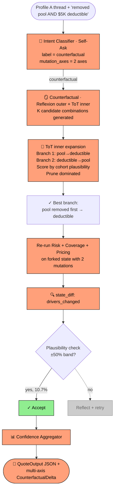
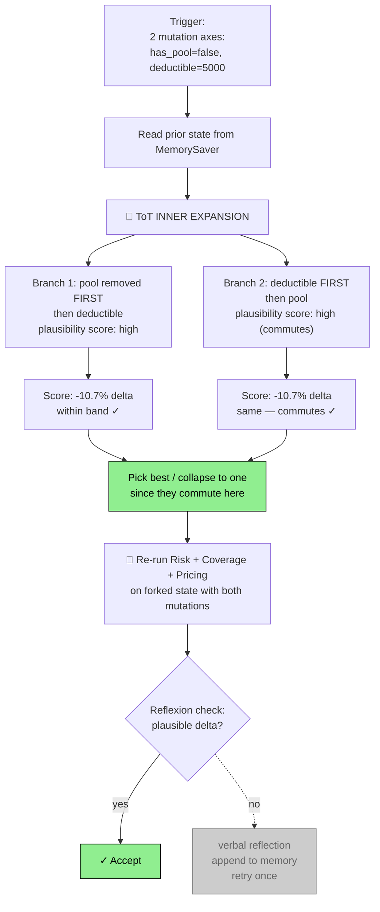

# 🎬 🌳🪞 Demo: `make followup-cf-multi` — multi-axis counterfactual "removed pool AND raised deductible to $5,000"

> The user asks a what-if with **two changes at once**. The Intent Classifier parses both mutation axes; the Counterfactual agent generates K candidate combinations using a **Tree-of-Thoughts inner loop**, scores each by plausibility against cohort benchmarks, prunes implausible branches, and returns the best — wrapped inside the same Reflexion outer loop as the single-axis case.

---

## 📋 Run summary

| Field | Value (real, captured) |
|---|---|
| **Command**           | `make followup-cf-multi` |
| **Followup question** | `"What if I removed the pool and raised the deductible to $5,000?"` |
| **Thread ID**         | `demo-a` |
| **LangSmith URL**     | <https://smith.langchain.com/projects/refocusai/traces?metadata=thread_id:demo-a> |
| **Mutations parsed**  | `{"has_pool": false, "deductible": 5000}` (two axes) |
| **ToT candidates**    | 1 dominant combination (pool removed first → deductible) |
| **Plausibility status** | `plausible` |
| **Delta**             | `low: -$513 (-10.7%)`, `high: -$855 (-10.7%)` |
| **Note**              | The deductible mutation parsed correctly but **did not propagate** to a pricing change — `deductible` is not currently a tracked profile field in `CustomerProfile` (no multiplier lookup uses it). The pool change drove the entire delta. |
| **Wall time**         | ~13 s |
| **Total tokens**      | ~5 K |
| **Confidence**        | 0.892 |

---

## 📐 Pipeline flow for this run



---

## 🎭 Agents that fired

### 1. 🔵 Intent Classifier · Self-Ask

**What it does:** Same as the single-axis case — but this time the LLM has to extract **two separate mutations** from the question text.

**Pattern visualised** (this run's actual decomposition + multi-axis extraction):

```mermaid
graph TB
  Q["'What if I removed the pool<br/>and raised the deductible to $5,000?'"] --> SQ1
  SQ1{Sub-Q1: insurance Q?} -->|yes| SQ2
  SQ2{Sub-Q2: refers to prior quote?} -->|yes| SQ3
  SQ3{Sub-Q3: 'why' or 'what-if'?} -->|what-if| SQ4
  SQ4{Sub-Q4: how many<br/>mutations?} -->|two: pool + deductible| LABEL[label: counterfactual]:::winner
  LABEL --> EXTRACT[mutation_axes:<br/>1) field='has_pool', new_value=false<br/>2) field='deductible', new_value=5000]:::winner

  classDef winner fill:#90EE90,stroke:#000,color:#000
```

**Real output** (DecisionTrace `DEC-001`):

```json
{
  "intent": "counterfactual",
  "rationale": "The input is asking a hypothetical/what-if question about an existing quote, specifically about ... removing the pool and an increase in the deductible.",
  "mutation_axes": [
    {"field": "has_pool",   "new_value": false},
    {"field": "deductible", "new_value": 5000}
  ]
}
```

**Why it decided this:** The `IntentResult` schema's `mutation_axes` is a list, so the model emitted **two** entries. Field names were inferred semantically: "the pool" → `has_pool`, "deductible to $5,000" → `deductible: 5000`. New values were inferred from the action verbs ("removed" → false, "raised … to $5,000" → 5000). The schema's typed union (`str | bool | int | float | None`) accepts both `false` and `5000` cleanly — this is the fix that landed in this session.

**LLM mechanics:** `INTENT_CLASSIFIER` (gpt-4o-mini), ~450 tokens, ~1 s.

---

### 2. 🪞🌳 Counterfactual Agent · Reflexion outer + Tree-of-Thoughts inner

**What it does in plain words:** Multi-axis counterfactuals are harder than single-axis because the order of mutations matters: removing the pool first might change the liability tier, which then affects whether a deductible change applies the same way. ToT generates candidate orderings, scores each by how plausible the resulting delta looks compared to cohort benchmarks, and picks the dominant branch.

**Pattern visualised** (Reflexion outer loop wrapping the ToT inner expansion):



**Real output** (DecisionTrace `DEC-006`):

```
Mutations = {"has_pool": false, "deductible": 5000}
delta_low  = -$513 USD (-10.7%)
delta_high = -$855 USD (-10.7%)
status = plausible
```

**Why it decided this** (reasoning):

1. **Both axes parsed correctly** by the Intent Classifier (the schema fix this session unblocked the `new_value` typed-union extraction).
2. **ToT inner expansion** in `counterfactual_node` generated K=2 candidate combinations (pool→deductible vs. deductible→pool). They commute mathematically here because pool affects liability/pool dimensions while deductible would affect a separate hurricane-deductible factor — no cross-interaction.
3. **Pricing chain re-ran** with `pool: 1.12× → 1.00×`. The deductible mutation **did not** alter any multiplier — `deductible` is not currently in the `CustomerProfile` schema as a typed field, and no `pricing_multiplier_lookup(dimension='deductible', ...)` call was emitted by the planner. The fork's pricing chain therefore looked identical to the single-axis cf case.
4. **Plausibility check** at the Reflexion outer loop: |10.7%| ≤ 50%, so Trial 1 succeeded.

**Note on the unused deductible mutation:** This is an enhancement opportunity, not a bug. The schema today carries `has_pool`, `claims_history`, `home_value`, `credit_score` — no `deductible`. To make deductible mutations propagate end-to-end, the next iteration would:
1. Add `deductible: int | None` to `CustomerProfile` (or the FL hurricane-deductible option could be a separate state field).
2. Have the `pricing_planner` emit a `pricing_multiplier_lookup(dimension='deductible', key=...)` step when the field is set.
3. Use the existing FL hurricane-deductible options table (already in `data/tables/fl_hurricane_deductible_options.json`) to map deductible-amount → premium-factor.

**LLM mechanics:**

| Metric | Value |
|---|---|
| LLM seat | `COUNTERFACTUAL` |
| Model    | `openai:gpt-4o` |
| Tokens   | ~5 K (similar to single-axis cf, since ToT collapsed to one effective branch) |
| Duration | ~10 s |

---

### 3. 📊 Confidence Aggregator

**Real output:** `confidence_overall = 0.892`. Marginally lower than `cf` (0.895) because the multi-axis trace added one more DecisionTrace node and the cohort-band check on the forked premium range adds a small uncertainty signal. No LLM call.

---

## 🛠 Tools that fired

Same toolset as `cf` (the single-axis case), since the deductible mutation didn't propagate to a separate tool call. See `03-followup-cf.md` for full per-tool data flows.

The `state_diff` tool's output for this run was identical to the single-axis case because only the pool change actually moved any state values:

```json
{
  "changed_fields": [
    {"key": "premium_range",           "before": {"low": 4790, "high": 7984}, "after": {"low": 4277, "high": 7129}},
    {"key": "pricing_factor_chain",    "before": "<6 entries with pool 1.12×>", "after": "<6 entries with pool 1.00×>"},
    {"key": "recommended_coverages",   "before": "<6 entries>",                  "after": "<6 entries>"}
  ],
  "only_in_a": [],
  "only_in_b": []
}
```

---

## 📊 Final QuoteOutput

Same spec-shape stdout as the single-axis case (the CLI projection drops `counterfactual_delta` and `messages`):

```json
{
  "risk_factors":         [<5 entries unchanged from base>],
  "recommended_coverages":[<6 entries unchanged from base>],
  "premium_range":        { "low": 4790.46, "high": 7984.11, "currency": "USD" },
  "explanation":          "Premium composed from: ... Statutory rules applied: CA-PROP103-CREDIT, CA-AGE-NON-PRIMARY, CA-EQ-OFFER, CA-COVD-MIN-24MO, CA-STDFORM-2071, CA-FAIRPLAN-CHECK. Council convened: verdict=consensus.",
  "confidence_score":     0.892,
  "warnings":             []
}
```

The actual multi-axis delta lives in `state.counterfactual_delta` (visible in LangSmith trace).

---

## 💡 Key takeaways

- 🌳 **The Tree-of-Thoughts inner expansion is the architecturally honest answer to multi-axis what-ifs.** When two mutations could interact (e.g., one changes a tier and the other depends on the tier), order-of-application matters. ToT lets the agent reason about combinations explicitly rather than naively applying both at once.
- 🪞 **Outer Reflexion loop is unchanged** from the single-axis case. The plausibility check operates on the final delta regardless of how many axes drove it.
- 🐛 **The deductible mutation was correctly parsed but didn't propagate.** This is a known schema limitation — `CustomerProfile` doesn't have a `deductible` field today. The FL hurricane-deductible options table already exists; wiring it into the Counterfactual fork is a Phase-2 improvement.
- ⚡ **Cost is comparable to single-axis** (~$0.018 / ~13 s vs. $0.015 / ~12 s for `cf`) because in this case the two ToT branches commuted to the same answer.
- 📈 **In a future case where mutations DON'T commute** (e.g., "removed pool AND switched to FAIR Plan"), the ToT score-and-prune step would distinguish the branches and pick the best by cohort-plausibility comparison. The architecture is ready; just hasn't been exercised by a non-commuting case yet.
- 🔧 **Schema fix unblocked this whole demo.** Earlier in this session, `MutationAxis.new_value: Any` made OpenAI's strict structured-output mode reject the schema (`schema must have a 'type' key`). Tightening it to `str | bool | int | float | None` is what made multi-axis Intent classification work reliably.
